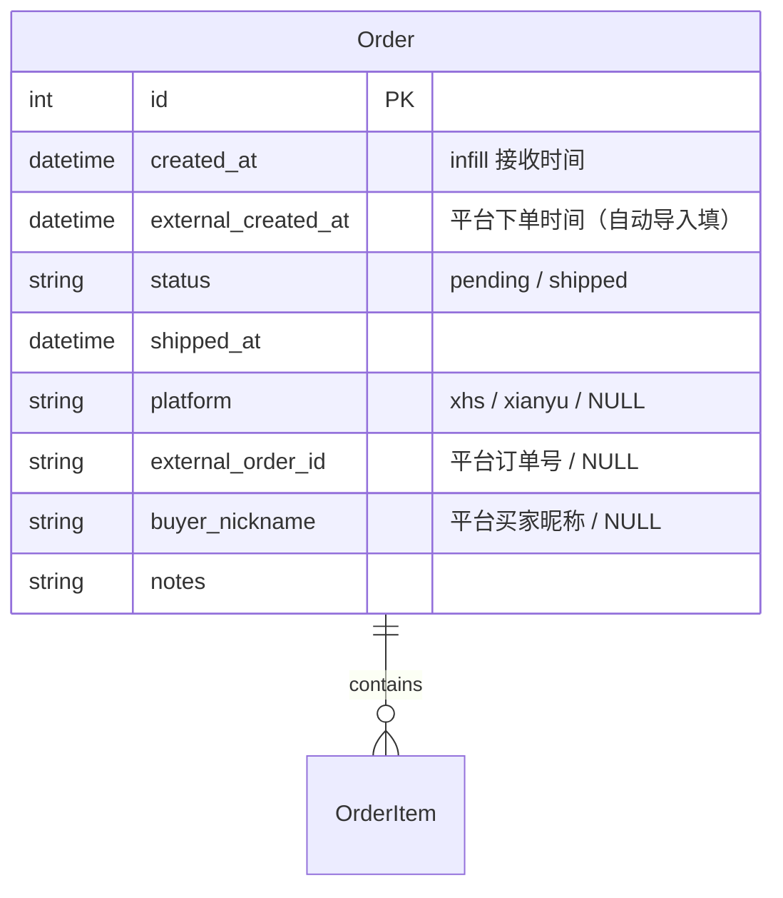
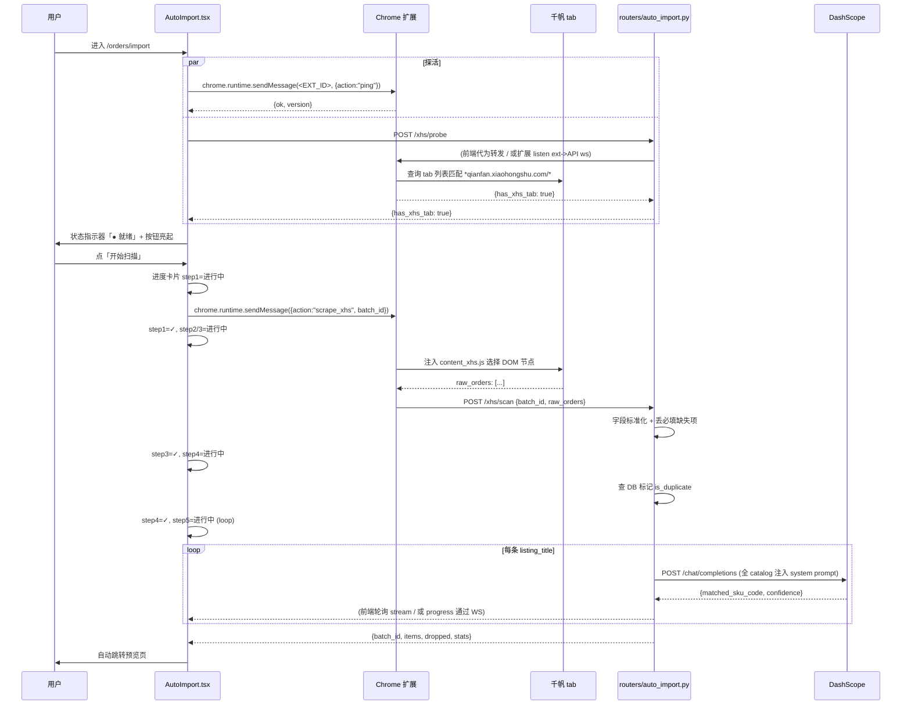
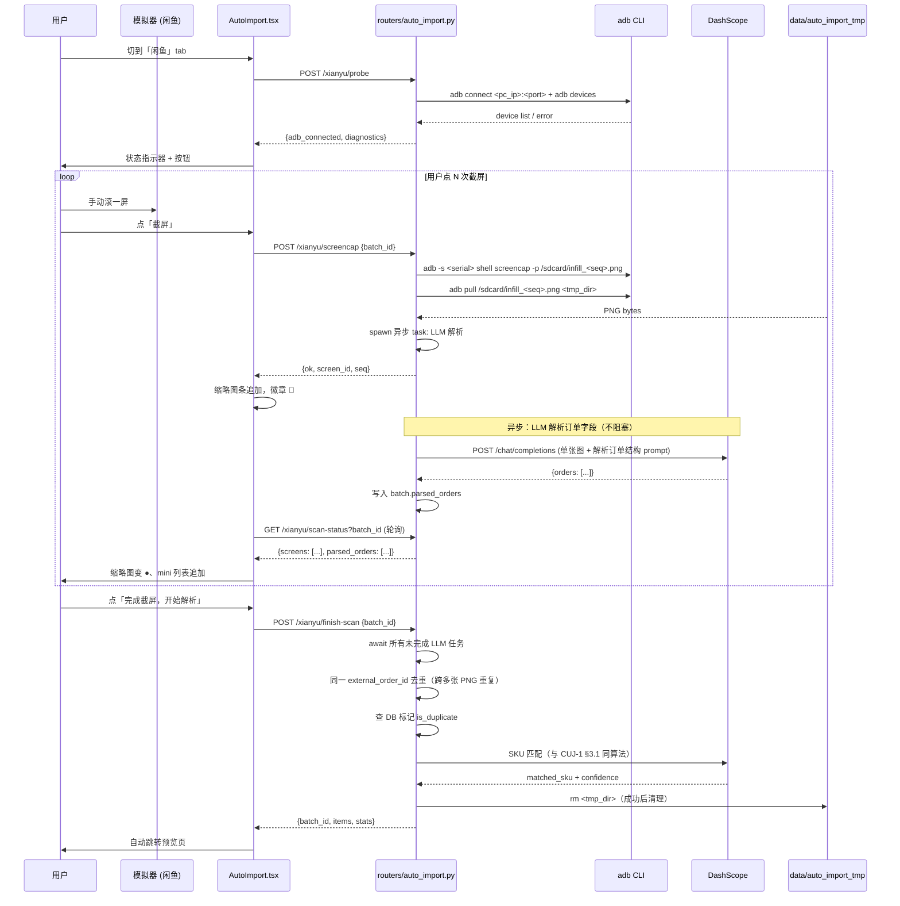
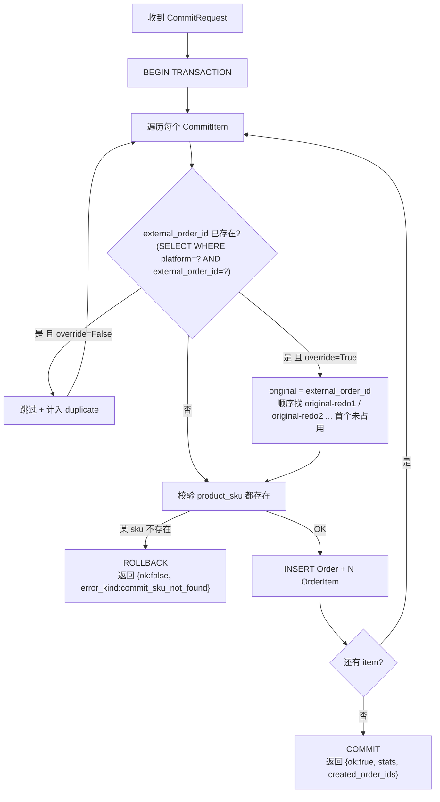
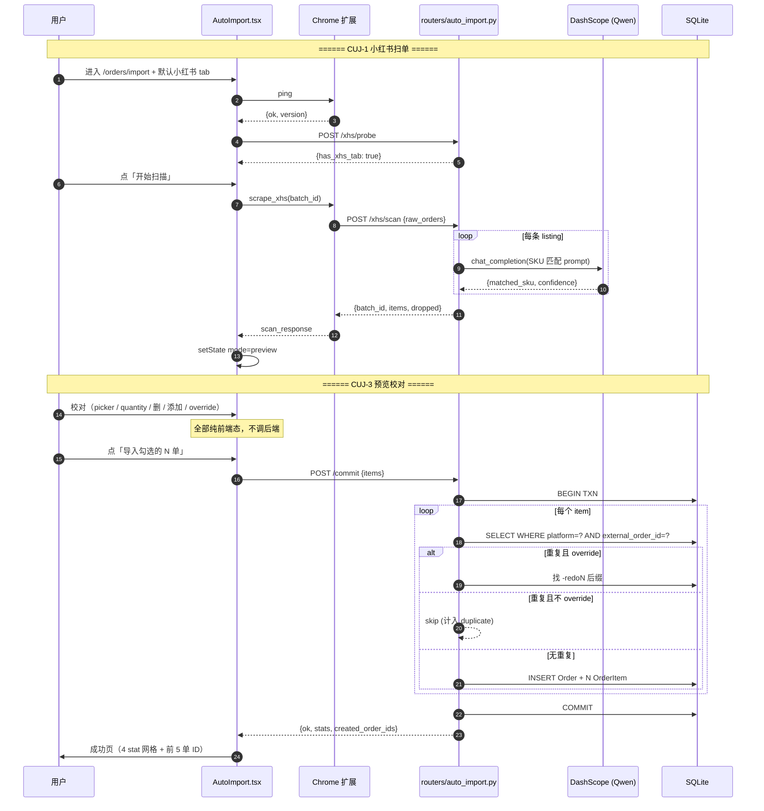

# 自动导入订单（Auto-Import Orders）

> Last updated: 2026-06-18 18:54:18 (UTC+8)
> Serves: prd-006（自动导入订单 — 小红书千帆 Chrome 扩展 + 闲鱼 ADB 截屏 + LLM 匹配 catalog SKU + 预览校对 + 一键导入）
>
> **上下游关系**：
> - 本组件是 `Order` / `OrderItem` 的**自动写源之一**（手工录入仍由 `routers/orders.py` 处理）。新订单一律落 `status='pending'`，由 [design-orders-inventory.md](design-orders-inventory.md) 接管后续生命周期（待处理队列 / 发货扣库存 / 历史）。
> - 本组件**读** catalog（component / product / SKU code）做 LLM 匹配，由 [design-catalog.md](design-catalog.md) 维护这些表的更新链路。
> - 本组件**复用** [system.md §6.5](system.md#65-llm-provider-抽象) 的 LLM provider 抽象（与 [design-intake.md](design-intake.md) 共用 `OpenAICompatibleVisionProvider`），但跑的是不同 prompt / 不同任务（intake 是结构化解析，本组件是分类匹配）。
>
> 业务规格见 [docs/prd/prd-006-auto-import-orders.md](../prd/prd-006-auto-import-orders.md)；所有交互细节、视觉规范、文案口径以 PRD 为权威。本文档描述**工程实现**、数据契约、关键算法、外部集成（Chrome 扩展、ADB）与 `Order` 表 schema 演进的迁移路径。

---

## Overview

自动导入订单替代手工录单流程：作坊主每天 ~50 单分布在两个销售渠道（小红书千帆、闲鱼），都没有可用的开放 API。本组件的工程任务：

1. **从小红书千帆抓订单**：用户在自己 Chrome 浏览器登录千帆后台。infill 前端通过 Chrome 扩展（`externally_connectable` 机制）让扩展爬取当前打开的千帆 tab 的 DOM，结构化后回传 infill 后端。
2. **从闲鱼抓订单**：闲鱼无 Web 端，用户在 PC 上跑 MuMu/蓝叠/雷电模拟器或 USB 真机。infill 服务（跑在 Mac mini）通过**局域网 ADB** 连到用户 PC 的 ADB 端口，触发 `adb shell screencap` 截整页 PNG。
3. **LLM 匹配 catalog SKU**：两路径抓到的「平台原文标题」（如「龙猫摆件大号 灰白款」）由 LLM（Qwen3-omni-flash via DashScope）匹配到 catalog 已有 SKU code（如 `PR-0042`）+ 返回 0~1 置信度。MVP 把当前 catalog 全部 SKU（≈50 个，几 KB 量级）注入 prompt 让 LLM 在已知集合内挑。
4. **统一预览批次**：两路径汇入同一张表格，按置信度三档（高/中/低）高亮，用户校对低置信度行后一键导入。
5. **批次原子写入**：用户点「导入勾选的 N 单」时，所有勾选订单在**单事务**内创建 `Order` + `OrderItem`，任一失败整批回滚。

实现文件（**计划**，本轮实施前不存在）：

- 后端：
  - `backend/app/routers/auto_import.py` — HTTP 路由（probe / scan / commit / config 等 10 个端点）
  - `backend/app/services/auto_import.py` — 业务编排（DOM 解析 / 截屏循环 / 批次 in-memory 存储 / 唯一约束查询 / 单事务批量写）
  - `backend/app/services/auto_import_llm.py` — LLM SKU 匹配（**复用** `services/intake_llm.OpenAICompatibleVisionProvider`，新增 `match_skus()` 方法或独立模块包装）
  - `backend/app/services/adb_client.py` — `adb` CLI 子进程封装（`connect` / `devices` / `screencap` / `pull`）
  - `backend/app/schemas_auto_import.py` — Pydantic 请求/响应 schema
- 前端：
  - `frontend/src/pages/AutoImport.tsx` — 统一 tab 页（默认 `/orders/import`）
  - `frontend/src/pages/auto_import/XhsTab.tsx` / `XianyuTab.tsx` / `Preview.tsx` / `SuccessPanel.tsx` / `FailurePanel.tsx`
  - `frontend/src/pages/settings/AutoImportSettings.tsx`（路由 `/settings/auto-import`）
  - 在 `frontend/src/api/client.ts` 追加 `api.autoImport.*` 子对象
- Chrome 扩展（独立子项目）：
  - `extension/manifest.json`（Manifest V3，`externally_connectable.matches` 配置 infill 来源）
  - `extension/background.js` — 接收 `chrome.runtime.sendMessage` + 派发到 content script
  - `extension/content_xhs.js` — 注入到 `*qianfan.xiaohongshu.com/*` tab 抓 DOM
  - 打包产物分发：`backend/static/extensions/infill-xhs-scraper-v0.1.x.zip`
- 数据：
  - `data/auto_import_tmp/<batch_id>/screen_<seq>.png` — 闲鱼截屏期临时 PNG（TTL 30 分钟）
  - `SystemConfig` 新增三个 key：`auto_import_adb_device_type` / `auto_import_adb_pc_ip` / `auto_import_adb_port`
  - `Order` 表新增 4 列：`platform` / `external_order_id` / `buyer_nickname` / `external_created_at`，详见 §数据模型

---

## Goals & Non-Goals

**Goals（工程层面）**
- 把两条平台无 API 的录单链路自动化，端到端 < 3 分钟（用户感知）。
- **统一的预览批次模型**：扫描后两个平台的 batch 形状完全一致，CUJ-3 不感知来源。
- **批次纯前端态 + 一次 commit**：扫描后到导入前的 batch 不进 DB（避免无谓的临时表），不做 TTL；导入时单事务写库。
- **LLM 匹配可单元测试**：把 SKU 匹配作为纯函数（输入：标题 + catalog 全集 + LLM client），输出：候选 + 置信度。
- **Chrome 扩展 + ADB 都是「检测先于使用」**：每个 CUJ 入口先 probe 就绪状态，故障态有具体诊断路径（不是黑盒「失败」）。
- **复用现有 LLM provider 抽象**：不为 prd-006 单独写一份 HTTP client；只新增一个新 provider entry（Qwen / DashScope）+ 一个 SKU 匹配 prompt 模块。

**Non-Goals**
- 不抓取收货地址（闲鱼地址在二级页面、千帆 DOM 中也未稳定提取，MVP 跳过）。
- 不做定时自动扫描（无 cron / scheduler；用户每次手动触发）。
- 不做批量回填历史订单（往前抓 N 天）。
- 不做地址智能纠错 / 二维码登录托管。
- 不做多平台并发扫描（串行，避免 LLM 限流 / 用户预览冲突）。
- 不做扩展自动 OTA 升级（用户手动下载 zip 装入开发者模式）。
- 不实现 ADB 自动滚动模拟器（截屏由用户手动控制节奏）。
- 不做预览批次后端 TTL 持久化（批次只活在前端 React state 里；MVP 简化）。

---

## System Context

```mermaid
flowchart TB
    subgraph PC["用户 PC（Mac/Windows）"]
        Chrome["Chrome 浏览器<br/>已登录千帆后台"]
        Ext["infill Chrome 扩展<br/>(Manifest V3)"]
        Emu["闲鱼 App<br/>(MuMu / 蓝叠 / 雷电 / USB 真机)"]
        AdbServer["adb server<br/>:5037 / 模拟器调试端口"]
        Chrome --- Ext
        Emu --- AdbServer
    end

    subgraph Mini["Mac mini（infill 服务）"]
        subgraph FE["React SPA"]
            Page["pages/AutoImport.tsx<br/>+ AutoImportSettings.tsx"]
            Page -.调 chrome.runtime.sendMessage.-> Ext
            Page -->|HTTP /api/auto-import/*| Router
        end
        Router["routers/auto_import.py"]
        Svc["services/auto_import.py<br/>+ adb_client.py + auto_import_llm.py"]
        LLMShared["services/intake_llm.py<br/>OpenAICompatibleVisionProvider<br/>(共享)"]
        Router --> Svc
        Svc --> LLMShared
        AdbCLI["adb CLI<br/>(brew install android-platform-tools)"]
        Svc -.子进程调用.-> AdbCLI
    end

    AdbCLI -- "TCP/IP<br/>adb connect <PC_IP>:<port>" --> AdbServer
    LLMShared -- "POST /chat/completions<br/>OpenAI-compatible" --> DashScope["阿里云 DashScope<br/>Qwen3-omni-flash"]
    Ext -- "回传抓到的 DOM 结构" --> Router

    DB[("SQLite<br/>orders + system_config")]
    Svc --> DB

    style PC fill:#fef9e7
    style Mini fill:#e7f3ff
    style DashScope fill:#ffe7e7
```

**关键集成边界**：

| 边界 | 协议 | 谁发起 | 数据形状 |
|---|---|---|---|
| 前端 ↔ Chrome 扩展 | `chrome.runtime.sendMessage(<EXT_ID>, msg)`（`externally_connectable`） | 前端 → 扩展 | `{action, batch_id?}` |
| 扩展 ↔ 后端 | HTTP POST `/api/auto-import/xhs/scan` | 扩展 | `{ batch_id, raw_orders: [...] }` |
| 后端 ↔ ADB server | `adb` CLI 子进程（`adb -s <serial> shell screencap ...`） | 后端 | shell exit code + binary file pull |
| 后端 ↔ DashScope | HTTPS POST `/chat/completions`（OpenAI 兼容） | 后端 | 标准 OpenAI 协议（与 intake 共享 provider） |

---

## Detailed Design

### 1. 数据模型

#### 1.1 `Order` 表 schema 扩展（**新增 4 列**）

| 字段 | 类型 | Nullable | 说明 |
|---|---|---|---|
| `platform` | `VARCHAR(16)` | ✅ | 值域 `'xhs'`（小红书千帆）/ `'xianyu'`（闲鱼）/ `NULL`（人工录入）。**默认 NULL** 保证向后兼容。 |
| `external_order_id` | `VARCHAR(64)` | ✅ | 平台侧原始订单号；人工录入留 NULL。重复 override 时追加 `-redoN` 后缀。 |
| `buyer_nickname` | `VARCHAR(128)` | ✅ | 平台买家昵称；人工录入留 NULL。CUJ-1 必填三件套之一（缺则后端丢弃该条扫描结果）。 |
| `external_created_at` | `DATETIME` | ✅ | 平台侧下单时间（与 infill 的 `created_at` 区分）；LLM 未识别到时落 `now()` fallback。 |

**新增唯一约束**：

```sql
CREATE UNIQUE INDEX uq_orders_platform_external
  ON orders(platform, external_order_id)
  WHERE platform IS NOT NULL AND external_order_id IS NOT NULL;
```

- SQLite 3.8+ 支持 **partial unique index**（`WHERE` 子句），人工录入的 `(NULL, NULL)` 不参与去重。
- `(platform, external_order_id)` 复合键是防重导入的兜底；前端 CUJ-3 已通过预览查询 surface 重复，commit 端点再做一次保护。

**详细的字段语义、人工与自动录入的兼容关系、`-redoN` override 约定** → 见 [design-orders-inventory.md §数据模型](design-orders-inventory.md#数据模型详见-systemmd-§4)，本文档不再重复。

#### 1.2 ER 增量



#### 1.3 `SystemConfig` 新增 keys

| key | 默认 | 说明 |
|---|---|---|
| `auto_import_adb_device_type` | `mumu` | 值域 `mumu` / `bluestacks` / `ldplayer` / `usb` |
| `auto_import_adb_pc_ip` | `""` | 用户 PC 局域网 IP；空则视为未配置 |
| `auto_import_adb_port` | `7555` | ADB 端口（MuMu 默认 7555 / 其他默认 5555 / USB 真机用 5037） |

**为什么不新建一张 `AutoImportConfig` 表**：单用户 3 个 KV 配置，与现有 `SystemConfig` 模式完全契合（参见 `schedule_specs.md` 的 `changeover_minutes` 同模式）。新表会引入额外 schema 演进负担。

#### 1.4 预览批次（in-memory，**不入 DB**）

```python
# services/auto_import.py 模块级
@dataclass
class PreviewItem:
    external_order_id: str
    buyer_nickname: str | None
    external_created_at: datetime | None
    is_duplicate: bool                    # 数据库已存在 (platform, external_order_id)
    existing_order_id: int | None         # 重复时指向已有 Order.id
    was_duplicate_overridden: bool = False # 用户点「改判为新单」后置 True（前端态，commit 时透传）
    products: list[PreviewProduct]

@dataclass
class PreviewProduct:
    listing_title: str                    # 平台原文（用于浮窗灰底框 + 重新匹配）
    matched_sku_code: str | None          # catalog Product.sku，如 PR-0042
    matched_sku_name: str | None
    confidence: float                     # 0~1，手选后置 1.0 但前端显示「手选」
    quantity: int

@dataclass
class PreviewBatch:
    batch_id: str                         # uuid4 hex
    source: Literal["xhs", "xianyu"]
    items: list[PreviewItem]
    scanned_at: datetime
    raw_meta: dict                        # 扫描方式描述（"Chrome 扩展" / "ADB 截屏 8 张"）+ 总耗时
```

**前端持有 batch**（React state），后端在扫描端点返回后**不缓存**。理由：

1. 用户唯一可达「预览页」的入口是「扫描完成 → 自动跳转」；刷新 / 切其他路由后丢弃符合 PRD 「批次不持久化」原则。
2. 避免引入 TTL / 后端 cache key 管理 / cleanup cron。
3. commit 端点幂等性靠 `(platform, external_order_id)` 唯一约束兜底（即便重提交相同 payload 也不会重复落库，只是计入「重复跳过」）。

> **PRD 描述 vs 设计决策**：prd-006 CUJ-3 Edge Cases 中提到「后端临时 batch 缓存的 TTL 为 30 分钟」。**本设计文档决定不实现该后端缓存** — 闲鱼截屏临时 PNG 文件需要 TTL（见下文 §3.2），但**结构化 batch 数据不需要后端态**。请 PRD 维护者下次更新时移除该 TTL 描述（或确认本设计偏离）。详见 [§Open Questions §1](#open-questions--risks)。

---

### 2. API / Interface Contract

所有端点挂在 `app/routers/auto_import.py` 下，统一前缀 `/api/auto-import`。

| 方法 + 路径 | 请求 | 响应 | 说明 |
|---|---|---|---|
| `GET /api/auto-import/xhs/extension-status` | — | `{ ok, configured: bool, version?: str }` | CUJ-4 用；前端再通过 `chrome.runtime.sendMessage` 实测扩展是否响应 |
| `POST /api/auto-import/xhs/probe` | — | `{ ok, has_xhs_tab: bool }` | CUJ-1 入页时调；返回扩展是否能找到千帆 tab |
| `POST /api/auto-import/xhs/scan` | `{ batch_id, raw_orders: [...] }`（扩展直传） | `{ ok, batch_id, items: [PreviewItem], dropped: [{external_order_id, reason}], stats: {...} }` | CUJ-1 主端点；做字段标准化 + 去重查询 + LLM 匹配 |
| `POST /api/auto-import/xianyu/probe` | — | `{ ok, adb_connected: bool, device_serial?: str, diagnostics: [...] }` | CUJ-2 入页时调；返回 ADB 连通性 + 三项诊断 |
| `POST /api/auto-import/xianyu/screencap` | `{ batch_id }` | `{ ok, screen_id, seq } 或 { ok: false, error }` | CUJ-2 每次「截屏」按钮触发；后端 `adb screencap` + `pull` 到 tmp + 异步触发 LLM 解析 |
| `GET /api/auto-import/xianyu/scan-status?batch_id=<>` | — | `{ batch_id, screens: [{screen_id, seq, status: queued/parsing/done/failed, parsed_orders_count?}], parsed_orders: [PreviewItem (不含 SKU)] }` | 前端轮询；用于扫描中卡片实时刷新缩略图 + mini 订单列表 |
| `POST /api/auto-import/xianyu/finish-scan` | `{ batch_id }` | `{ ok, batch_id, items: [PreviewItem], dropped, stats }` 或 `{ ok: false, error_kind, error }` | CUJ-2「完成截屏，开始解析」终结点；等待所有 LLM 解析任务 + 跑二次 SKU 匹配 + 返回完整 batch |
| `POST /api/auto-import/cancel-scan` | `{ batch_id }` | `{ ok }` | CUJ-1 / CUJ-2 取消；后端 abort 所有未完成 LLM 调用 + rm tmp PNG |
| `POST /api/auto-import/sku-search` | `{ q: str, limit?: int=10 }` | `{ ok, candidates: [{sku, name, code}] }` | CUJ-3 picker 浮窗搜索框；模糊匹配 catalog 全集（汉字 / 拼音 / code） |
| `POST /api/auto-import/commit` | `{ batch_id?, items: [CommitItem] }` | `{ ok, stats, created_order_ids, skipped: {duplicate, manual} }` 或 `{ ok: false, error }` | CUJ-3 最终导入端点；**单事务**批量写 |
| `POST /api/auto-import/xianyu/test-adb` | `{ device_type, pc_ip, port }` | `{ ok, connected: bool, device_serial?, system?, diagnostics: [...] }` | CUJ-4 测试按钮；不持久化配置 |
| `GET /api/auto-import/xianyu/config` | — | `{ device_type, pc_ip, port }` | CUJ-4 / CUJ-2 入页读 |
| `PUT /api/auto-import/xianyu/config` | `{ device_type, pc_ip, port }` | `{ ok }` | CUJ-4 保存按钮 |

#### CommitItem schema

```python
class CommitProduct(BaseModel):
    product_sku: str             # catalog Product.sku，如 PR-0042
    quantity: int                # 1~999

class CommitItem(BaseModel):
    platform: Literal["xhs", "xianyu"]
    external_order_id: str       # 含 -redoN 后缀（若用户 override）
    buyer_nickname: str | None
    external_created_at: datetime | None
    products: list[CommitProduct]
    override_duplicate: bool = False  # 用户点过「改判为新单」时传 True

class CommitRequest(BaseModel):
    batch_id: str | None         # 可选；MVP 仅用于 telemetry，不做 server-side 校验
    items: list[CommitItem]
```

#### `RawOrder` schema（扩展 → 后端 `xhs/scan`）

扩展抓 DOM 后回传：

```typescript
type RawOrder = {
  external_order_id: string;
  buyer_nickname: string;
  external_created_at: string;  // ISO 8601 字符串
  products: { listing_title: string; quantity: number }[];
};
```

后端 `xhs/scan` 端点对必填三件套 `external_order_id` / `buyer_nickname` / `products` 任一缺失则**丢弃该订单**（不入 batch），统计到响应 `dropped` 列表里。

#### 错误码约定

所有端点统一返回 `{ok: bool, ...}` 而非 HTTPException（与 `intake` / `catalog` 一致，便于前端按 `error_kind` 分支渲染 UI）。常用 `error_kind`：

| error_kind | 触发条件 | 用户可见文案 |
|---|---|---|
| `no_api_key` | LLM provider 未配置 | 「未检测到 LLM 提供商 API key — 请在 `.env` 配置 `QWEN_API_KEY` 后重启」 |
| `llm_timeout` | SKU 匹配 90s 未完成 | 「LLM 调用超时 — 90 秒未收到响应」 |
| `llm_http_4xx` / `llm_http_5xx` | DashScope HTTP 错 | 「LLM 服务异常 (HTTP {status})」+ 等宽错误体 |
| `adb_not_installed` | `adb` CLI 找不到 | 「Mac mini 未安装 adb — `brew install --cask android-platform-tools`」 |
| `adb_connection_refused` | `adb connect` 拒绝 | 「无法连接到 {pc_ip}:{port}」 + 三项诊断 |
| `adb_device_offline` | `adb devices` 状态为 offline | 「设备处于 offline 状态 — 请在 PC 上点 ADB 调试授权弹窗」 |
| `screencap_failed` | `adb screencap` 退码非零 / pull 失败 | 「截屏失败 — IO 错或设备临时无响应」 |
| `extension_not_responding` | 扩展 ping 5s 无响应 | 「Chrome 扩展未响应 — 请确认已装并启用」 |
| `extension_no_xhs_tab` | 扩展回报无千帆 tab | 「未发现千帆订单 tab — 请先在 Chrome 中打开千帆后台」 |
| `extension_scrape_failed` | 扩展抓 DOM 失败 | 「DOM 抓取失败 — 千帆页面结构可能已变更」 |
| `commit_sku_not_found` | commit 时某 product_sku 已被 catalog 删 | 「product_sku={} 已不存在于 catalog」 |
| `commit_db_error` | 单事务 rollback | 「数据库错误 — 整批未写入」+ 原始错误 |

---

### 3. 关键算法与逻辑

#### 3.1 小红书千帆扫描链路（CUJ-1）



**关键工程取舍**：

- **扩展 → 后端**：扩展不直接持久化任何 infill 数据。扩展拿到 raw DOM 后立即 POST 给后端 `/xhs/scan`（CORS 由 backend 全开允许）。扩展的 service worker 仅做 message routing。
- **进度反馈**：MVP 不引入 WebSocket / SSE。前端的 5 步进度条是**乐观推进** — `step1/2/3` 在前端拿到扩展响应后置 ✓，`step4/5` 在收到 `/xhs/scan` 单次响应后置 ✓。中途的「正在匹配第 18/42 条」副文案 MVP 简化为**纯前端动画估算**（基于已知 LLM 平均耗时 / total），不要求服务端真实进度。**未来若用户反映卡死焦虑可加 SSE，但本轮不做**。
- **LLM 批量调用**：MVP 用 **N 次独立调用**（每个 listing 一次），而不是「整批一次匹配」。原因：① 单调用响应体小、parse 简单；② 失败可独立标记（仅该行红色低置信度）；③ DashScope 限流容忍度更友好（短小请求、可加限速）。代价：N 次 system prompt 重复，token 消耗更高 — 50 单 × 平均 2 商品 = 100 次调用 × ~500 tokens system prompt ≈ 5 万 tokens（约 0.5 元，可接受）。**未来若 token 成本压力上升，二期切换到「整批一次匹配」分批模式**。

#### 3.2 闲鱼扫描链路（CUJ-2）



**关键工程取舍**：

- **手动截屏、自动 + 异步解析**：用户控制截屏节奏（避免自动滚动适配不同模拟器分辨率的脆弱性），但 LLM 解析在后端 spawn 异步任务（`asyncio.create_task` 或 `BackgroundTasks`）边截边解析，不阻塞用户。「完成」按钮才阻塞等待所有任务完成。
- **去重跨多张 PNG**：闲鱼订单列表向下滚动会有 overlap，同一 `external_order_id` 可能出现在第 1 张底部 + 第 2 张顶部。后端在 `finish-scan` 时按 `external_order_id` 字典 dedupe（首次出现的字段为准）。
- **轮询 vs WebSocket**：MVP 用 1.5s 间隔轮询 `/xianyu/scan-status`。50 单 / 天的扫描节奏下，轮询开销可忽略。WebSocket 引入额外的连接管理 / 状态机复杂度，不值得。
- **PNG TTL**：扫描期 PNG 落在 `data/auto_import_tmp/<batch_id>/`。清理触发：
  1. `finish-scan` 成功 → 立即 `rmtree`。
  2. `cancel-scan` → 立即 `rmtree`。
  3. **惰性清理**：每次 `/xianyu/screencap` 调用前扫 `data/auto_import_tmp/`，删除 mtime > 30 分钟的目录（与 intake_tmp TTL 1 小时不同的原因：闲鱼 PNG 更大、用户场景更短）。

#### 3.3 LLM SKU 匹配（核心算法）

**Prompt 设计**（system prompt，硬编码在 `services/auto_import_llm.py`）：

```
你是一个 3D 打印作坊的订单匹配助理。我会给你一条平台订单的商品标题（如「龙猫摆件大号 灰白款」），
你需要从下面的 catalog SKU 列表中找出最匹配的一项（或确认无匹配）。

## Catalog SKU 全集

| SKU code | 产品名称 |
|---|---|
| PR-0001 | 转角书桌-配色1-纯白 |
| PR-0002 | 转角书桌-配色2-木纹 |
| PR-0042 | 龙猫摆件-大号-灰白 |
| ...     | ...                |
（最多 ~50 行，本作坊全部 SKU）

## 任务

1. 分析输入标题里的关键词（产品名 / 尺寸 / 颜色 / 款式）。
2. 在 catalog 表里找最语义接近的一行。
3. 输出 JSON：
{
  "matched_sku_code": "PR-0042" 或 null,
  "confidence": 0.0~1.0 浮点数,
  "reasoning": "简短中文，说明匹配依据（一句话）"
}

## 置信度判定指南

- 1.0 ~ 0.85：所有关键词（产品名 + 尺寸 + 颜色）都对得上，无歧义。
- 0.84 ~ 0.55：核心产品名对得上，但某个修饰词模糊或缺失（如标题缺尺寸 / 颜色名差异如「灰白款」vs「灰白」）。
- < 0.55：核心产品名不确定 / 多个 SKU 都有可能 / catalog 里没有合适项 → matched_sku_code 设为 null。

严格输出 JSON，**不要** markdown 包装。
```

**User message**：仅当前要匹配的 listing_title。

**为什么 MVP 选「全 catalog 注入 prompt」**：

| 准则 | 全 catalog 注入（**选用**） | RAG（embedding 检索 → top-K 注入） |
|---|---|---|
| 实现复杂度 | 低（无 embedding service） | 中（需 embedding model + vector store） |
| Token 成本 | 当前 50 SKU × ~30 chars ≈ 2KB system prompt | 仅 top-K × ~30 chars，省 70%+ |
| 准确率（小 catalog） | 高（LLM 看到全集，无召回损失） | 中（embedding 召回可能漏） |
| 准确率（大 catalog） | 低（token 上限触底） | 高 |
| 切换成本 | 0 | 实现一次后稳定 |
| **裁决** | **选用**（catalog < 200 SKU），二期 ≥ 200 SKU 时切 RAG | |

**LLM Provider 复用**：

直接复用 `services/intake_llm.OpenAICompatibleVisionProvider`（其实是通用 OpenAI Chat 兼容 client，名字里的 "Vision" 是历史遗留 — **本设计建议下次重构时改名为 `OpenAICompatibleLLMProvider`**，但本轮不做以避免破坏现有测试）。

新增逻辑：

```python
# services/auto_import_llm.py
from app.services.intake_llm import OpenAICompatibleVisionProvider, LLMProviderError, get_active_provider

SKU_MATCH_SYSTEM_PROMPT = """..."""  # 如上

def match_listing_to_sku(
    listing_title: str,
    catalog_skus: list[tuple[str, str]],   # [(sku_code, product_name), ...]
    timeout_seconds: int = 30,
) -> tuple[str | None, float, str]:
    """返回 (matched_sku_code, confidence, reasoning)。失败抛 LLMProviderError。"""
    provider = get_active_provider()
    if not provider:
        raise LLMProviderError("no_api_key", "未配置 LLM provider")
    # 渲染 system prompt
    table_rows = "\n".join(f"| {code} | {name} |" for code, name in catalog_skus)
    system = SKU_MATCH_SYSTEM_PROMPT.format(table_rows=table_rows)
    # 复用 provider 的底层 chat 调用（需要扩展 provider 加 `chat_completion(system, user)` 方法）
    ...
```

> **现状缺口**：`OpenAICompatibleVisionProvider` 当前**唯一公开方法是 `recognize(assembly_images, produce_images, ...)`**，强耦合到 intake 的「图片识别 → JSON 草稿」流程。要复用到 SKU 匹配场景需要**抽出一个底层 `chat_completion(messages: list[dict], json_object: bool = True) -> dict` 方法**，让 intake 与 auto-import 各自包一层 prompt 渲染 + 响应解析。这是本轮实施的**必做重构**，详见 [§6 与现有组件的关系](#6-与现有组件的关系-必做重构)。

#### 3.4 批次去重（commit 端点）



**关键不变量**：

1. **原子性**：任一 item 验证失败 → 整批 ROLLBACK，不部分落库（与 prd-001 CUJ-1 的「N 个独立请求中途失败半成功」缺陷不同 — 本组件刻意单事务避免这一问题）。
2. **重复跳过 ≠ 错误**：去重跳过的 item 不算失败，正常返回 `ok=true`，归入 `skipped.duplicate`。
3. **`-redoN` 后缀算法**：原 `external_order_id` 为 `XHS-2026-001250` 时，第一次 override 写入 `XHS-2026-001250-redo1`，第二次 override（如果用户连续两次操作）写入 `XHS-2026-001250-redo2`。逻辑：`SELECT external_order_id LIKE 'XHS-2026-001250-redo%'` → 取最大数字 +1。

---

### 4. Chrome 扩展架构

#### 4.1 Manifest V3 关键配置

```json
{
  "manifest_version": 3,
  "name": "infill 小红书千帆抓单",
  "version": "0.1.0",
  "permissions": ["tabs", "scripting"],
  "host_permissions": ["*://*.qianfan.xiaohongshu.com/*"],
  "externally_connectable": {
    "matches": [
      "http://localhost:5173/*",
      "http://localhost:8000/*",
      "http://<MAC_MINI_IP>:8000/*"
    ]
  },
  "background": { "service_worker": "background.js" },
  "content_scripts": [
    {
      "matches": ["*://*.qianfan.xiaohongshu.com/*"],
      "js": ["content_xhs.js"],
      "run_at": "document_idle"
    }
  ]
}
```

**关键决策**：

- `externally_connectable.matches` 必须 hardcoded — Chrome 安全模型要求显式列出可调用方域名。**未来若用户的 infill 部署 IP 变化，需重新打包扩展**（接受这一摩擦；提供 `host_permissions: ["<all_urls>"]` 是过度授权）。
- 不申请 `cookies` 权限：扩展只读 DOM，不读 cookie / localStorage / 不发外部 HTTP（除了向 infill backend POST）。
- `content_xhs.js` `run_at: document_idle`：千帆 SPA 首屏加载完后才注入，避免 race。

#### 4.2 通信协议（前端 ↔ 扩展 ↔ 后端）

```javascript
// 前端发起
const EXT_ID = "<chrome_extension_id>";  // 装扩展后获得
chrome.runtime.sendMessage(EXT_ID, { action: "scrape_xhs", batch_id: "abc123" }, (response) => {
  // response 形如 { ok: true, scraped_count: 42 } 或 { ok: false, error: "..." }
});

// background.js
chrome.runtime.onMessageExternal.addListener((msg, sender, sendResponse) => {
  if (msg.action === "ping") {
    sendResponse({ ok: true, version: chrome.runtime.getManifest().version });
    return;
  }
  if (msg.action === "scrape_xhs") {
    chrome.tabs.query({ url: "*://*.qianfan.xiaohongshu.com/*" }, async (tabs) => {
      if (!tabs.length) {
        sendResponse({ ok: false, error: "extension_no_xhs_tab" });
        return;
      }
      const tab = tabs[0];
      const [{ result: rawOrders }] = await chrome.scripting.executeScript({
        target: { tabId: tab.id },
        func: extractQianfanOrders,  // 内联或 importScripts
      });
      // POST 给 infill backend
      const resp = await fetch("http://<infill_host>:8000/api/auto-import/xhs/scan", {
        method: "POST",
        headers: { "Content-Type": "application/json" },
        body: JSON.stringify({ batch_id: msg.batch_id, raw_orders: rawOrders }),
      });
      const data = await resp.json();
      sendResponse(data);  // 透传给前端
    });
    return true;  // 异步 sendResponse 必须返回 true
  }
});
```

**DOM 选择器维护**：`extractQianfanOrders` 内的 CSS 选择器随千帆改版会失效。**约定**：选择器集中在 `content_xhs.js` 顶部常量；改版后开发者更新扩展 → 重新打包 → 通过 `/static/extensions/...` 分发 → 用户重新加载扩展。

#### 4.3 扩展打包与分发

- 仓库内子目录：`extension/`（不进 frontend / backend 主项目）。
- 构建脚本：`scripts/build-extension.sh` → `release/infill-xhs-scraper-v0.1.x.zip`。
- 部署：构建后端镜像时把 zip copy 进 `backend/static/extensions/`，FastAPI 静态文件挂载暴露 `/static/extensions/infill-xhs-scraper-v0.1.x.zip`。
- 版本号：扩展 `manifest.json.version` 与后端期望版本号在 `system_config` 表的 `auto_import_extension_min_version` key 校验匹配（CUJ-4 显示 `v0.1.x`）。

---

### 5. ADB 集成

#### 5.1 子进程封装（`services/adb_client.py`）

```python
import subprocess
from dataclasses import dataclass

@dataclass
class AdbDevice:
    serial: str
    state: str  # "device" / "offline" / "unauthorized"
    properties: dict  # ro.build.version.release 等

class AdbClient:
    def __init__(self, adb_path: str = "adb"):
        self.adb_path = adb_path

    def is_installed(self) -> bool:
        try:
            subprocess.run([self.adb_path, "version"], capture_output=True, timeout=5, check=True)
            return True
        except (FileNotFoundError, subprocess.CalledProcessError, subprocess.TimeoutExpired):
            return False

    def connect(self, endpoint: str, timeout_s: int = 5) -> tuple[bool, str]:
        result = subprocess.run(
            [self.adb_path, "connect", endpoint],
            capture_output=True, timeout=timeout_s, text=True
        )
        # 输出 "connected to 192.168.1.100:7555" / "failed to connect" / "already connected"
        ok = "connected" in result.stdout.lower() and "failed" not in result.stdout.lower()
        return ok, result.stdout.strip()

    def list_devices(self) -> list[AdbDevice]:
        result = subprocess.run(
            [self.adb_path, "devices", "-l"],
            capture_output=True, timeout=5, text=True, check=True
        )
        devices = []
        for line in result.stdout.splitlines()[1:]:
            if not line.strip():
                continue
            parts = line.split()
            if len(parts) >= 2:
                devices.append(AdbDevice(serial=parts[0], state=parts[1], properties={}))
        return devices

    def screencap(self, serial: str, dest_path: str) -> bytes:
        # screencap → /sdcard, pull → 本地
        tmp_remote = f"/sdcard/infill_{uuid.uuid4().hex[:8]}.png"
        subprocess.run(
            [self.adb_path, "-s", serial, "shell", "screencap", "-p", tmp_remote],
            capture_output=True, timeout=15, check=True
        )
        subprocess.run(
            [self.adb_path, "-s", serial, "pull", tmp_remote, dest_path],
            capture_output=True, timeout=15, check=True
        )
        subprocess.run(
            [self.adb_path, "-s", serial, "shell", "rm", tmp_remote],
            capture_output=True, timeout=5, check=False  # 删失败不阻塞
        )
        return Path(dest_path).read_bytes()
```

**关键决策**：

- **使用系统 `adb` CLI** 而不是 Python adb 库（如 `pure-python-adb`）。理由：
  | 准则 | CLI 子进程（**选用**） | Python adb 库 |
  |---|---|---|
  | 兼容性（不同模拟器） | 高（CLI 是参考实现） | 中（不同库支持参差） |
  | 安装复杂度 | 用户需 `brew install --cask android-platform-tools` | pip install |
  | 错误诊断（用户可独立测试） | 用户可在 terminal 直接跑 `adb connect` 复现 | 不可 |
  | Docker 兼容 | 需在镜像内装 adb | 同 |
  | **裁决** | **选用**（用户友好 + 自助诊断） | |

- **`adb` 路径检测**：MVP 用 `which adb` 找 PATH（Mac mini 默认 `/usr/local/bin/adb`）。`.env` 可选 `ADB_PATH` 覆盖。
- **Docker 部署**：infill 镜像内 `RUN apt-get install -y adb`（不大 ~20MB）。同时 host network 模式或 `--network=host`，让容器能访问宿主机 PC 网络。**详见 [system.md §7 部署](system.md#7-部署与基础设施)** — 此处提示而非重复。

#### 5.2 端口默认值

| 设备类型 | 默认端口 | 说明 |
|---|---|---|
| `mumu` | 7555 | MuMu 模拟器默认 ADB 端口 |
| `bluestacks` | 5555 | 蓝叠 |
| `ldplayer` | 5555 | 雷电 |
| `usb` | 5037 | USB 真机走本地 adb server（不需要 connect） |

**前端 `/settings/auto-import` 切换设备类型时自动填入默认端口**（PRD CUJ-4 AC 已要求）。

#### 5.3 三项诊断逻辑（`xianyu/probe` 与 `xianyu/test-adb`）

```python
def diagnose_adb(device_type: str, pc_ip: str, port: int) -> list[Diagnostic]:
    results = []
    # 1. adb CLI 是否已装
    installed = adb_client.is_installed()
    results.append(Diagnostic(label="ADB 客户端已安装", ok=installed,
        hint=None if installed else "brew install --cask android-platform-tools"))
    if not installed:
        return results  # 后续无意义
    # 2. PC IP 是否可达（ping 一次）
    if device_type == "usb":
        results.append(Diagnostic(label="USB 真机模式（跳过 IP ping）", ok=True))
    else:
        ping_ok = subprocess.run(["ping", "-c", "1", "-W", "2", pc_ip],
            capture_output=True, timeout=5).returncode == 0
        results.append(Diagnostic(label=f"PC IP {pc_ip} 可 ping 通", ok=ping_ok,
            hint=None if ping_ok else "检查 PC IP / 局域网连接"))
    # 3. 端口是否开
    nc_ok = subprocess.run(["nc", "-zv", "-w", "2", pc_ip, str(port)],
        capture_output=True, timeout=5).returncode == 0
    results.append(Diagnostic(label=f"端口 {port} 开放", ok=nc_ok,
        hint=None if nc_ok else "PC 防火墙可能拦截了入站连接"))
    # 4. adb devices 状态
    connect_ok, _ = adb_client.connect(f"{pc_ip}:{port}")
    devices = adb_client.list_devices()
    target = next((d for d in devices if d.serial == f"{pc_ip}:{port}"), None)
    if target and target.state == "device":
        results.append(Diagnostic(label=f"设备状态 {target.state}", ok=True))
    elif target and target.state == "offline":
        results.append(Diagnostic(label=f"设备状态 offline", ok=False,
            hint="请在 PC 上点 ADB 调试授权弹窗，或重启模拟器"))
    else:
        results.append(Diagnostic(label="adb devices 找不到目标设备", ok=False,
            hint="检查 ADB endpoint 配置"))
    return results
```

---

### 6. 与现有组件的关系（**必做重构**）

#### 6.1 `OpenAICompatibleVisionProvider` 抽底层方法

**问题**：现状的 `recognize(assembly_images, produce_images, ...)` 强耦合 intake 业务。SKU 匹配不传图、传 text-only listing_title + catalog 表，无法复用。

**目标**：抽出一个底层方法

```python
class OpenAICompatibleVisionProvider:
    def chat_completion(
        self,
        messages: list[dict],          # OpenAI 标准 message 列表
        *,
        json_object: bool = False,
        max_tokens: int = 4096,
        temperature: float = 0.1,
        timeout_seconds: int = 120,
    ) -> str:
        """返回 message.content 字符串。失败抛 LLMProviderError。"""
        # 从现有 recognize() 抽出 §httpx 调用 + 状态码处理 + content 提取的部分
        ...

    def recognize(self, ...) -> dict:
        """intake 流程：渲染 vision prompt + 多图 → 调 chat_completion + 解析 + schema 校验。"""
        messages = self._build_intake_messages(...)
        content = self.chat_completion(messages, json_object=True)
        cleaned = _strip_markdown_json(content)
        parsed = json.loads(cleaned)
        # 现有 schema 校验逻辑
        ...
```

新增的 `services/auto_import_llm.py` 调用 `provider.chat_completion(...)` 包装 SKU 匹配 prompt。

**改动范围**（**对 intake 零行为变更**）：

- `services/intake_llm.py::OpenAICompatibleVisionProvider.recognize` 内联的「构造 messages → POST → 解析 content」拆分；新增 `chat_completion`。
- 现有 71 个 intake 测试**不应失败**（行为不变，仅内部重构）。
- intake 的 `recognize_response.error_kind` 枚举不变。

#### 6.2 LLM provider 注册表追加 Qwen3-omni-flash 推荐

`PROVIDERS` 注册表已有 `qwen` entry（default model `qwen-vl-ocr`）。prd-006 用文本匹配不需要 vision，**新增一个 provider key `qwen3-omni-flash` 或修改 `qwen` 默认 model**？

| 准则 | 修改 `qwen` 默认 model 为 `qwen3-omni-flash` | 新增 `qwen-omni` provider entry |
|---|---|---|
| 影响 intake | 是（如用户用 qwen 跑 intake）| 否 |
| 一份 .env 同时配 intake + auto-import | 是（同 key 共享） | 否（两 key 独立）|
| 配置清晰度 | 中（一个 key 两用） | 高 |
| **裁决** | **选用 + 在 intake 测试里 mock 掉具体 model** | |

**决定**：保持单一 `QWEN_API_KEY` 共享。默认 model 改为 `qwen-omni-turbo` 或类似（**待用户最终确认 prd-006 中提到的 qwen3-omni-flash 具体 model ID** — 详见 §Open Questions）。intake 的 vision 调用与 auto-import 的 chat 调用都走同一 API key、同一 base_url，仅 prompt 不同。

#### 6.3 `Order` 表 schema 迁移

**触发点**：用户首次升级到含 prd-006 的版本。

**现有 `auto_migrate` 能力**：仅自动加列（详见 [system.md §6.4](system.md#64-启动期自迁移automigrate)）。本次新增 4 列恰好在能力范围内。

**问题**：**partial unique index 不在 `auto_migrate` 能力范围内**。`auto_migrate` 只处理 `ALTER TABLE ADD COLUMN`。

**解决方案**：在 `services/catalog.py` 中按现有 `ensure_sku_column_exists` / `ensure_order_notes_column_exists` 模式新增 `ensure_order_auto_import_schema_exists(engine)` 函数：

```python
def ensure_order_auto_import_schema_exists(engine: Engine) -> bool:
    """v0.4.0：确保 orders 表有自动导入新列 + partial unique index。

    幂等：全部已存在 → 返回 False。
    """
    inspector = inspect(engine)
    if "orders" not in set(inspector.get_table_names()):
        return False
    existing_cols = {col["name"] for col in inspector.get_columns("orders")}
    altered = False
    for col_name, col_sql in [
        ("platform", "VARCHAR(16) DEFAULT NULL"),
        ("external_order_id", "VARCHAR(64) DEFAULT NULL"),
        ("buyer_nickname", "VARCHAR(128) DEFAULT NULL"),
        ("external_created_at", "DATETIME DEFAULT NULL"),
    ]:
        if col_name not in existing_cols:
            with engine.connect() as conn:
                conn.execute(text(f"ALTER TABLE orders ADD COLUMN {col_name} {col_sql}"))
                conn.commit()
            altered = True
    # partial unique index
    existing_indexes = {idx["name"] for idx in inspector.get_indexes("orders")}
    if "uq_orders_platform_external" not in existing_indexes:
        with engine.connect() as conn:
            conn.execute(text(
                "CREATE UNIQUE INDEX IF NOT EXISTS uq_orders_platform_external "
                "ON orders(platform, external_order_id) "
                "WHERE platform IS NOT NULL AND external_order_id IS NOT NULL"
            ))
            conn.commit()
        altered = True
    return altered
```

在 `app/main.py.lifespan` 中调用，紧跟现有 `ensure_order_notes_column_exists`。

#### 6.4 与 `design-orders-inventory.md` 的契约边界

| 责任 | design-auto-import.md（本文档） | design-orders-inventory.md |
|---|---|---|
| 创建 `Order(status='pending')` | ✅（commit 端点单事务） | ✅（人工录单端点）|
| 校验 `(platform, external_order_id)` 唯一 | ✅ | ✅（DB 兜底） |
| 维护 `Order` 表 schema 总览 | ❌（仅描述新增 4 列） | ✅ |
| 发货扣库存 | ❌ | ✅ |
| 富余计算 | ❌ | ✅ |
| 重复订单 `-redoN` override 算法 | ✅ | 引用本文档 |
| 自动导入扫描 / LLM 匹配 | ✅ | ❌ |

#### 6.5 与 `design-intake.md` 的契约边界

| 责任 | design-auto-import.md | design-intake.md |
|---|---|---|
| LLM provider 抽象 | ❌（复用 intake 的） | ✅（**重构后** `OpenAICompatibleVisionProvider.chat_completion` 公开方法 + 私有 `recognize` 内部用） |
| LLM provider 注册表 | ❌（共享） | ✅ |
| `LLM_PROVIDER` env 变量约定 | ❌（共享） | ✅ |
| Vision 调用（多图 base64） | ❌ | ✅ |
| Text-only chat 调用 | ✅（SKU 匹配 prompt） | ❌ |

---

### 7. 前端架构（`pages/AutoImport.tsx`）

#### 7.1 路由与菜单

| 现有路径 | 新增/修改 |
|---|---|
| `/orders` | 不变（订单管理三 Tab）|
| `/orders/import` | **新增**：自动导入统一页（小红书 / 闲鱼双 tab + 预览批次 + 成功 / 失败页 — 通过组件内部 mode state 切换）|
| `/settings/auto-import` | **新增**：CUJ-4 自动导入设置（Chrome 扩展状态 + ADB endpoint 表单）|

`App.tsx` 新增 2 条 route，`Layout.tsx` 在「订单管理」下新增「自动导入」子菜单或在「系统设置」下「自动导入设置」子菜单。

**菜单结构决策**：

| 准则 | 嵌入到现有 `/orders` 菜单下 | 新增顶级菜单「自动导入」 |
|---|---|---|
| 信息架构清晰度 | 高（订单子功能）| 中（变多）|
| 用户初次发现成本 | 低（在订单上下文找到）| 中 |
| 实现复杂度 | 低（AntD Menu 子菜单展开/折叠） | 低 |
| **裁决** | **选用**：`/orders/import` 菜单嵌入「订单管理」下（与 prd-006 PRD CUJ-1 描述一致） | |

#### 7.2 状态机

`AutoImport.tsx` 内部 mode：

```typescript
type AutoImportMode =
  | { kind: "tabs"; activeTab: "xhs" | "xianyu" }
  | { kind: "scanning_xhs"; batchId: string; step: 1|2|3|4|5; abortController: AbortController }
  | { kind: "scanning_xianyu"; batchId: string; screens: ScreenState[]; parsedOrders: PreviewItem[]; abortController: AbortController }
  | { kind: "preview"; batch: PreviewBatch }
  | { kind: "committing"; batch: PreviewBatch }
  | { kind: "success"; stats: CommitStats; sourceTab: "xhs" | "xianyu" }
  | { kind: "failure"; batch: PreviewBatch; error: string };
```

**Sticky state 跨 tab**：用户从 tabs(xhs) 切到 tabs(xianyu) 不丢前端态（PRD CUJ-1 AC 要求）。实现：两个 tab 各自的扫描态分别存到组件 state 的 `xhsState` / `xianyuState` 字段（不互覆盖）。

#### 7.3 Chrome 扩展通信封装

```typescript
// frontend/src/api/extension.ts
const EXT_ID = import.meta.env.VITE_INFILL_EXT_ID;  // .env 配置

export async function pingExtension(timeoutMs = 5000): Promise<{ ok: boolean; version?: string }> {
  if (!chrome?.runtime?.sendMessage) {
    return { ok: false };  // 不在 Chrome 或不支持
  }
  return new Promise((resolve) => {
    const timer = setTimeout(() => resolve({ ok: false }), timeoutMs);
    chrome.runtime.sendMessage(EXT_ID, { action: "ping" }, (response) => {
      clearTimeout(timer);
      if (chrome.runtime.lastError) {
        resolve({ ok: false });
      } else {
        resolve({ ok: true, version: response?.version });
      }
    });
  });
}

export async function scrapeXhs(batchId: string): Promise<{ ok: boolean; scan_response?: any; error?: string }> {
  return new Promise((resolve) => {
    chrome.runtime.sendMessage(EXT_ID, { action: "scrape_xhs", batch_id: batchId }, (response) => {
      if (chrome.runtime.lastError) {
        resolve({ ok: false, error: chrome.runtime.lastError.message });
      } else {
        resolve(response);
      }
    });
  });
}
```

**类型声明**：`chrome.runtime` API 用 `@types/chrome`。前端 TS 不再用全 `any`（与 `design-frontend.md` 风险 1 一致 — auto-import 模块从一开始就上类型）。

---

## Data Flow



---

## Alternatives Considered

### A. 扩展抓 DOM 方式

| 准则 | content script 注入抓 DOM（**选用**） | 扩展拦截 XHR 反序列化 | 用户手抄/截图 + OCR |
|---|---|---|---|
| 实现复杂度 | 中（CSS 选择器维护）| 高（XHR 拦截 + payload 解析）| 低 / 高（OCR 精度差）|
| 改版鲁棒性 | 低（选择器易失效）| 中（API 路径相对稳定）| 高 |
| 字段完整性 | 高（看到什么抓什么） | 中（取决于 XHR payload） | 中 |
| 用户登录开销 | 0（用 Chrome 原生 session） | 0 | 0 |
| **裁决** | **选用**（千帆 DOM 改版频率低，选择器易维护） | | |

### B. 闲鱼抓单方式

| 准则 | ADB 截屏 + LLM 视觉解析（**选用**） | UI Automator | Frida hook 闲鱼 app |
|---|---|---|---|
| 兼容多模拟器 | 高 | 低（每家适配） | 中 |
| 抗闲鱼改版 | 中（LLM 看图，UI 变化容忍）| 低（accessibility node 易变）| 低（hook 点易变）|
| 实现复杂度 | 中（ADB + LLM 集成） | 高 | 高（root + Frida server）|
| LLM 成本 | ~0.01 元/张 × 8 张 = 0.08 元/扫 | 0 | 0 |
| Token / 网络可控性 | 中（用户主控截屏次数） | N/A | N/A |
| **裁决** | **选用**（与 specs.md 「技术约束最稳定」一致） | | |

### C. SKU 匹配方式

见 [§3.3](#33-llm-sku-匹配核心算法) 已有的全 catalog 注入 vs RAG 对比。

### D. 预览批次后端持久化

| 准则 | 纯前端态（**选用**） | 后端 in-memory dict + TTL 30 min | 后端 DB 表 + cleanup cron |
|---|---|---|---|
| 实现复杂度 | 低 | 中（cleanup 逻辑 + 进程重启清空） | 高（schema + 迁移 + 清理）|
| 跨 tab / 跨进程 | 不支持（单一浏览器 tab）| 支持 | 支持 |
| 用户刷新页面体验 | 重新扫（1-2 min） | 重新扫（同前端态丢） | 保留 |
| 多用户场景 | N/A（单用户） | N/A | N/A |
| **裁决** | **选用** + PRD 中 30 min TTL 描述应删除 | | |

### E. ADB 集成方式

见 [§5.1](#51-子进程封装servicesadb_clientpy) 已有的 CLI 子进程 vs Python adb 库对比。

---

## Cross-Cutting Concerns

### 错误处理

- 所有端点返回 `{ok: bool, error_kind?, error?}` 结构（与 intake 一致）。
- 前端按 `error_kind` 分支渲染 UI（PRD 已规定每种错误的具体卡片样式）。
- LLM `raw_response_preview` 限 200 字符（与 intake 一致），防止 PII / token 泄漏。
- ADB 错误的「三项诊断」是关键 UX 抓手 — 让用户能自助修复而非看到黑盒「失败」。

### 安全

- 单用户本地部署，无鉴权（与 [system.md §5.3](system.md#53-跨切面安全说明现状)一致）。
- **Chrome 扩展安全模型**：`externally_connectable.matches` 显式列出 infill 来源；扩展只读 DOM、不读 cookie。
- **ADB 端口暴露**：模拟器 ADB 端口在用户 PC 上对局域网开放是必要风险；CUJ-4 文案明确告知用户「PC 防火墙拦端口」是常见情况。
- **DashScope API key**：仅读 `.env`（`QWEN_API_KEY`），不入 DB、不出现在任何 HTTP 响应。
- 扫描期临时 PNG：在 `data/auto_import_tmp/` 卷外不可见；TTL 30 分钟自动清理。
- 前端 → 扩展通信走 `chrome.runtime.sendMessage`（Chrome 自带安全 channel），不走 `window.postMessage`（后者易被恶意 webpage 监听）。

### 性能

- **LLM 调用是主要耗时**：CUJ-1 单批 50 单平均 ~30s（SKU 匹配 50 次串行调用 × ~600ms）；CUJ-2 单批 ~45s（图片解析 8 张 × ~2.5s 异步并行 + SKU 匹配 50 次串行）。前端 5 步进度条 + 缩略图实时反馈承担「看似快」的体感。
- **DB 写入**：commit 50 单 + 平均 2 商品 = 50 INSERT Order + 100 INSERT OrderItem，单事务 < 200ms。
- **预览表格**：50 单 × 2 商品 = 100 子行，AntD Table 无需虚拟化（design-frontend 现有惯例）。
- **轮询 scan-status**：1.5s 间隔 × 平均扫描 60s = ~40 次轮询，每次响应 < 5KB。可忽略。

### 可观测性

- 复用 [design-intake.md §6](design-intake.md#6-启发式分类与文件管理) 的 stdout deque 环形缓冲；本组件的 LLM 错误 / ADB 错误 / 扫描耗时打 stdout。
- `GET /api/intake/recent-logs` 暂时**复用为通用日志端点**（虽路径在 intake 前缀下）；二期或可拆出 `/api/sys/recent-logs`。本轮不做。

### 测试策略

#### 单元测试（`backend/tests/test_auto_import.py`，新建）

| 测试类 | 覆盖目标 |
|---|---|
| `TestRedoSuffixAllocator` | `XHS-001 → -redo1`、连续 override → `-redo2 / -redo3`、跨平台同 ID 不冲突 |
| `TestSkuMatchPromptRender` | 输入 catalog 全集 + listing，渲染 system prompt 含全部 SKU；mock LLM 返回 → 解析 `(sku, conf, reasoning)` |
| `TestRawOrderNormalize` | 必填三件套缺失 → 丢弃；正常订单 → 标准化 PreviewItem |
| `TestDedupeAcrossScreens` | 闲鱼跨多张 PNG 同 external_order_id 取首次出现的字段 |
| `TestCommitAtomicity` | 50 条混合（30 正常 + 5 重复跳过 + 1 sku 不存在）→ ROLLBACK + 0 落库 + 错误 |
| `TestAdbDiagnoseFlow` | mock subprocess → 模拟 4 种诊断状态组合 |
| `TestPartialUniqueIndex` | 手工录单 `(NULL, NULL)` × 多条 不冲突；`(xhs, 001)` × 2 冲突 |

#### 集成测（FastAPI `TestClient`）

| 端点 | 用例 |
|---|---|
| `/xhs/scan` | mock LLM → POST raw_orders 含必填缺失 + 正常 → 响应 dropped + items 正确 |
| `/xianyu/screencap` | mock `adb_client` → POST batch_id → screen_id 落地 + async LLM task spawn |
| `/xianyu/finish-scan` | 等待 task 完成 → 返回 batch + LLM SKU 匹配结果 |
| `/commit` | end-to-end：fixture catalog + 3 items（含 1 重复 override + 1 sku 不存在）→ rollback 表现 |
| `/xianyu/test-adb` | mock subprocess → 各错误码组合诊断输出 |

#### Mock 边界

- `adb_client` 注入 `FakeAdbClient`：测试可预设 `connect / list_devices / screencap` 返回值。
- LLM 沿用 intake 测试套件的 `FakeOpenAICompatibleVisionProvider` 模式。
- Chrome 扩展：**不做后端单测覆盖**；扩展自身用浏览器手动测 + 提供 e2e fixture 页面（千帆 DOM 静态副本）。

---

## Migration / Rollout

### 阶段 1：后端 schema + 基础设施（无前端可见行为）

1. 加 `services/migrate.py` 新增 `ensure_order_auto_import_schema_exists`。
2. `app/main.py.lifespan` 调用新函数。
3. **此阶段升级**：旧 DB 自动补列 + 索引；现有人工录单功能完全不受影响。

### 阶段 2：LLM provider 重构（intake 测试零回归）

1. 抽出 `OpenAICompatibleVisionProvider.chat_completion`。
2. 跑 `pytest backend/tests/test_intake.py` 全绿。
3. 部署后 intake 功能行为不变。

### 阶段 3：后端 auto-import 端点 + 服务

1. `routers/auto_import.py` + `services/auto_import.py` + `services/adb_client.py` + `services/auto_import_llm.py`。
2. `app/main.py` 注册 router。
3. 此阶段可独立 `curl` 测试 `/probe` / `/test-adb` 端点。

### 阶段 4：前端页面

1. `pages/AutoImport.tsx` + 子组件 + `pages/settings/AutoImportSettings.tsx`。
2. `api/client.ts` 追加 `api.autoImport.*`。
3. `Layout.tsx` 菜单 + `App.tsx` 路由。

### 阶段 5：Chrome 扩展打包 + 文档

1. `extension/` 目录 + `scripts/build-extension.sh`。
2. zip 产物 copy 进 `backend/static/extensions/`。
3. 用户手动安装：CUJ-4 引导。

### 阶段 6：QA + PM Review

每个 CUJ 验收按 PRD AC 走。

### 回滚计划

- **DB schema 回滚**：partial unique index 可 `DROP INDEX uq_orders_platform_external`；新 4 列可保留（nullable，对老代码无害）。
- **前端回滚**：`/orders/import` 路由如缺失则跳回 `/orders`（route fallback）。
- **后端回滚**：`/api/auto-import/*` 端点删除后前端调用得 404，UI 显示通用错误（接受 — 回滚是事故场景，UX 退化可容忍）。

### 功能标志（feature flag）

MVP **不引入 feature flag**。理由：单用户本地部署，灰度无意义；回滚靠 git revert + 重启容器。

---

## Dependencies & Integration Points

### 新增依赖

| 包 | 用途 | 版本约束 |
|---|---|---|
| `@types/chrome` | 前端 Chrome runtime API 类型 | `^0.0.270` |

后端无新增 pip 依赖（`adb` 是系统 CLI 不入 requirements.txt）。

### 新增环境变量

| 变量 | 默认 | 用途 |
|---|---|---|
| `LLM_PROVIDER` | `deepseek`（现状）| 切换到 `qwen` 启用 DashScope；本组件**强烈建议** prd-006 上线时统一切到 `qwen`（intake 也跟切，详见 [§Open Questions §2](#open-questions--risks)） |
| `QWEN_API_KEY` | — | DashScope API key（与 intake 共享） |
| `QWEN_BASE_URL` | `https://dashscope.aliyuncs.com/compatible-mode/v1` | DashScope OpenAI-compatible 端点 |
| `QWEN_MODEL` | `qwen-vl-ocr`（现状）| **待用户确认** prd-006 使用的具体 model ID |
| `ADB_PATH` | `adb`（从 PATH 找） | 可选；显式指定 `adb` CLI 路径 |
| `VITE_INFILL_EXT_ID` | — | 前端构建期注入 Chrome 扩展 ID |

### 新增路径

- `data/auto_import_tmp/`（加 `.gitignore`）
- `backend/static/extensions/`（构建期产物，加 `.gitignore`）

### 上游被依赖

- **prd-001 订单管理**：本组件创建的 `Order(status='pending')` 立即在 `/orders` 「待处理」Tab 可见，不需要二者协调。
- **prd-005 产品录入**：用户在预览页发现 catalog 缺 SKU → 跳 `/intake` 录入 → 录入成功后 `load_catalog(db)` 立刻同步到 DB → 用户返回预览页 picker 搜索可立即用（与 [design-intake.md §10 Open Questions §catalog 在用户校对期间被改了](design-intake.md) 一致）。

---

## Open Questions & Risks

> 本节集中本组件特有的待澄清项 / 已知风险。跨组件风险见 [system.md §9](system.md#9-跨切面-open-questions--risks)。

1. **预览批次 TTL 与 PRD 不一致**：PRD CUJ-3 Edge Cases 中描述「后端临时 batch 缓存 TTL 30 分钟」，本设计**决定不实现后端缓存**（仅前端态）。需 PRD 维护者下次刷新时移除该描述，或推翻本设计。**阻塞性：中**（如要保留 TTL，需新增 in-memory store + cleanup，工作量 ~0.5 天）。
2. **DashScope 具体 model ID 待确认**：PRD 写「Qwen3-omni-flash」，但 DashScope API 实际 model 名可能是 `qwen3-omni-turbo` / `qwen-vl-max` / `qwen-omni-turbo` 等。实施前需用 `curl` 或控制台确认。同时确认：(a) 该模型是否能在同一 prompt 里既做图片解析（CUJ-2）又做文本匹配（CUJ-1/2 二次匹配）？(b) 不能则需 2 个 model ID（一个 vision + 一个 chat）。**阻塞性：高**（决定 LLM 调用 cost / 错误率）。
3. **Chrome 扩展 ID 在 dev / prod 不同**：开发期 Chrome 装未签名扩展会生成随机 ID；生产期需上传 Chrome Web Store 拿稳定 ID（或用 `key` 字段 hardcode 公钥派生 ID）。MVP 走「用户自己 sideload」路径，每个用户的 ID 不同 → 前端 `VITE_INFILL_EXT_ID` 也要 per-用户 配置 ❓ 或在 `pages/auto-import` 入口让用户输入扩展 ID 一次性保存？**阻塞性：高**，需用户决定。
4. **千帆 DOM 选择器维护流程**：千帆改版（季度级）后扩展抓不到订单，扩展自身需更新发布新版本。MVP 无 OTA 升级机制，需用户手动重装。**接受**为「年 ~2 次的小维护」。
5. **prd-001 现有「批量录单非原子」缺陷**：本组件用单事务批量写避开了这个问题，但人工录单路径（`POST /api/orders` × N）仍是 N 个独立请求。本组件**不修复**人工录单端点（不在 prd-006 范围）；下次 prd-001 优化时建议沿用本组件的「单事务 commit」模式（`POST /api/orders/batch`）。
6. **ADB 在 Docker 镜像内的连通性**：Mac mini 跑 Docker 时，容器内 `adb connect <host_pc_ip>:7555` 需要容器能访问局域网。`--network=host` 是最简方案。如果 prd 上线后部署形态变（K8s / 远程）需重新评估。
7. **LLM 重试与 token 消耗**：MVP 不做自动重试（与 intake 一致）。但 SKU 匹配的 N 次串行调用任一失败会让该行红色低置信度。用户体验上**可接受**（重新扫整批的成本是 30s）。
8. **`-redoN` 后缀 vs DB 唯一约束绕过**：本设计选 `-redoN` 后缀。原 PRD 文档（§prd-001 schema 扩展）已采纳此方案。优势：schema 改动小 + 历史可追溯；劣势：`external_order_id` 不再严格等于平台 ID（含后缀 redo 标记）。**接受**。
9. **前端 Chrome 扩展 API 类型**：`chrome.runtime.sendMessage` 仅在 Chrome / Edge / Brave 可用。MVP 不支持 Firefox / Safari（用户已知用 Chrome）。
10. **Settings 页菜单挂载位置**：PRD 描述「左侧导航『系统设置』下子项『自动导入』」。`/settings` 现状是单页含多个 Section（打印机 / 操作窗口 / 换版时间 / 重置）。**实施决策**：MVP 把 `/settings/auto-import` 做成独立页面（与 PRD 路由一致），但 `/settings` 现有页面不拆分。`Layout.tsx` 菜单实现「系统设置」一级菜单 + 「自动导入」二级（或保持平级，子菜单展开）— 二选一由前端实施时按 AntD Menu 风格定。

---

## 附录 A：CUJ ↔ 端点 / 组件映射

| CUJ | 触发的端点 | 关键前端组件 | 主要后端 service |
|---|---|---|---|
| CUJ-1（小红书扫单）| `/xhs/extension-status`、`/xhs/probe`、`/xhs/scan` | `XhsTab.tsx`、`ScanningProgress.tsx`、Chrome 扩展 `content_xhs.js` | `services/auto_import.py::handle_xhs_scan` + `services/auto_import_llm.py::match_listing_to_sku` |
| CUJ-2（闲鱼扫单）| `/xianyu/probe`、`/xianyu/screencap`、`/xianyu/scan-status`、`/xianyu/finish-scan` | `XianyuTab.tsx`、`ScreencapGrid.tsx`、`ParsedOrdersList.tsx` | `services/auto_import.py::handle_xianyu_*` + `services/adb_client.py` + `services/auto_import_llm.py` |
| CUJ-3（预览校对+导入）| `/sku-search`、`/commit` | `PreviewTable.tsx`、`SkuPicker.tsx`、`SuccessPanel.tsx`、`FailurePanel.tsx` | `services/auto_import.py::commit_batch` |
| CUJ-4（设置）| `/xhs/extension-status`、`/xianyu/test-adb`、`/xianyu/config` GET/PUT | `pages/settings/AutoImportSettings.tsx`、`ChromeExtensionCard.tsx`、`AdbConfigCard.tsx` | `services/auto_import.py::probe_adb`、`SystemConfig` 直读/写 |

---

## 附录 B：实施前 Checklist

- [x] 确认 DashScope model ID — 复用现有 `QWEN_MODEL`（默认 `qwen-vl-ocr`），一个 client 处理 vision + chat。
- [x] 决定 Chrome 扩展 ID 配置策略 — 用户手动填入 `frontend/.env` 的 `VITE_INFILL_EXT_ID`。
- [x] 在 `.env.example` 加 `ADB_PATH` / `INFILL_EXT_ID`（QWEN 段已存在）。
- [x] 在 `.gitignore` 加 `release/extension/`、`backend/static/extensions/*`（保留 `.gitkeep`）。
- [x] `backend/requirements.txt` 无新增（adb 是系统 CLI；httpx 已在）。
- [x] `frontend/package.json` 加 `@types/chrome`。
- [x] PRD 与本设计的差异（预览批次 TTL）确认 — 走纯前端态，无后端 TTL。
- [x] 菜单挂载位置 — 保持 `Layout.tsx` 平级 7 项，自动导入入口由 `/orders` 与 `/settings` 页内按钮跳转。
- [x] LLM provider 抽 `chat_completion()`（Task 1.1）。
- [x] Order schema 扩展 + partial unique index helper（Task 1.2）。
- [x] Chrome extension scaffold + 构建脚本（Task 1.3）。
- [x] ADB client + 诊断 + config CRUD（Task 2.1）。
- [x] LLM SKU matching + 闲鱼 screenshot parser + SKU search（Task 2.2）。
- [x] `routers/auto_import.py` 13 endpoints + 单事务 commit + `-redoN` 后缀（Task 2.3）。
- [x] frontend `api.autoImport.*` + `extension.ts` + `@types/chrome`（Task 3.1）。
- [x] AutoImportSettings 页（CUJ-4）+ entry buttons（Task 3.2）。
- [x] AutoImport 父 + XhsTab + ScanningProgress（CUJ-1, Task 4.1）。
- [x] XianyuTab + ScreencapGrid（CUJ-2, Task 4.2）。
- [x] PreviewTable + SkuPicker + Success/Failure 面板（CUJ-3, Task 4.3）。
- [x] `main.py.lifespan` 串入 ensure helper + router 注册 + 静态分发挂载（Task 5.1）。
