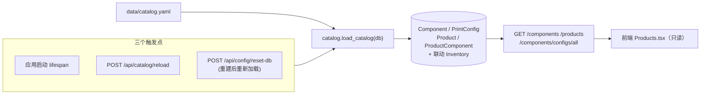
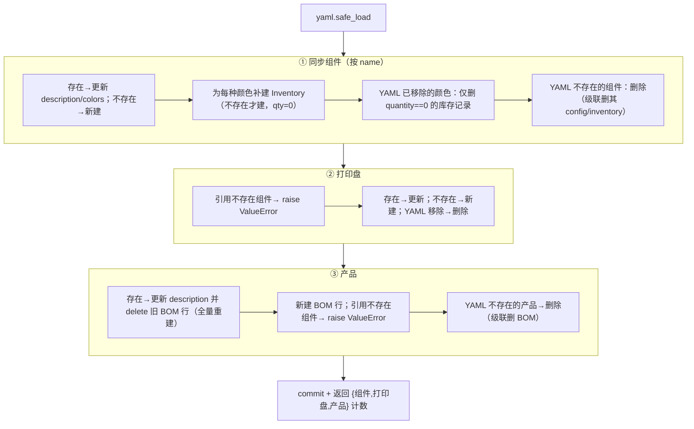
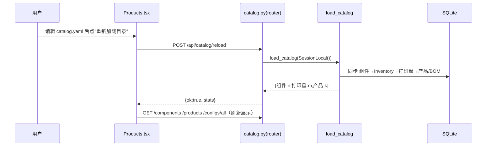

# 产品目录加载（Catalog）

> Last updated: 2026-06-14 01:38:46 (UTC+8)
> Serves: 产品目录管理（specs.md 第 1、3 节）、目录只读展示与重新加载
>
> 业务规格见 [docs/specs.md](../specs.md) §3（数据模型）、§8.2（目录页）。
>
> **写源 vs 读源**：本文档描述的 `load_catalog(db)` 是**读源**（YAML → DB 镜像）。`data/catalog.yaml` 的**写源**有两个：① 用户手工编辑（原始路径，prd-000）；② **prd-005 产品录入工具**通过 `POST /api/intake/merge` 自动追加（备份 + append + 回滚 + 立即调用 `load_catalog`），详见 [design-intake.md](design-intake.md)。两个写源都通过同一个 `load_catalog` 入 DB，保证语义一致。

## Overview

`data/catalog.yaml` 是产品目录（组件、打印盘配置、产品 BOM）的**唯一数据源**。数据库中的 `Component`/`PrintConfig`/`Product`/`ProductComponent` 表只是 YAML 的运行时镜像。本组件负责把 YAML 解析并**差量同步**到 DB，并联动维护库存记录。网页对目录只读，用户通过编辑 YAML + 点「重新加载目录」维护（**或**通过 prd-005 「产品录入」页自动 append + reload，详见 design-intake.md）。

实现文件：
- `backend/app/services/catalog.py` — `load_catalog(db)`，加载与同步逻辑。
- `backend/app/routers/catalog.py` — 只读查询端点 + `POST /api/catalog/reload`。
- `data/catalog.yaml`（运行时）/ `data/catalog.yaml.example`（示例模板）。

## Goals & Non-Goals

**Goals**
- YAML 为单一事实源，DB 可随时从 YAML 完全重建。
- 同步**幂等**：重复加载结果一致。
- 安全删除：YAML 中移除的项从 DB 删除，但**不误删有库存的颜色记录**。

**Non-Goals**
- 不做目录的网页编辑（只读）。
- 不做 YAML schema 校验/版本管理（仅在引用不存在组件时抛错）。
- 不保留目录变更历史/审计。

## System Context



## Detailed Design

### YAML 格式（中文键，与 `catalog.yaml` 一致）

```yaml
组件:
  - 名称: 转角书桌-下桌
    描述: 转角书桌-下桌          # 可选
    可选颜色: [白色, 棕色]        # 可选；缺省视为无颜色组件（用 "" 占位）

打印盘:
  - 盘号: 转角书桌-1号盘          # 唯一标识（plate_name）
    组件: 转角书桌-下桌           # 按名称引用组件，必须已存在
    数量: 2                       # 每盘产出 → PrintConfig.quantity
    耗时分钟: 200                 # → PrintConfig.duration_minutes

产品:
  - 名称: 转角书桌-配色1-纯白
    描述: ...                     # 可选
    BOM:
      - 组件: 转角书桌-下桌
        颜色: 白色                # → ProductComponent.color（缺省 ""）
        数量: 1
      - 组件: 转角书桌-固定件
        颜色: 任意颜色            # 颜色是自由字符串，需与库存/BOM 口径一致
        数量: 1
```

### 字段映射

| YAML | DB 字段 | 备注 |
|---|---|---|
| 组件.名称 | `Component.name` | **匹配键**（按 name 查找/去重） |
| 组件.描述 | `Component.description` | 默认 `""` |
| 组件.可选颜色 | `Component.colors`（JSON list） | 驱动库存记录的颜色集合 |
| 打印盘.盘号 | `PrintConfig.plate_name` | **匹配键** |
| 打印盘.组件 | `PrintConfig.component_id` | 按组件名解析为 id |
| 打印盘.数量 | `PrintConfig.quantity` | 每盘产出 |
| 打印盘.耗时分钟 | `PrintConfig.duration_minutes` | |
| 产品.名称 | `Product.name` | **匹配键** |
| 产品.BOM[].组件/颜色/数量 | `ProductComponent.{component_id,color,quantity}` | BOM 每次加载**全量重建** |

### 同步语义（差量 upsert + 安全删除）

`load_catalog` 分三阶段，顺序固定（组件 → 打印盘 → 产品），因为后者按名称引用前者。



**关键规则**：
- **匹配键是名称/盘号**而非 id。改名等同于「删旧建新」。
- **库存联动**：组件颜色集合变化时，新增颜色补一条 qty=0 的 `Inventory`；移除颜色**仅当库存为 0** 才删（保护已有库存不被误删）。无颜色组件用 `color=""` 占位一条库存记录。
- **BOM 全量重建**：产品已存在时先 `delete` 全部 `ProductComponent` 再重建，保证与 YAML 一致（无遗留行）。
- **引用完整性**：打印盘/BOM 引用不存在的组件 → 抛 `ValueError`，`reload` 端点捕获为 `{ok:false, error}`，启动期 `lifespan` 则会让加载失败（异常上抛）。

### API / Interface Contract

| 方法 + 路径 | 响应 | 说明 |
|---|---|---|
| `GET /api/components` | `list[ComponentOut]` | 组件（含 colors） |
| `GET /api/products` | `list[ProductOut]` | 产品（含 bom_items） |
| `GET /api/components/configs/all` | `list[PrintConfigOut]` | 全部打印盘 |
| `GET /api/components/{id}/configs` | `list[PrintConfigOut]` | 某组件的打印盘 |
| `POST /api/catalog/reload` | `{ok:true, stats}` 或 `{ok:false, error}` | 重新加载（用独立 `SessionLocal()`） |

> `reload` **不抛 HTTPException**，而是返回 `{ok, error}`，前端 `Products.tsx` 据 `res.ok` 提示成功/失败。

## Data Flow



## Alternatives Considered

| 准则 | YAML 单一源 + 网页只读（现状） | 网页全 CRUD + DB 为源 | YAML 导入但 DB 可覆盖 |
|---|---|---|---|
| 维护成本（开发） | 低（无 CRUD UI） | 高 | 中 |
| 维护成本（用户） | 中（需会编辑 YAML） | 低 | 中 |
| 单一事实源清晰度 | 高 | 高 | 低（双向易冲突） |
| 适合个人作坊 | 是 | 偏重 | 易混乱 |
| **裁决** | **选用** | | |

理由：个人作坊、目录种类少（<10 产品、20~30 组件，specs §9），文本编辑 + reload 足够，省去整套目录 CRUD UI 与冲突处理。

## Cross-Cutting Concerns

- **错误处理**：引用不存在组件 → `ValueError`；reload 端点转 `{ok:false}`，启动期则中断加载。
- **性能**：加载内有较多逐条查询（每组件/盘/产品按名查、删旧 BOM）。规模极小（specs §9），无碍。
- **安全**：无鉴权；YAML 文件随容器卷可被宿主直接编辑（即设计意图）。
- **幂等性**：重复加载收敛到与 YAML 一致的状态（差量 upsert + 删除多余项）。
- **测试**：当前无 `load_catalog` 的单元测试（风险）。

## Dependencies & Integration Points

- **被依赖**：排班（`design-scheduler.md`）、订单/库存（`design-orders-inventory.md`）全部依赖目录表。
- **与库存耦合**：组件颜色集合驱动 `Inventory` 行的存在性（见同步规则）。
- **路径**：`CATALOG_PATH` 环境变量覆盖默认 `<repo>/data/catalog.yaml`（Docker 指向 `/app/data/catalog.yaml`）。
- **写源（产品录入）**：[design-intake.md](design-intake.md) 的 `POST /api/intake/merge` 是除「用户手工编辑」之外的唯一 `catalog.yaml` 写入路径。该路径在文件级别保证原子性（备份 + 失败回滚到 `catalog.yaml.bak.<timestamp>`），并在写入成功后**同进程**直接调用 `load_catalog(db)`（不绕 HTTP），让 prd-000 CUJ-1 `/products` 页面立刻可见新条目。失败回滚后 catalog.yaml 文件状态与合并前完全一致，DB 内部分一致性由 `load_catalog` 现有实现决定（见 Open Questions §2）。

## Open Questions & Risks

1. **改名即删旧建新**：按名称匹配，组件/产品改名会丢失关联（如该组件的库存若非 0 不会被删，但新名下会另建一条，造成两条记录）。无 id 稳定映射。
2. **`reset-db` 按名称恢复库存/订单**：依赖名称在 YAML 重新加载后仍存在（`config.py.reset_database`），改名会导致恢复丢失。
3. **颜色是自由字符串**：BOM 颜色（如「任意颜色」「丝绸粉」）必须与 `可选颜色`、库存口径完全一致，无枚举约束，易因错别字产生「幽灵需求键」。
4. **无 schema 校验**：缺字段（如打印盘缺「数量」）会在加载时 `KeyError`，错误信息不友好。
5. **无单元测试覆盖** `load_catalog` 的差量删除分支。
