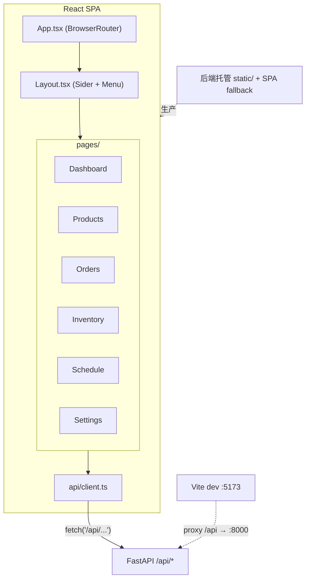
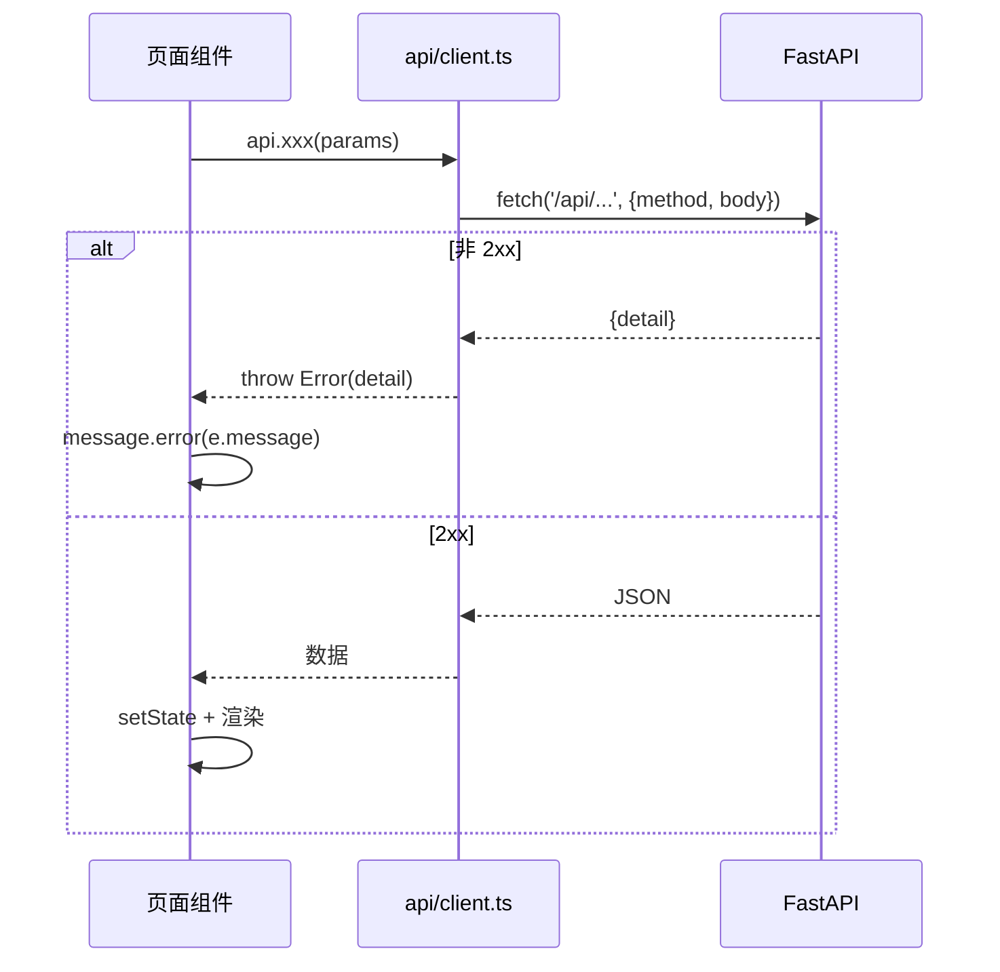

# 前端（Frontend）

> Last updated: 2026-06-13 02:11:44 (UTC+8)
> Serves: 全部界面页面（specs.md §8）
>
> 技术栈与部署见 [system.md](system.md)；各后端域见对应 `design-*.md`。

## Overview

单页应用（SPA），React 19 + TypeScript + Ant Design 6 + react-router 7 + Vite 8。中文界面，单用户。通过 `api/client.ts` 统一访问后端 `/api`。生产模式下由后端托管构建产物，开发模式下 Vite dev server 代理 `/api` 到后端。

实现目录：`frontend/src/`
- `App.tsx` — 路由表。
- `components/Layout.tsx` — 侧边栏布局 + 菜单导航。
- `api/client.ts` — fetch 封装 + 所有端点方法。
- `pages/` — 六个页面：Dashboard / Products / Orders / Inventory / Schedule / Settings。

## Goals & Non-Goals

**Goals**
- 覆盖 specs §8 的六个页面职责。
- API 调用集中在 `api/client.ts`，页面不直接 `fetch`。
- 部署友好：BrowserRouter + 后端 SPA fallback 支持深链接刷新。

**Non-Goals**
- 无状态管理库（Redux/Zustand 等）——各页面用本地 `useState` + 进入时拉取。
- 无前端类型模型——`api/client.ts` 全部用 `any`（见风险）。
- 无前端测试。

## System Context

## Detailed Design

### 路由表（`App.tsx`）

| path | 页面 | 菜单标签 | 对应 specs |
|---|---|---|---|
| `/` | Dashboard | 仪表盘 | §8.1 |
| `/products` | Products | 产品目录 | §8.2 |
| `/orders` | Orders | 订单管理 | §8.3 |
| `/inventory` | Inventory | 库存管理 | §8.4 |
| `/schedule` | Schedule | 排班中心 | §8.5 |
| `/settings` | Settings | 系统设置 | §8.6 |
| `*` | → Navigate `/` | — | 兜底重定向 |

所有路由嵌套在 `AppLayout`（`<Outlet/>`）下，左侧 `Sider` + `Menu`，`selectedKeys` 绑定 `location.pathname`。

### API client 封装（`api/client.ts`）

- `BASE = '/api'`；`request<T>(path, options)` 包装 `fetch`，自动设 `Content-Type: application/json`，非 2xx 时读取 `body.detail` 抛 `Error`。
- 导出单一 `api` 对象，方法按域分组（目录/订单/库存/打印机/配置/排班）。
- **泛型几乎都是 `any`**（`request<any[]>` / `request<any>`），无前端数据模型类型（见风险）。

### 各页面职责

| 页面 | 数据来源（api 方法） | 关键交互 | 现状要点 |
|---|---|---|---|
| **Dashboard** | `getOrders('pending')`、`getSurplus`、`getPrinters` | 三个统计卡（待处理订单/打印机数/库存预警数）+ 库存需求表 | **不含甘特图概览**（specs §8.1 规划但未实现）；库存预警 = `surplus<0` 计数 |
| **Products** | `getComponents`、`getProducts`、`getAllConfigs`、`reloadCatalog` | 「重新加载目录」按钮；产品/组件/打印盘三张只读表 | 只读，符合 specs §8.2 |
| **Orders** | `getOrders`、`getProducts`、`createOrder`、`shipOrder`、`deleteOrder` | 新建订单（多 item Modal）、pending/all 标签页、发货、删除 | 软 FIFO 列表 |
| **Inventory** | `getInventory`、`getSurplus`、`setInventory` | 行内编辑库存数量（批量保存）、展示库存/需求 | 用 `setInventory`（绝对设置）保存编辑 |
| **Schedule** | 大量（见下） | 生成排班、查看列表/甘特图、确认、执行控制、闹钟 | 系统最复杂页面 |
| **Settings** | `getPrinters`/`createPrinter`/`deletePrinter`、`getScheduleConfigs`/`upsertScheduleConfig`、`getSystemConfigs`/`upsertSystemConfig`、`resetDatabase` | 打印机增删（批量）、换版时间、按星期操作窗口编辑、重置数据库 | 操作窗口默认值在前端硬编码一份（风险） |

### Schedule 页面（重点）

`Schedule.tsx` 是最复杂的页面，承担排班生成、展示、执行控制与闹钟：

**生成参数表单**（对应 `GeneratePlanRequest`）：
- 排班日期（DatePicker，默认明天）、开始时间（TimePicker，默认 00:00）、时长（1~168h）。
- 调度策略（Radio：优先凑齐发货 / 最大化利用率 / 智能规划）。
- 富余生产开关（Switch）。
- 指定产品（多选 Select → `target_product_ids`）。
- 同步强度（Slider 0~100，默认 50）。

**视图**（Tabs，`viewMode` 状态绑定）：
- **甘特图（`renderGantt`）**：**已实现**——用原生 HTML/CSS（绝对定位色块）渲染，横轴时间（自动选刻度间隔、跨天显示日期）、纵轴打印机、任务为色块（按状态/富余着色：完成绿、取消灰、失败红、富余橙、普通蓝）。**未使用 AntV/G2**（specs/旧报告称未实现，实为已用原生 DOM 实现）。
- **列表视图（`renderList`）**：按批次卡片分组，显示「收菜时间 / 启动时间」、各打印机任务行、富余标签、状态、执行操作按钮。

**排班总结（`renderSummary`）**：本地计算各组件「当前库存 / 本次生产（含富余拆分）/ 排班后库存 / 订单需求 / 仍缺」表 + 「排班后可组装产品数」 + 「打印机利用率」条形。叠加了 earlier plans 的产出（口径见 `design-orders-inventory.md` 风险 3）。

**执行控制**（仅 confirmed 排班）：批次「开始」（`startBatch` 用当前时间）、任务「完成/取消/失败」（`completeTask` 成功后提示库存 +N）。草稿态可删除任务/批次。

**闹钟**：纯前端 `setInterval` 倒计时 + `AudioContext` 蜂鸣 + 浏览器 `Notification`，用于提醒收菜（按批次启动时间 - 换版时间计算）。

### 时间显示约定

`fmtTime` 处理 >24:00 的时间字符串（如 `33:40` → `MM-DD 09:40`），与后端 `"HH:MM"` 可跨天的存储约定配套（见 `system.md` §4.3）。

## Data Flow

页面统一模式：进入时 `useEffect` 调 `reload()` 拉数据存入 `useState`；操作后再次 `reload()`/`refreshPlan()` 刷新。无全局 store、无缓存层。

## Alternatives Considered

| 准则 | 本地 useState + 重新拉取（现状） | 引入状态管理库 | 引入数据请求库(SWR/React Query) |
|---|---|---|---|
| 实现复杂度 | 低 | 中 | 中 |
| 适合页面数/数据量 | 是（6 页、单用户） | 过度 | 偏重 |
| 缓存/失效控制 | 手动 | 手动 | 自动 |
| **裁决** | **选用** | | |

甘特图实现：

| 准则 | 原生 HTML/CSS（现状） | AntV/G2（specs 规划） |
|---|---|---|
| 依赖体积 | 0（无新增依赖） | 较大 |
| 定制自由度 | 高 | 中 |
| 实现成本 | 已完成 | 需引入 + 学习 |
| **裁决** | **选用（specs 的 G2 规划已放弃）** | |

## Cross-Cutting Concerns

- **错误处理**：`client.ts` 抛 `Error(detail)`，页面 `message.error` 提示。
- **安全**：无鉴权前端（与后端一致，`system.md` §5.3）。
- **性能**：数据量小；甘特图/总结为本地 O(任务数) 计算，无虚拟化需求。
- **可观测性**：无前端日志/监控。
- **测试**：无前端测试（`package.json` 仅 eslint，无测试框架）。
- **构建**：`tsc -b && vite build`；ESLint（含 react-hooks、react-refresh 插件）。

## Dependencies & Integration Points

- **依赖**：后端 `/api/*` 全部端点（见各组件文档的 API 表）。
- **集成**：开发期 Vite proxy（`vite.config.ts`：`/api → http://localhost:8000`）；生产期后端 SPA fallback 托管 `static/`（`system.md` §3、§7）。

## Open Questions & Risks

1. **全 `any` 无类型模型**：`api/client.ts` 与各页面用 `any`，丧失 TS 类型安全，后端 schema 变更不会在前端编译期暴露。建议从 `schemas.py` 派生前端类型或共享 OpenAPI 生成类型。
2. **操作窗口默认值前端硬编码**：`Settings.tsx` 弹窗默认 `[08:00-12:00, 12:30-18:00, 18:30-23:00]` 与后端 `scheduler.py:53` fallback 各一份，两处可能漂移（同 `system.md` §9.4）。
3. **多处魔法值/口径分散**：默认开始时间 `'08:00'`、`'00:00'`、`changeoverMin=15`、利用率配色阈值等散落在组件内，无集中常量。
4. **`renderSummary` 把排班逻辑搬到前端**：可组装数、富余拆分、利用率均在前端重算，与后端口径若演进易不一致（如富余口径，见 `design-orders-inventory.md` 风险 3）。
5. **Dashboard 弱于 specs §8.1**：无甘特图概览，仅统计卡 + 库存表。
6. **闹钟依赖页面常驻**：`setInterval`/`AudioContext` 在 Schedule 页内，切走页面或刷新会丢失闹钟。
