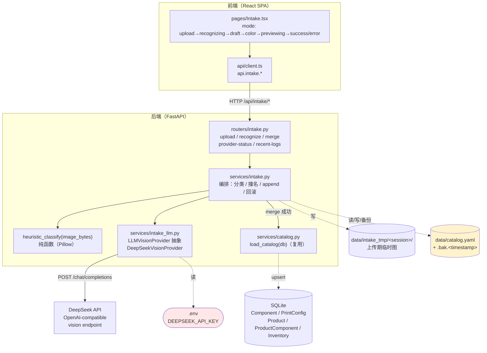
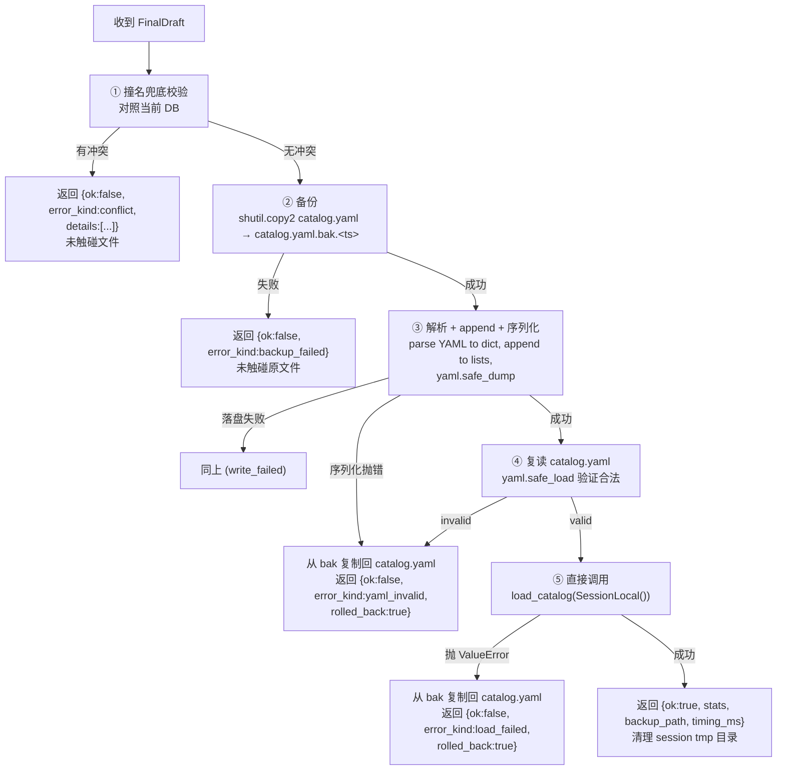
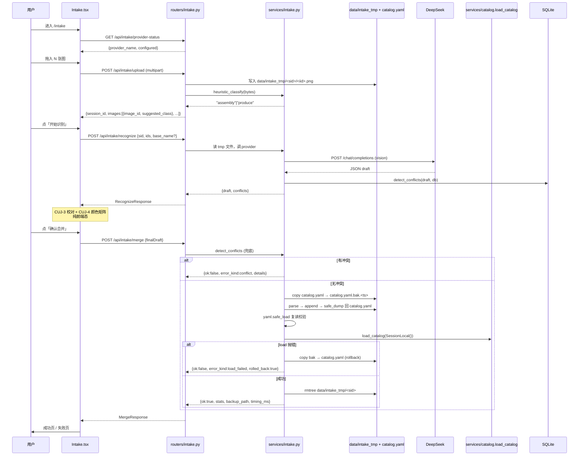

# 产品录入（Intake）

> Last updated: 2026-06-14 01:38:46 (UTC+8)
> Serves: prd-005（产品录入：截图上传 + 启发式分类 + LLM 识别 + 颜色矩阵 + 合并到 catalog.yaml）
>
> **上下游关系**：本组件是 `data/catalog.yaml` 的**写源**（write-source）。读源（read + sync 到 DB）由 [design-catalog.md](design-catalog.md) 维护。合并成功后必须直接复用 `load_catalog(db)` 链路（同进程函数调用，不走 HTTP 边界），让 prd-000 `/products` 页面立刻可见新产品。
>
> 业务规格见 [docs/prd/prd-005-intake.md](../prd/prd-005-intake.md)。所有交互细节、视觉规范、文案口径以 PRD 为权威；本文档描述**工程实现**、数据契约、关键算法、与其它组件的集成。

## Overview

`data/catalog.yaml` 是单一数据源（详见 design-catalog.md），但**手填**字段多、命名规则严、易写错。本组件把「从拓竹切片截图 → 草稿 → 合并入 catalog.yaml」的链路搬到网页：

1. 用户拖入若干截图，前端上传到后端 `/api/intake/upload`，后端用**启发式像素采样**（无 LLM）把每张图归为 `assembly`（组装图）或 `produce`（打印盘）。
2. 用户点「开始识别」，后端调用 **DeepSeek vision** 模型（OpenAI-compatible API 协议，单 provider，架构留扩展位），把多张图打成结构化 JSON：组件名、装配件数、盘号、单盘件数、耗时。
3. 用户在前端校对草稿（撞名兜底）+ 填写颜色矩阵（多配色变体）。
4. 用户点「确认合并」，后端：**备份 → append 写入 → 调用 `load_catalog(db)` → 失败回滚** 五步原子链路。

实现文件（**计划**，本轮实施前不存在）：
- 后端：
  - `backend/app/routers/intake.py` — HTTP 路由（upload / recognize / merge / provider-status / recent-logs）
  - `backend/app/services/intake.py` — 业务编排（启发式分类、撞名检测、YAML append、merge 事务）
  - `backend/app/services/intake_llm.py` — LLM provider 抽象（`LLMVisionProvider` + `DeepSeekVisionProvider`）
  - `backend/app/schemas_intake.py` — Pydantic 请求/响应 schema（独立文件避免污染 `schemas.py`）
- 前端：
  - `frontend/src/pages/Intake.tsx` — 单页五步向导（mode 状态机：`upload`→`recognizing`→`draft`→`color`→`previewing`→`success`/`error`）
  - 在 `frontend/src/api/client.ts` 内追加 `api.intake.*` 子对象
- 数据：
  - `data/intake_tmp/<session_id>/<image_id>.<ext>` — 上传期临时文件（TTL 1h，merge 成功即删）
  - `data/catalog.yaml.bak.<YYYYMMDD-HHMMSS>` — 每次合并产生的备份（**永久保留**，用户手动清理）
  - `.env` 中读 `DEEPSEEK_API_KEY`（不入 DB，详见 §7 跨切面）

## Goals & Non-Goals

**Goals（工程层面）**
- 把多步工作流封装成 5 个 HTTP 端点 + 1 个单页向导，状态机清晰、可单元测试。
- 启发式分类零 LLM token、可纯函数测试（输入 PNG bytes、输出 `"assembly"|"produce"`）。
- LLM provider 抽象：MVP 只实现 DeepSeek，但 `LLMVisionProvider` 接口允许未来加入 OpenAI/Claude/Qwen 而**不需要改路由层**。
- 合并写入 catalog.yaml 是**原子可回滚**：失败一定回到合并前的文件状态。
- 合并成功后复用现有 `load_catalog(db)` 函数调用（同进程，不绕 HTTP），保证 `/products` 立刻可见新条目。

**Non-Goals**
- 不做草稿持久化（关页面即丢；MVP 简化、重做不痛 — PRD 引言已声明）。
- 不做识别历史 / 置信度分数 / 多 provider fallback chain / 一次上传多产品 / LLM 自动推断颜色（PRD 范围明确排除）。
- 不做 LLM 调用计费/配额管理（DeepSeek 控制台自己看；本系统不重复造）。
- 不做后台 worker / 队列 / 流式响应（DeepSeek 单次请求约 20~40 秒、同步可接受，MVP 三阶段灯是体感工具非真同步）。
- 不做用户级隔离（单用户本地部署；session_id 只用于隔离临时文件，不做权限校验）。

## System Context



## Detailed Design

### 1. 端点契约（`POST /api/intake/*`）

所有路由挂在 `app/routers/intake.py` 下，无前缀（与 `catalog` router 现状一致），统一前缀 `/api/intake`。

| 方法 + 路径 | 请求 | 响应 | 说明 |
|---|---|---|---|
| `GET /api/intake/provider-status` | — | `{ provider_name: "DeepSeek", configured: bool }` | 前端进入页面时检测；`configured=false` 时整页禁用（PRD CUJ-1 cuj-1-no-api-key） |
| `POST /api/intake/upload` | `multipart/form-data`：N 张图片文件 + 可选 `session_id` form 字段 | `{ session_id, images: [{ image_id, filename, suggested_class: "assembly"|"produce", width, height }] }` | 上传时**同步**做启发式分类；不调用 LLM |
| `POST /api/intake/recognize` | `{ session_id, assembly_image_ids: [..], produce_image_ids: [..], product_base_name?: str }` | `{ ok: true, draft: {...} }` 或 `{ ok: false, error_kind, error: str, raw_response_preview?: str }` | 调用 LLM；返回值含**预先做的撞名检测**（避免前端多一次往返） |
| `POST /api/intake/merge` | `{ draft: FinalDraft }`（前端最终态，含变体与颜色矩阵） | `{ ok: true, stats, backup_path, timing_ms }` 或 `{ ok: false, error_kind, error, rolled_back: bool, backup_path?: str }` | 备份 → append → load_catalog → 失败回滚 |
| `GET /api/intake/recent-logs?lines=100` | query `lines` | `{ logs: str }` | 失败页「查看后端日志」按钮（MVP 读 stdout 最近 N 行；详见 §6） |

**为何不引入 `POST /api/intake/classify`** — 启发式分类是 ~ms 级、零成本，做在 upload 端点的请求内（同步返回 `suggested_class`），省一次往返。

**为何不单独 `POST /api/intake/check-conflicts`** — 撞名检测必须在 recognize 后做（需要草稿组件名/盘号），把它内嵌在 recognize 响应里同样省一次往返。**merge 端点服务端再做一次撞名兜底**（防御纵深）。

### 2. 数据契约（Pydantic schemas）

完整定义在 `backend/app/schemas_intake.py`：

```python
# ---------- Upload ----------

class UploadedImage(BaseModel):
    image_id: str                          # uuid4 hex
    filename: str
    suggested_class: Literal["assembly", "produce"]
    width: int
    height: int

class UploadResponse(BaseModel):
    session_id: str                        # 同样是 uuid4 hex；若客户端没传则后端生成
    images: list[UploadedImage]

# ---------- Recognize ----------

class RecognizeRequest(BaseModel):
    session_id: str
    assembly_image_ids: list[str]
    produce_image_ids: list[str]
    product_base_name: Optional[str] = None  # 用户在 CUJ-1 顶部输入框可留空；LLM 推断

class DraftComponent(BaseModel):
    name: str                              # 形如 "床头柜-侧板"，已含产品基名前缀
    assembly_quantity: int                 # 装配件数（每套产品所需）

class DraftPlate(BaseModel):
    plate_name: str                        # 形如 "床头柜-侧板-2"，默认按命名约定生成
    component_name: str                    # 必须出现在 components 列表
    quantity_per_plate: int                # 单盘件数
    duration_minutes: int                  # 由 "2h43m"/"17m45s" 解析后的整数分钟
    source_image_id: str                   # 用于「原图复核」drawer 反查

class Conflict(BaseModel):
    kind: Literal["component", "plate", "product"]
    name: str                              # 草稿里冲突的名字
    existing_name: str                     # 与之冲突的现有 catalog 条目名

class Draft(BaseModel):
    product_base_name: str                 # LLM 推断或用户预填
    components: list[DraftComponent]
    plates: list[DraftPlate]

class RecognizeResponse(BaseModel):
    ok: bool
    draft: Optional[Draft] = None
    conflicts: list[Conflict] = []         # 预先兜底，前端 CUJ-3 顶部 alert 直接用
    error_kind: Optional[Literal[
        "no_api_key", "http_401", "http_5xx", "timeout",
        "parse_failed", "schema_invalid", "image_too_large"
    ]] = None
    error: Optional[str] = None
    raw_response_preview: Optional[str] = None  # parse_failed 时附最多 200 字符的原始响应

# ---------- Merge ----------

class ColorCell(BaseModel):
    component_name: str                    # 必须出现在 components
    color: str                             # 中文字符串，非空（CUJ-4 要求所有 cell 填齐）

class Variant(BaseModel):
    variant_name: str                      # "床头柜 - 灰白"
    color_cells: list[ColorCell]           # 长度 == len(components)

class FinalDraft(BaseModel):
    product_base_name: str
    components: list[DraftComponent]
    plates: list[DraftPlate]
    variants: list[Variant]                # 长度 >= 1

class MergeStats(BaseModel):
    新增组件: int
    新增打印盘: int
    新增产品变体: int

class MergeResponse(BaseModel):
    ok: bool
    stats: Optional[MergeStats] = None
    backup_path: Optional[str] = None
    timing_ms: Optional[dict[str, int]] = None  # {"写入": 12, "重新加载": 130}
    error_kind: Optional[Literal[
        "conflict", "backup_failed", "write_failed",
        "yaml_invalid", "load_failed"
    ]] = None
    error: Optional[str] = None
    rolled_back: bool = False              # 写入或 reload 失败时是否成功从 bak 恢复
    details: Optional[list[Conflict]] = None  # error_kind == "conflict" 时
```

### 3. 启发式分类器（`heuristic_classify`）

**目标**：从切片软件截图判定是「打印盘 produce」还是「组装图 assembly」，不调用 LLM。

**观察**（基于 `data/intake/床头柜/` 真实样本）：
- **打印盘 produce**：截图右上角约 25% × 30% 的区域有一个**深色信息面板**（拓竹切片软件的耗材/总时间面板，整体偏黑，含「打印用时」「模型打印时间」等行）。
- **组装图 assembly**：仅显示建模平台（暗灰）与产品本体，**无右上角面板**。截图右上区域是中性灰（平台底图 + 透明 UI），整体均值亮度高于 produce 的面板区。

**算法**（`backend/app/services/intake.py::heuristic_classify(image_bytes: bytes) -> Literal["assembly", "produce"]`）：

```python
from PIL import Image
import io

PRODUCE_PANEL_LUMINANCE_THRESHOLD = 80   # 经验值，详见下方 calibration
PRODUCE_PANEL_REGION = (0.72, 0.02, 0.98, 0.30)  # (x1, y1, x2, y2) 比例

def heuristic_classify(image_bytes: bytes) -> str:
    img = Image.open(io.BytesIO(image_bytes)).convert("L")  # 灰度
    w, h = img.size
    x1, y1, x2, y2 = PRODUCE_PANEL_REGION
    crop = img.crop((int(w * x1), int(h * y1), int(w * x2), int(h * y2)))
    # PIL 灰度的均值即等效 luminance（0=黑 / 255=白）
    mean = sum(crop.getdata()) / max(1, len(crop.getdata()))
    return "produce" if mean < PRODUCE_PANEL_LUMINANCE_THRESHOLD else "assembly"
```

**阈值校准**：`80` 是基于现有 `data/intake/床头柜/produce/*.png`（面板区域均值 ~45）与 `assembly/assembly.png`（同区域均值 ~180）的中位区间取值。`heuristic_classify` 是纯函数，单测时把真实样本作为 fixture 入仓。

**失败模式（PRD CUJ-1 用户可手动调类，下面是为开发者列示）**：
- 用户截图被裁剪过（右侧 panel 不在 25% 范围内）→ 误判 produce 为 assembly；用户拖一下纠正。
- 拓竹切片软件未来改主题（白色面板）→ 启发式失效，但 panel 内仍有文字，可在二期改成「右上区域**色块差异度**而非绝对亮度」。
- 非拓竹截图（用户拖入 iPhone 截图、随手照片）→ 大概率归为 assembly（panel 区域颜色随机）；用户手动纠正或删除即可。
- 兜底：**永远允许用户手动从一栏拖到另一栏**（PRD CUJ-1 Step 4），启发式失败不阻塞流程。

### 4. LLM Provider 抽象

#### 接口定义（`backend/app/services/intake_llm.py`）

```python
from abc import ABC, abstractmethod
from dataclasses import dataclass

@dataclass
class RecognizeInput:
    product_base_name: Optional[str]
    assembly_images: list[bytes]    # 已读到内存的 PNG/JPG bytes
    produce_images: list[bytes]

@dataclass
class LLMRawDraft:
    """LLM 返回的结构化草稿。后端 service 层再做校验 / 撞名 / 默认名生成。"""
    product_base_name: str
    components: list[dict]       # [{"name": "侧板", "assembly_quantity": 2}, ...]
    plates: list[dict]           # [{"component_name": "侧板", "quantity_per_plate": 9,
                                  #   "duration_minutes": 163, "source_index": 0}, ...]

class LLMVisionProvider(ABC):
    name: str  # "DeepSeek" / "OpenAI" / ...

    @abstractmethod
    def is_configured(self) -> bool:
        """检查 API key 等配置是否就绪。"""

    @abstractmethod
    def recognize(self, payload: RecognizeInput, timeout_seconds: int = 120) -> LLMRawDraft:
        """单次 LLM 调用：所有图一次性提交，返回结构化草稿。
        失败时抛 LLMProviderError(error_kind, message, raw_preview)。"""

class LLMProviderError(Exception):
    def __init__(self, error_kind: str, message: str, raw_preview: str | None = None):
        self.error_kind = error_kind
        self.message = message
        self.raw_preview = raw_preview
        super().__init__(message)
```

#### DeepSeek 实现（`DeepSeekVisionProvider`）

- 配置：`os.environ["DEEPSEEK_API_KEY"]`、可选 `DEEPSEEK_BASE_URL`（默认 `https://api.deepseek.com`）、可选 `DEEPSEEK_VISION_MODEL`（默认 `deepseek-vl2-chat` 或 `deepseek-vl-7b-chat`，取实际可用模型 — **见 §11 Open Questions §1**）。
- 调用：`POST {base}/chat/completions`，OpenAI-compatible 协议，body：
  ```json
  {
    "model": "<vision_model>",
    "messages": [
      {
        "role": "system",
        "content": "你是一个解析拓竹切片软件截图的工具，严格按 JSON schema 输出。"
      },
      {
        "role": "user",
        "content": [
          {"type": "text", "text": "<下方 prompt §5>"},
          {"type": "image_url", "image_url": {"url": "data:image/png;base64,<...>"}},
          {"type": "image_url", "image_url": {"url": "data:image/png;base64,<...>"}}
        ]
      }
    ],
    "response_format": {"type": "json_object"},
    "max_tokens": 4096,
    "temperature": 0.1
  }
  ```
- 单次请求所有图（assembly + produce）一起送，**MVP 不做 per-image batch**（更简单、原子、避免部分失败的合并难题）。后续若个别 LLM 提供商有图数量上限可在子类内做分批 + 合并。
- 超时：`timeout=120s`（HTTPX/requests 层级超时；前端 `AbortController` 设 90s 早于服务端超时，让用户取消能立刻退回）。
- 重试：**不做**（DeepSeek 一次请求是 token 计费，自动重试可能让用户多花一份 token；用户点「重试」按钮显式触发即可）。
- 错误映射（异常 → `LLMProviderError.error_kind`）：

  | 触发条件 | error_kind | 用户可见文案 |
  |---|---|---|
  | `is_configured() == False` | `no_api_key` | 「未检测到 LLM 提供商 API key」 |
  | HTTP 401/403 | `http_401` | 「HTTP 401 Unauthorized — DeepSeek 拒绝请求，可能是 API key 无效或已用尽额度」 |
  | HTTP 5xx | `http_5xx` | 「HTTP 5xx — DeepSeek 服务暂时不可用，请稍后重试」 |
  | `requests.Timeout` / 网络超时 | `timeout` | 「连接超时 — 90 秒未收到响应，请检查网络」 |
  | JSON 解析失败 | `parse_failed` | 「响应解析失败 — 返回内容不是预期的 JSON 结构」+ raw_preview |
  | Pydantic schema 校验失败 | `schema_invalid` | 「响应格式校验失败」+ raw_preview |
  | DeepSeek 拒绝大图 | `image_too_large` | 「图片过大 — 单张图超过 LLM 接受的最大尺寸」 |

#### Provider 工厂与未来扩展

```python
# services/intake_llm.py

_REGISTERED: list[type[LLMVisionProvider]] = [DeepSeekVisionProvider]

def get_active_provider() -> LLMVisionProvider | None:
    """按注册顺序取第一个 is_configured() == True 的 provider。
    MVP 只有 DeepSeek。未来加新 provider 时把类追加到 _REGISTERED 即可。
    多 provider 同时配置时取**第一个**（MVP 不实现 fallback chain）。"""
    for cls in _REGISTERED:
        inst = cls()
        if inst.is_configured():
            return inst
    return None
```

未来加 OpenAI / Claude / Qwen 的步骤：
1. 在 `intake_llm.py` 加 `class OpenAIVisionProvider(LLMVisionProvider): ...`。
2. 实现 `is_configured()`（读对应 env 变量如 `OPENAI_API_KEY`）+ `recognize()`。
3. 把类追加到 `_REGISTERED`。
4. 无需改 router、无需改 `services/intake.py`。

### 5. LLM Prompt 与输出 schema

**Prompt 文本**（中文，硬编码在 `DeepSeekVisionProvider` 里、随产品迭代仅调一处，后续若多 provider 同 prompt 可上移到模块常量）：

```
你是一个解析「拓竹切片软件」截图的工具。我会给你两类图片：

1. 组装图（assembly）：俯视 / 侧视 / 45° 等多张产品装配示意，每张图展示同一产品的多个组件位置与数量。
2. 打印盘截图（produce）：拓竹切片软件每个打印盘的预览，每张图主体是建模平台上摆放的某种组件，右上角小面板写有「打印用时」、「耗材」等信息。

任务：

A. 给出产品基名（如「床头柜」），如下方用户已提供请用用户提供的。
B. 从组装图推断每种组件的「装配件数」（每套产品所需的数量）。组件名简短，如「侧板」「抽屉」「隔板大」「把手」。**不要**带产品基名前缀，我会自己拼。
C. 对每张打印盘截图：识别「单盘件数」（建模平台上该组件的件数）+ 「打印时间」（右上角面板中「打印用时」字段，常见格式 2h43m / 17m45s，输出为整数分钟）+ 关联到组件列表中的某一项（按视觉相似度判断）。**不要**读拓竹切片软件 UI 上的盘号「01/02/03」，盘号系统会按命名约定生成。
D. **不要**推断颜色（截图里的灰色是切片软件默认色）。

约束：
- 严格输出 JSON，**不要**带 markdown 包裹 / 解释文字。
- 字段全部中文 key 或如下 schema 指定的英文 key（保持一致）。
- 若某张图无法识别，对应字段填 null 而不是省略。

输入：
- 用户提供的产品基名：<product_base_name 或「（未提供，请你推断）」>
- assembly 截图：<N 张，按上传顺序的 index 0..N-1>
- produce 截图：<M 张，按上传顺序的 index 0..M-1>

输出 JSON schema：
{
  "product_base_name": "床头柜",
  "components": [
    {"name": "侧板", "assembly_quantity": 2},
    {"name": "抽屉", "assembly_quantity": 4},
    ...
  ],
  "plates": [
    {
      "source_index": 0,                  // 对应 produce 截图的 index
      "component_name": "侧板",            // 必须出现在 components[].name
      "quantity_per_plate": 9,
      "duration_minutes": 163
    },
    ...
  ]
}
```

**`response_format: {"type": "json_object"}`** — DeepSeek 与 OpenAI 兼容协议支持该参数，模型会保证输出可解析 JSON（无 markdown 包裹）。即便如此后端仍兜底剥 ```json``` 包裹 + try-load。

**后端校验**：拿到 `LLMRawDraft` 后做：
1. JSON 反序列化 → Pydantic 校验（结构错误 → `parse_failed` / `schema_invalid`）。
2. `plates[].component_name` 必须出现在 `components[].name`，否则丢回 LLM 不是好策略；MVP 直接把该 plate 的 `component_name` 设为 `""`，让用户在 CUJ-3 校对页用「所属组件」下拉重新选。
3. 把 `LLMRawDraft` 转成 `Draft`：
   - `components[].name` 前缀拼接 `<product_base_name>-<name>`。
   - `plates[].plate_name` 默认生成 `<product_base_name>-<component_name>-<quantity_per_plate>`。
   - `plates[].source_image_id` = `produce_image_ids[source_index]`（前端反查原图用）。

### 6. 启发式分类与文件管理

#### 临时文件目录

```
data/intake_tmp/
└── <session_id>/             # uuid4 hex
    ├── <image_id>.png        # 上传时按 mime type 决定扩展名
    ├── <image_id>.png
    └── _meta.json            # {image_id: {filename, suggested_class}}（可选：MVP 可不落地，靠 client 持有 metadata）
```

- **session_id 生成**：客户端首次 upload 不带 session_id，后端生成 uuid4 hex 返回；后续追加上传带上同一 session_id 复用目录。
- **清理策略**：
  - `merge` 成功 → 删除该 session 目录。
  - **TTL**：进程内**惰性清理** — 每次有新 upload 请求时扫描 `data/intake_tmp/`，删除 `mtime > 1 小时`的目录（cheap、无需 cron）。MVP 不实现独立 background sweeper。
  - 进程重启后 tmp 目录仍存活，下次 upload 时被 TTL 扫描清掉。
- **磁盘占用**：单 session 通常 ~10 张图 × ~500KB = 5MB；TTL 1 小时后清掉。即便堆积上限可控。

#### `/api/intake/recent-logs` 实现

简单：进程启动时把 stdout 双路写一份到环形缓冲（`collections.deque(maxlen=500)`），端点直接 join。**不**做磁盘日志文件（避免引入新的运维概念）。前端 Modal 用 `<textarea readonly>` 等宽字体展示。

### 7. 合并端点（`POST /api/intake/merge`）— 关键事务

这是本组件唯一**写**操作，需保证「失败必回滚」。流程：



#### YAML append 实现

**决策**：**parse → 修改 dict → re-dump**，**不**做文本 append。

```python
import yaml

def append_to_catalog(catalog_path: Path, new_components, new_plates, new_products) -> None:
    with open(catalog_path, "r", encoding="utf-8") as f:
        data = yaml.safe_load(f) or {}
    data.setdefault("组件", []).extend(new_components)
    data.setdefault("打印盘", []).extend(new_plates)
    data.setdefault("产品", []).extend(new_products)
    with open(catalog_path, "w", encoding="utf-8") as f:
        yaml.safe_dump(
            data, f,
            allow_unicode=True,        # 保留中文
            sort_keys=False,           # 保留键顺序
            default_flow_style=False,  # 块状（多行）而非内联
            width=4096,                # 不要主动折行
        )
```

**对比文本 append 的取舍**：

| 准则 | parse → re-dump（**选用**） | text append |
|---|---|---|
| 文件结构正确性（确保 YAML 合法） | 高（PyYAML 兜底） | 中（手拼字符串易错） |
| 保留用户的注释 | **顶层注释保留，块间/行间注释会丢** | 全部保留 |
| 保留用户的空行 / 缩进风格 | 不保留（PyYAML 重新排版） | 完全保留 |
| 与 prd-000 doctrine 兼容 | 兼容（YAML 仍是单一源） | 兼容 |
| 实现复杂度 | 低 | 中 |
| **裁决** | **选用** | |

**理由**：`catalog.yaml` 是数据文件不是文档文件；用户偶发的注释在 prd-000 范围内本就无承诺保留；而格式合法性必须严格保证（否则下次 `load_catalog` 启动期失败、用户被迫手改）。

**用户告知**：在 PRD CUJ-5 「合并摘要」下方的灰底说明条已隐含「会改写整文件」的语义（「合并前会自动备份」）。如果合并后用户开 catalog.yaml 发现格式被重排，**bak 文件可恢复**。

#### 撞名检测

```python
def detect_conflicts(db: Session, draft: FinalDraft) -> list[Conflict]:
    existing_components = {c.name for c in db.query(Component).all()}
    existing_plates = {p.plate_name for p in db.query(PrintConfig).all()}
    existing_products = {p.name for p in db.query(Product).all()}
    conflicts = []
    for c in draft.components:
        if c.name in existing_components:
            conflicts.append(Conflict(kind="component", name=c.name, existing_name=c.name))
    for p in draft.plates:
        if p.plate_name in existing_plates:
            conflicts.append(Conflict(kind="plate", name=p.plate_name, existing_name=p.plate_name))
    for v in draft.variants:
        if v.variant_name in existing_products:
            conflicts.append(Conflict(kind="product", name=v.variant_name, existing_name=v.variant_name))
    return conflicts
```

被 `recognize`（预览撞名）与 `merge`（兜底校验）两处复用。

#### 直接调用 `load_catalog(db)` 而非 HTTP `/catalog/reload`

```python
# services/intake.py 的 merge 函数末尾
from .catalog import load_catalog
from ..database import SessionLocal

with SessionLocal() as sub_db:
    stats = load_catalog(sub_db)
```

理由：①  避免一次 HTTP 往返；② 在同一事务边界内捕获 `ValueError`（引用不存在组件 等）；③ prd-000 CUJ-2 已论证 `load_catalog` 是幂等的差量同步。

#### 备份文件命名与生命周期

- 命名：`data/catalog.yaml.bak.<YYYYMMDD-HHMMSS>` — 词典序排序即时间序，便于 `ls -1` 查阅最旧/最新。
- **保留策略：永久保留**（用户手动 `rm`）。理由：单文件 < 50KB，年增 < 100 次，磁盘占用忽略不计；保留全历史是无成本的审计兜底。
- 失败回滚 = `shutil.copy2(bak_path, catalog_path)`，**不删 bak**（保留作回滚证据）。

### 8. 颜色矩阵 → catalog.yaml 展开映射

CUJ-4 的 N 行 × M 列矩阵（组件 × 变体）按以下规则展开到 catalog.yaml：

#### 组件级（`组件:`）— N 行

每个**草稿组件**对应一条 `组件:` 条目；`可选颜色` = 该组件在所有变体（所有列）中出现过的色名 dedupe + 排序（稳定 set order）。

```yaml
组件:
  - 名称: 床头柜-侧板
    描述: 床头柜-侧板          # 默认 = name；用户未来若想改可手编 YAML
    可选颜色: [灰白, 黑色, 粉色]  # union of all variants' colors for this component
```

#### 打印盘级（`打印盘:`）— P 行

每个**草稿打印盘**对应一条 `打印盘:` 条目；与变体/颜色完全无关（盘是按件数维度产出的中性件，颜色在「装入打印机时」由用户根据排班决定，与现有 catalog 一致）。

```yaml
打印盘:
  - 盘号: 床头柜-侧板-2
    组件: 床头柜-侧板
    数量: 2
    耗时分钟: 163
```

#### 产品级（`产品:`）— M 行（每个变体一条）

每个**变体**对应一条 `产品:` 条目；BOM 行数 = `len(components)`，每行 `颜色` 字段 = 该变体在该组件 cell 的颜色值。

```yaml
产品:
  - 名称: 床头柜 - 灰白
    描述: 床头柜 - 灰白
    BOM:
      - 组件: 床头柜-侧板
        颜色: 灰白
        数量: 2
      - 组件: 床头柜-抽屉
        颜色: 灰白
        数量: 4
      - ...
  - 名称: 床头柜 - 黑粉
    BOM:
      - 组件: 床头柜-侧板
        颜色: 黑色
        数量: 2
      - 组件: 床头柜-抽屉
        颜色: 粉色
        数量: 4
      - ...
```

**关键不变量**（实现 + 测试）：
1. ∀ 变体 v，∀ 组件 c：`v.BOM[c].颜色` ∈ catalog `组件[c].可选颜色`（聚合一致性）。
2. ∀ 打印盘 p：`p.组件` ∈ catalog `组件[*].名称`（外键完整性，否则 `load_catalog` 抛 `ValueError`）。
3. ∀ 变体 v：`len(v.BOM) == len(components)`（每个组件每变体都有一行，CUJ-4 「所有 cell 填齐」AC 保证）。

### 9. 前端架构（`pages/Intake.tsx`）

#### 状态机

单页 + 内部 `mode` 状态，URL 始终 `/intake`：

```typescript
type IntakeMode =
  | { kind: "upload" }
  | { kind: "recognizing"; abortController: AbortController }
  | { kind: "draft"; draft: Draft; conflicts: Conflict[] }
  | { kind: "color"; draft: Draft }            // 含 user-edited variants
  | { kind: "previewing"; finalDraft: FinalDraft }
  | { kind: "merging" }
  | { kind: "success"; stats: MergeStats; backupPath: string }
  | { kind: "error"; errorKind: string; error: string };
```

**对比多路由方案的取舍**：

| 准则 | 单页 + mode（**选用**） | 多路由 `/intake/upload`, `/intake/draft` |
|---|---|---|
| 共享前端态（草稿） | 自然（同一组件 useState） | 需要 context / store |
| URL bookmark 价值 | 无需（草稿无持久化） | 有但用户场景不重要 |
| 实现复杂度 | 低 | 中 |
| 与现有页面风格一致 | 一致（其它页全是单页） | 不一致 |
| **裁决** | **选用** | |

#### 路由与菜单

`App.tsx` 添加：
```tsx
import Intake from './pages/Intake';
// ...
<Route path="/intake" element={<Intake />} />
```

`components/Layout.tsx` 的 `menuItems` 在 `/products` 与 `/orders` 之间插入：
```tsx
{ key: '/intake', icon: <ScanOutlined />, label: '产品录入' },
```

（PRD CUJ-1 AC：图标为 AntD `ScanOutlined`，位于「产品目录」之后第 3 位。）

#### `api/client.ts` 扩展

```typescript
api.intake = {
  providerStatus: () => request<{provider_name: string; configured: boolean}>('/intake/provider-status'),
  upload: (files: File[], sessionId?: string) => {
    const fd = new FormData();
    files.forEach(f => fd.append('files', f));
    if (sessionId) fd.append('session_id', sessionId);
    return fetch(`${BASE}/intake/upload`, { method: 'POST', body: fd }).then(r => r.json());
  },
  recognize: (body: RecognizeRequest, signal?: AbortSignal) =>
    request<RecognizeResponse>('/intake/recognize', { method: 'POST', body: JSON.stringify(body), signal }),
  merge: (body: { draft: FinalDraft }) =>
    request<MergeResponse>('/intake/merge', { method: 'POST', body: JSON.stringify(body) }),
  recentLogs: (lines = 100) => request<{logs: string}>(`/intake/recent-logs?lines=${lines}`),
};
```

注意 `request<T>` 现有实现自动加 `Content-Type: application/json`，对于 `upload` 的 multipart **不能用** `request`，直接 `fetch`。

## Data Flow



## Alternatives Considered

### 启发式分类的备选

| 准则 | 像素均值阈值（**选用**） | OCR 检测「打印用时」关键字 | 训练小 CNN 二分类 | 用户手动归类 |
|---|---|---|---|---|
| 实现复杂度 | 低（10 行 Pillow） | 中（引入 OCR 引擎） | 高（数据集 + 训练） | 零（无后端） |
| 性能 | ~10ms/图 | ~200ms/图 | ~50ms/图 | — |
| 准确率（默认主题） | 100% on 现有样本 | ~99% | 未测 | — |
| 切片软件主题变更鲁棒性 | 低（白色面板会失效） | 高（关键字不变） | 中（取决于训练集） | 100% |
| 用户负担 | 低（可手动纠正） | 同 | 同 | **高**（每次都要拖） |
| **裁决** | **选用** + 永远开放手动纠正兜底 | | | |

### LLM provider 协议

| 准则 | OpenAI-compatible（**选用**） | DeepSeek 私有 SDK | 自己写 transport |
|---|---|---|---|
| 依赖体积 | `requests` 或现有 `httpx` 即可 | 额外 SDK | 同 OpenAI 兼容 |
| 切换 provider 成本 | 零（同协议） | 高（每家 SDK 一份） | 零 |
| 与未来 OpenAI/Claude/Qwen 兼容 | 是 | 否 | 是 |
| **裁决** | **选用** | | |

### 合并写入策略

| 准则 | parse → re-dump（**选用**） | text append（最后位置追加） | 在专用「补丁块」内 append |
|---|---|---|---|
| YAML 合法性兜底 | 强（safe_dump 保证） | 弱（手拼字符串） | 弱 |
| 保留用户注释 / 排版 | 顶层注释保留，其余丢 | 全部保留 | 大部分保留 |
| 实现复杂度 | 低 | 中 | 中 |
| 失败回滚成本 | 同（都靠 bak） | 同 | 同 |
| **裁决** | **选用** + bak 兜底 | | |

### 多图请求策略

| 准则 | 单次请求所有图（**选用**） | 每图独立请求 |
|---|---|---|
| 原子性 | 全成功或全失败 | 部分成功难处理 |
| 用户体验 | 30~40 秒一次等待 | 多次等待 |
| Token 成本 | 一次 system prompt | N 次 system prompt |
| 跨图推断能力 | 强（LLM 同时看到 assembly + produce） | 弱（无法关联） |
| 风险 | 单图大可能超 token 上限 | 单图独立处理 |
| **裁决** | **选用**，二期再做分批 | |

## Cross-Cutting Concerns

### 错误处理
- 所有路由统一返回 `{ok: bool, ...}` 结构，**不用** `HTTPException`（与 `catalog/reload` 一致）。
- LLM 错误细分 `error_kind`，前端按 kind 决定文案与 UI 分支。
- `parse_failed` 时附 `raw_response_preview` 截断至 200 字符，便于用户判断 prompt 退化。

### 安全
- 单用户本地部署，无鉴权（与 `system.md` §5.3 一致）。
- `DEEPSEEK_API_KEY` 只读 `.env`，不入 DB、不出现在任何 HTTP 响应（`/provider-status` 只返回 `configured: bool`）。
- 文件上传：仅接受 `image/png`、`image/jpeg`、`image/webp` MIME；前端文件类型校验 + 后端 `magic bytes` 二次校验。
- 上传单文件硬上限：**10MB**（防止意外大文件占满磁盘 / DeepSeek 拒绝）；超限返回 400。
- Session id 是 uuid4，无横向越权风险（单用户场景；即便有也只是看到自己未清理的 tmp 文件）。

### 性能
- 启发式分类：~10ms/图（Pillow 灰度均值，常数级）。
- LLM 调用：20~40 秒/次（外部 API，不可控）。前端 90 秒 abort，后端 120 秒 timeout（让前端先 abort）。
- merge 链路：①  撞名校验 (~5ms DB query) + ② 备份 copy (~5ms 文件 IO) + ③ append (~10ms) + ④ load_catalog (~130ms 目录全量同步，依规模而定)。总计 < 500ms。
- 磁盘 tmp：每 session ~5MB，TTL 1 小时；上限可控。

### 可观测性
- `print()` 流到 stdout（与现有代码风格一致），关键事件：upload 张数、recognize 耗时、merge 各阶段耗时、错误堆栈。
- `/api/intake/recent-logs` 暴露最近 500 行 stdout（环形缓冲 deque）供失败页 Modal 用。

### 测试策略

#### 纯函数单测（`backend/tests/test_intake.py`，新建）

| 测试类 | 覆盖目标 |
|---|---|
| `TestHeuristicClassifier` | 用 `data/intake/床头柜/{assembly,produce}/*.png` 作 fixture，断言分类正确；用合成的「全白图」「全黑图」断言边界 |
| `TestPromptResponseParsing` | 用伪造的 LLM 响应（标准 JSON / markdown 包裹 JSON / 缺字段 / 非法 component_name 引用），断言 service 层的解析 + 默认名生成 + 错误映射 |
| `TestDetectConflicts` | 用内存 DB（SQLAlchemy in-memory SQLite）建几个 Component/PrintConfig/Product，喂入草稿断言冲突项 |
| `TestAppendToCatalog` | 用 tmpdir 准备一个 catalog.yaml fixture，调 `append_to_catalog`，断言 round-trip 后 `yaml.safe_load` 仍合法且包含新增条目 |
| `TestMergeRollback` | 把 `load_catalog` mock 成抛 `ValueError`，调 merge 端点，断言 catalog.yaml 内容与备份一致（bak 文件存在） |
| `TestColorMatrixExpansion` | 给 finalDraft 3 变体 × 6 组件，断言生成的 `组件.可选颜色` = union、`产品.BOM` = N 条 × M 变体 |

#### 集成测（FastAPI `TestClient`）

| 端点 | 用例 |
|---|---|
| `/api/intake/provider-status` | 设置/不设置 `DEEPSEEK_API_KEY`，断言 `configured` 值 |
| `/api/intake/upload` | 上传 1 张真实样本图，断言 suggested_class 正确，断言 tmp 文件落地 |
| `/api/intake/recognize` | mock `DeepSeekVisionProvider.recognize` 返回预设 LLMRawDraft，断言响应里的 draft 字段命名/前缀正确 |
| `/api/intake/merge` | end-to-end：准备 fixture catalog.yaml + in-memory DB + 预设 finalDraft，断言 ok=true + 成功后 DB 有新 Component 行 + bak 文件存在 |

#### Mock 边界

- 测试中**永不**调真实 DeepSeek API（无 token 消耗、无网络依赖）。
- `LLMVisionProvider` 注入 `FakeVisionProvider`：测试可以预设其 `recognize` 返回值。

### 与现有 PRD/组件的关系

- `design-catalog.md` 的 `load_catalog(db)` 是本组件的**直接下游**（同进程调用）。
- `design-orders-inventory.md` 受**间接影响**：新合并的 `Component.可选颜色` 会通过 `load_catalog` 触发新建 `Inventory(qty=0)` 行（详见 design-catalog.md 同步规则）。
- `design-frontend.md` 受**结构性影响**：新增一个 `pages/Intake.tsx` + 菜单项 + 路由表行；但不引入新依赖、不改 `api/client.ts` 结构（按域分组的现有模式）。
- `design-scheduler.md` **不受影响**：scheduler 读 DB 即可，不关心目录如何写入。

## Dependencies & Integration Points

### 新增依赖

| 包 | 用途 | 版本约束 |
|---|---|---|
| `Pillow` | 启发式分类的图像采样 | `>=10.0,<12.0` |
| `python-multipart` | FastAPI multipart 上传（**FastAPI 0.115 文件上传必装**） | `>=0.0.9` |
| `requests` 或现有 `httpx` | LLM HTTP 调用 | 复用现有；若无则 `httpx>=0.27` |

加到 `backend/requirements.txt`。

### 配置

- 必需：`.env` 文件根目录新增 `DEEPSEEK_API_KEY=sk-xxx`；提供 `.env.example` 模板。
- 可选：`DEEPSEEK_BASE_URL`（默认 `https://api.deepseek.com`）、`DEEPSEEK_VISION_MODEL`（默认值见 §11 Open Questions §1）。
- 应用读 `.env` 的方式：MVP 直接用 `os.environ.get`（不引入 `python-dotenv`），由 `docker-compose.yml` / shell 加载 `.env`（与现有 `DATABASE_URL`、`CATALOG_PATH` 一致）。

### 路径

- `data/intake_tmp/`（新建，加到 `.gitignore`）
- `data/catalog.yaml.bak.*`（新建，加到 `.gitignore` 但保留宿主机）
- `data/intake/`（**仅测试 fixture** — 真实样本 `床头柜/assembly,produce/`，已在仓中；测试用，生产忽略）

### 上游被依赖关系

- **前端**：`pages/Intake.tsx` + `api/client.ts` 内 `api.intake.*`
- **后端 router 注册**：`app/main.py` 加 `app.include_router(intake.router)`

## Open Questions & Risks

1. **DeepSeek vision 模型 ID 待确认**：实施前查 DeepSeek 控制台或 `/v1/models` 端点确认当前可用 vision 模型 ID（候选 `deepseek-vl2-chat`、`deepseek-vl-7b-chat`、`deepseek-chat`+ vision 扩展）。Env 变量 `DEEPSEEK_VISION_MODEL` 留给运行时覆盖。**实施时一锤定音、写入设计文档**。
2. **启发式阈值 80 的鲁棒性**：仅基于 `data/intake/床头柜` 现有样本；其它产品（如形状很白的玩具）的 produce 截图是否仍稳定 < 80 待 QA 验证。降级方案见 §3 「失败模式」。
3. **DeepSeek 多图请求的 token 上限**：API 文档未明示单请求图数量上限；实测过若 > 10 图可能触发 `image_too_large`。MVP 不做分批，仅在错误返回时透出原始信息。
4. **YAML re-dump 后文件 diff 较大**：用户若手工 `git diff catalog.yaml` 会看到全文件重排，无法定位本次实际增量。**缓解**：每次 merge 前的 `bak` 文件可作为 diff baseline（`diff catalog.yaml.bak.<ts> catalog.yaml`）。
5. **撞名时是否允许「合并到已有条目」**：PRD CUJ-3 Mocks 描述里有「如果你确实想合到已有条目下，可以保持同名（系统会在合并时再次确认）」字样，但 AC 与流程图均要求「改名解除冲突才可继续」。**结论**：MVP 强制要求改名后再合并；合并到已有条目是 **未来扩展**（需考虑覆盖语义、冲突 BOM 等）。
6. **「产品基名变更同步组件名前缀」的实现复杂度**：PRD CUJ-3 Step 1 要求「编辑产品基名时下方所有未被用户手改过的组件名 / 盘号前缀自动同步」。需要在前端 state 内维护「字段是否被用户手改过」的脏标记（initial value vs current value 比较）。**已记入实施**。
7. **`raw_response_preview` 的 PII / token 泄漏风险**：若 DeepSeek 返回包含 API 元信息（如用量），可能透传到前端 UI。MVP 简化：截断 200 字符直接展示（这是技术作坊主自用产品，与 PRD CUJ-2 Edge 「原始错误信息直接透出，不做用户友好包装」一致）。
8. **是否缓存 LLM 响应以支持「免费重新识别」**：MVP **不做**。session 内若重试，重新调 LLM 重新计费。理由：用户通常重试是因为想换图，缓存反而误导。
9. **是否要 ratelimit / 防滥用**：单用户本地，**不做**。
10. **bak 文件累积无清理**：MVP 接受（每年 < 100 次 × < 50KB ≈ < 5MB）；二期可加 `/api/intake/cleanup-backups?keep=20` 端点。

---

## 附录 A：与 `design-catalog.md` 的契约边界

| 责任 | design-intake.md（本文档） | design-catalog.md |
|---|---|---|
| 写入 `data/catalog.yaml` | ✅ 唯一写源 | ❌ 只读 |
| 备份与回滚 `catalog.yaml` | ✅ | ❌ |
| 触发 DB 同步 | ✅（合并末尾调用 `load_catalog`） | ✅（启动期 / `/catalog/reload`） |
| YAML 格式约定（中文键、字段） | 遵循 design-catalog.md §「YAML 格式」 | ✅ 定义 |
| 引用完整性校验（盘.组件 / BOM.组件 存在） | ✅ 合并前撞名 + 合并后 `load_catalog` 兜底 | ✅ `load_catalog` 抛 `ValueError` |
| 撞名（重名）检测 | ✅（recognize 预览 + merge 兜底） | ❌（依赖 name 匹配做删旧建新，无主动撞名报警） |

## 附录 B：实施前 Checklist

- [ ] 确认 DeepSeek vision 模型 ID（§11 §1）。
- [ ] 在 `.env.example` 加 `DEEPSEEK_API_KEY=` 行。
- [ ] 在 `.gitignore` 加 `data/intake_tmp/`、`data/catalog.yaml.bak.*`。
- [ ] `backend/requirements.txt` 加 `Pillow`、`python-multipart`、可能的 `httpx`。
- [ ] 现有 `data/intake/床头柜/{assembly,produce}/*.png` 在测试中作为 fixture 引用。
