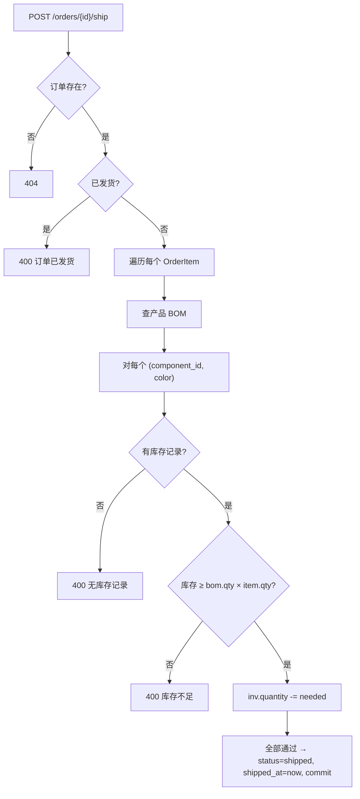
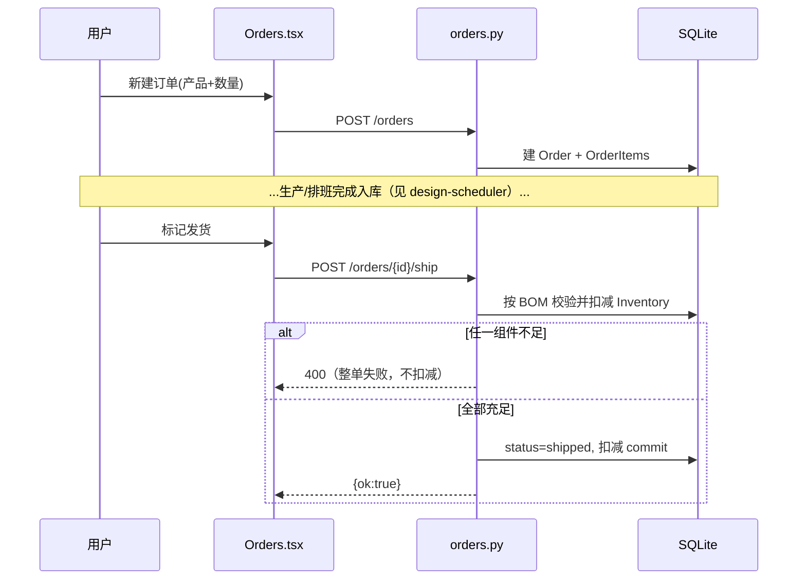

# 订单与库存（Orders & Inventory）

> Last updated: 2026-06-13 02:11:44 (UTC+8)
> Serves: 订单管理、组件库存管理、富余情况展示（specs.md 第 1、6 节，§8.3、§8.4）
>
> 业务规格见 [docs/specs.md](../specs.md)。库存与排班的入库闭环另见 [design-scheduler.md](design-scheduler.md)。

## Overview

本组件管理订单队列与组件库存（按「组件+颜色」维度），并通过 BOM 折算实现：
- **发货扣减**：订单标记已发货时，按 BOM 自动扣减各组件库存。
- **富余计算**：库存相对于待处理订单需求的盈亏（折算到组件维度）。

库存的**增加**由排班执行控制完成（任务 complete 时入库，见 `design-scheduler.md`），本组件负责**扣减、手动调整、查询、富余展示**。

实现文件：
- `backend/app/routers/orders.py` — 订单 CRUD + 发货扣减。
- `backend/app/routers/inventory.py` — 库存查询/调整/设置 + 富余计算。

## Goals & Non-Goals

**Goals**
- 软 FIFO 订单队列（按 `created_at`）。
- 发货时按 BOM 原子扣减，库存不足则整单失败（事务回滚）。
- 库存以「组件+颜色」为最小粒度。

**Non-Goals**
- 不做订单与具体产出批次的追溯绑定。
- 不做库存流水/审计日志（仅当前数量）。
- 不在本组件做排班（仅提供需求/库存数据）。

## System Context

```mermaid
flowchart LR
    FE_O["前端 Orders.tsx"] --> RO["orders.py"]
    FE_I["前端 Inventory.tsx / Dashboard.tsx"] --> RI["inventory.py"]
    RO --> Ord[("Order / OrderItem")]
    RO -->|发货扣减(按 BOM)| Inv[("Inventory")]
    RI --> Inv
    RI -->|读 BOM 算需求| Bom[("ProductComponent")]
    RI -->|读订单算需求| Ord
    Scheduler["排班完成入库<br/>(design-scheduler)"] -->|+quantity| Inv
```

## Detailed Design

### 数据模型（详见 `system.md` §4）

- `Order(created_at, status: pending|shipped, shipped_at)` 1—N `OrderItem(product_id, quantity)`。
- `Inventory(component_id, color, quantity)` —— 唯一性逻辑上是 `(component_id, color)`，由目录加载保证每组合一条（**注意：DB 层无 unique 约束，见风险**）。
- `ProductComponent(product_id, component_id, color, quantity)` —— BOM，折算依据。

### API / Interface Contract

#### 订单（`/api/orders`）

| 方法 + 路径 | 请求/响应 | 说明 |
|---|---|---|
| `GET /api/orders?status=` | `list[OrderOut]` | 按 `created_at` 升序；可按状态过滤 |
| `POST /api/orders` | `OrderCreate` → `OrderOut` | 新建订单（含多 item） |
| `GET /api/orders/{id}` | `OrderOut` | 取单 |
| `POST /api/orders/{id}/ship` | — | 标记发货 + 扣库存（见下） |
| `DELETE /api/orders/{id}` | — | 删除订单（级联删 item） |

#### 库存（`/api/inventory`）

| 方法 + 路径 | 请求/响应 | 说明 |
|---|---|---|
| `GET /api/inventory` | `list[InventoryOut]` | 全部库存行 |
| `POST /api/inventory/adjust` | `InventoryAdjust` → `InventoryOut` | 增量调整（正加负减，下限 0） |
| `PUT /api/inventory/{id}` | `InventoryAdjust` → `InventoryOut` | 直接设置数量（`max(0, qty)`） |
| `GET /api/inventory/surplus` | `list[{component_id,component_name,color,stock,demand,surplus}]` | 富余计算 |

### Logic & Behavior

#### 发货扣减（`ship_order`）



- 任一组件库存不足则**整单失败**（抛 HTTPException，事务未 commit，已扣的内存改动随 session 丢弃）。
- 扣减键是 `(bom.component_id, bom.color)`，与库存/BOM 颜色口径一致。

#### 富余计算（`get_surplus_info`）

1. 累加所有 `pending` 订单的 BOM 需求 → `component_demand[(comp_id,color)]`。
2. 读全部库存 → `inventory_map[(comp_id,color)]`。
3. 对需求键 ∪ 库存键的并集，输出 `{stock, demand, surplus = stock - demand}`。

> 该口径**仅看待处理订单需求，不含已排班产出**（与 `scheduler._get_initial_supply` 的「库存+已排班产出」不同）。前端 `Schedule.tsx` 的「排班总结」会另行叠加 earlier plans 产出做更完整的展示。

#### 手动调整两种语义

- `adjust`（增量）：`inv.quantity += data.quantity`，结果 < 0 归 0。按 `(component_id, color)` 定位。
- `set`（绝对）：`inv.quantity = max(0, data.quantity)`，按 `inventory_id` 定位（前端 Inventory.tsx 编辑用）。

## Data Flow



## Alternatives Considered

| 准则 | 发货即按 BOM 扣组件库存（现状） | 维护成品库存，发货扣成品 |
|---|---|---|
| 与生产模型一致性 | 高（生产/库存都是组件维度） | 低（需额外组装入库步骤） |
| 共享组件处理 | 自然（按组件扣） | 复杂 |
| 适合作坊 | 是（产品即时组装发货） | 过度建模 |
| **裁决** | **选用** | |

## Cross-Cutting Concerns

- **错误处理**：404/400 + 整单事务回滚（库存不足）。
- **一致性**：发货扣减在单请求事务内；失败不部分扣减。
- **安全**：无鉴权（`system.md` §5.3）。
- **性能**：每订单逐 item 查 BOM、逐组件查库存（N 次查询）。规模小无碍；潜在 N+1（同 `design-scheduler.md` 备注）。
- **测试**：当前无订单/库存路由的自动化测试。

## Dependencies & Integration Points

- **依赖**：目录表（`Product`/`ProductComponent`/`Component`，由 `design-catalog.md` 维护）。
- **与排班闭环**：库存增加来自排班任务 complete（`design-scheduler.md` 的 `complete_task`）；库存减少来自本组件发货扣减。两者共同维护 `Inventory`。
- **被依赖**：排班的需求计算读 `Order`，富余/Dashboard 读 surplus。

## Open Questions & Risks

1. **`Inventory` 无 DB 级唯一约束**：`(component_id, color)` 的唯一性仅靠 `load_catalog` 的「不存在才建」逻辑保证，并发或异常路径下理论上可能重复行（单用户场景风险低）。
2. **发货后不可撤销**：无「退货/撤销发货」入口，误标发货只能手动调库存补回。
3. **富余口径不含已排班产出**：`/inventory/surplus` 与排班初始供给口径不同，用户可能在不同页面看到不一致的「富余/缺口」数字（Dashboard/Inventory 用前者，Schedule 总结用叠加后者）。
4. **删除订单无状态校验**：`DELETE /orders/{id}` 对已发货订单也可删除，删除已发货订单不会回补库存。
