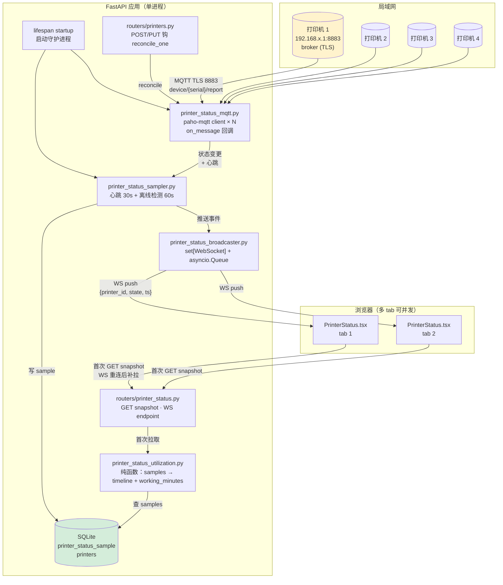
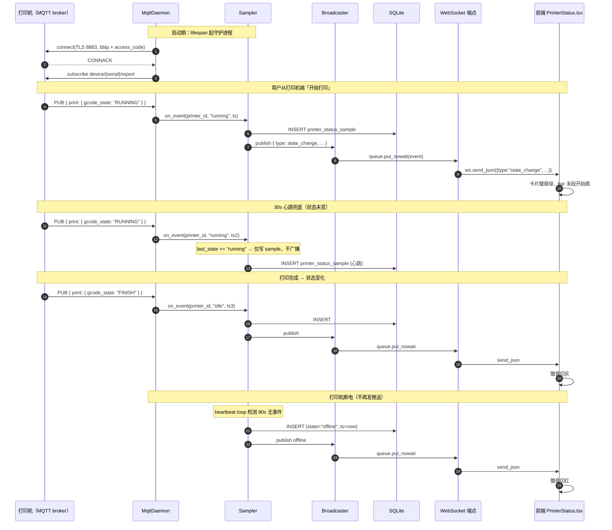
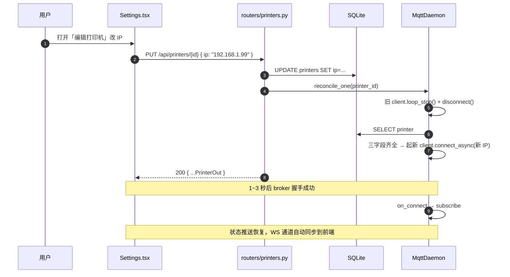

# 打印机状态与每日利用率监测（Printer Status）

> Last updated: 2026-06-22 22:32:41 (UTC+8)
> Serves: prd-007（打印机状态与每日利用率监测）；与 prd-004（系统配置·打印机管理）有上下游关系，扩展其 Printer schema 三字段并补「编辑」按钮 UI 入口
>
> **业务规格**：[docs/prd/prd-007-printer-status.md](../prd/prd-007-printer-status.md)。CUJ 文案、徽章颜色规范、交互细节以 PRD 为权威。本文档描述**工程实现**：DB schema 演进、MQTT 守护进程结构、Broadcaster 模型、WebSocket 通道、利用率算法、前端集成点。
>
> **上下游关系**：
> - **复用 `Printer` 表 + `PUT /api/printers/{id}` 端点**，扩展三个 nullable 凭证列（详见 [design-orders-inventory.md](design-orders-inventory.md) 与 [system.md §4](system.md) 的 schema 总览；本文档为该扩展的权威说明）。
> - **关闭 PRD-004 差异 #6**（打印机改名无 UI 入口）：本设计的「编辑」弹窗即首次提供改名能力，复用既有 `PUT /api/printers/{id}` 端点。
> - **不触碰排班域**：`PrintTask` / `PrintBatch` 仍由用户手动 confirm/complete；MQTT 状态不回写排班状态机（明确 Non-Goal）。
> - **无新 LLM / 外部 HTTP 依赖**：与 prd-006 复用模式无关；引入新依赖只有 `paho-mqtt`。

---

## 1. Overview

prd-007 引入对 4 台 Bambu Lab 打印机的「局域网层面是否在打印」监测，以及「每日 24h 工作分钟数 / 利用率」统计。整条链路两段、**全程推送、不轮询**：

```
打印机 ──MQTT push──▶  后端守护进程  ──WebSocket push──▶  前端 4 卡片状态页
                       │
                       └──写 printer_status_sample（用于利用率累计 + 时间轴 bar 渲染）
```

工程任务边界：

1. **DB schema 演进**：`Printer` 加 3 个 nullable 凭证列；新增 `printer_status_sample` 表；交由 `auto_migrate` + `create_all` 自动落地（无需新 ensure helper）。
2. **MQTT 守护进程**：FastAPI `lifespan` 启动期为每台「三凭证齐全」的打印机起一个 paho-mqtt 客户端，订阅 `device/{serial}/report`；用 asyncio 主循环 + 单后台线程做 `loop_start()` 的桥接。
3. **进程内 Broadcaster**：状态变更同时（a）写 sample；（b）扇出到所有 WebSocket 客户端。
4. **HTTP API 扩展 + 新增 2 端点**：`GET/POST/PUT /api/printers` 携带凭证字段；新增 `GET /api/printers/status/snapshot` + `WS /api/ws/printers/status`。
5. **前端**：新路由 `/printers/status` + `PrinterStatus.tsx` + 「编辑」按钮 + 弹窗 + 卡片组件（徽章 + 24h DOM bar）。

实现文件（**计划**，本轮实施前不存在）：

- 后端：
  - `backend/app/services/printer_status_mqtt.py` — 守护进程主体（每台机一个 paho-mqtt client + 主题订阅 + 回调）
  - `backend/app/services/printer_status_broadcaster.py` — 进程内 fanout（asyncio set of `WebSocket` + 发送队列）
  - `backend/app/services/printer_status_sampler.py` — 心跳 + 离线检测 + 写 sample 的协调
  - `backend/app/services/printer_status_utilization.py` — 利用率计算（snapshot 时实时聚合）
  - `backend/app/routers/printer_status.py` — `GET /api/printers/status/snapshot` + `WS /api/ws/printers/status`
  - `backend/app/schemas_printer_status.py` — Pydantic 请求/响应 schema
- 后端模型 / schema 演进：
  - `backend/app/models.py` — `Printer` 加 `ip` / `serial` / `access_code` 三列；新增 `PrinterStatusSample` 类
  - `backend/app/schemas.py` — `PrinterCreate` / `PrinterUpdate` / `PrinterOut` 扩展（**注意 PUT 改用 `PrinterUpdate` 而非 `PrinterCreate`，以支持 access_code 的「不传即保留」语义**）
  - `backend/app/routers/printers.py` — `PUT` 走 `PrinterUpdate`，并在创建/更新成功后调用 `printer_status_mqtt.reconcile_one(printer_id)`
- 前端：
  - `frontend/src/pages/PrinterStatus.tsx` — 主页面（4 卡片网格 + 顶部连接状态指示）
  - `frontend/src/pages/printer_status/PrinterCard.tsx` — 单张卡片（徽章 + 工时 + 24h DOM bar）
  - `frontend/src/pages/printer_status/Timeline24h.tsx` — 时间轴 bar（DOM 分段渲染）
  - `frontend/src/pages/printer_status/usePrinterStatusWS.ts` — WS hook（裸 `WebSocket` + 指数退避）
  - `frontend/src/pages/EditPrinterModal.tsx` — 「编辑打印机」弹窗（复用于 Settings 页与未来潜在调用）
  - `frontend/src/api/client.ts` — 追加 `api.getPrinterStatusSnapshot()`、修改 `api.updatePrinter()`
  - `frontend/src/components/Layout.tsx` — 菜单加「打印机状态」入口（Dashboard 与「系统设置」之间）

---

## 2. Goals & Non-Goals

**Goals（工程层面）**

- 守护进程**单进程内**完成 MQTT 订阅 + Broadcaster + 利用率累计，无独立 worker / 队列服务。
- 凭证变更后**毫秒级**触发对应客户端重订阅，无需重启 backend。
- WebSocket 通道**幂等、可断线重连**：客户端断线 → 重连 → 拉一次 snapshot 补齐 → 继续走 WS 增量；前端无丢事件感知。
- 利用率算法可纯单元测试：输入 sample list + 当前时刻 → 输出 working_minutes / timeline；不依赖 DB。
- MQTT 库选型**保守可控**，不引入大型抽象（拒绝 `bambulabs-api` 这种「全功能 SDK」—— 其抽象成本远大于我们需要的「订一个 topic」）。

**Non-Goals**

- 不做告警 / 通知（PRD 明确 Non-Goal）。
- 不持久化 MQTT 客户端重连状态（重启即从零订阅 — 单用户本地部署，丢窗口期样本可接受）。
- 不区分「网络不通」与「访问码错」，二者统一显示「离线」（PRD 明确 Non-Goal）。
- 不做跨时区 / 多服务器部署；自然日按服务器本地时区切日。
- 不回填历史样本，从功能上线那一刻起算。
- 不实现历史利用率趋势视图（数据已落库，未来视图层即可加）。

---

## 3. System Context



---

## 4. Detailed Design

### 4.1 数据模型

#### 4.1.1 `Printer` 表扩展（3 个 nullable 凭证列）

```python
class Printer(Base):
    __tablename__ = "printers"

    id = Column(Integer, primary_key=True, index=True)
    name = Column(String, nullable=False)
    # prd-007 引入：局域网 MQTT 凭证三件套（任一为 NULL 即视为「未配置」）
    ip = Column(String(64), nullable=True, default=None)
    serial = Column(String(32), nullable=True, default=None)
    access_code = Column(String(16), nullable=True, default=None)

    status_samples = relationship(
        "PrinterStatusSample",
        back_populates="printer",
        cascade="all, delete-orphan",
        passive_deletes=True,
    )
```

| 字段 | 类型 | 说明 |
|---|---|---|
| `ip` | `String(64), nullable` | 形如 `192.168.1.123`，无校验（PRD 明示） |
| `serial` | `String(32), nullable` | Bambu 序列号，如 `01P00A123456789`；用于 `device/{serial}/report` 主题 |
| `access_code` | `String(16), nullable` | 8 位数字字符串；TLS 8883 时作为 MQTT password。**敏感凭证**（详见 §7.1）|

迁移路径：

- **三个列均 nullable + 无 callable default** → `auto_migrate(engine)` 在启动期会自动 `ALTER TABLE printers ADD COLUMN ip VARCHAR DEFAULT NULL` 等三条（见 [system.md §6.4](system.md#64-启动期自迁移automigrate)），**无需新增 ensure helper**。新部署走 `create_all` 一次性建好。
- 旧 `data.db` 升级时 `auto_migrate` 把三列补出来，所有现存 `Printer` 行三列均为 `NULL`，状态页显示「未配置」，无破坏性变更。

#### 4.1.2 新表 `printer_status_sample`

```python
class PrinterStatusSample(Base):
    __tablename__ = "printer_status_sample"

    id = Column(Integer, primary_key=True, index=True)
    printer_id = Column(
        Integer,
        ForeignKey("printers.id", ondelete="CASCADE"),
        nullable=False,
        index=True,
    )
    ts = Column(DateTime, nullable=False, index=True)
    state = Column(String(16), nullable=False)  # running | pause | idle | offline

    printer = relationship("Printer", back_populates="status_samples")

    __table_args__ = (
        Index("ix_printer_status_sample_printer_ts", "printer_id", "ts"),
    )
```

| 字段 | 类型 | 说明 |
|---|---|---|
| `id` | `Integer PK` | |
| `printer_id` | `FK printers.id, ondelete=CASCADE` | 删 Printer 时 SQLite 级联删 sample |
| `ts` | `DateTime, indexed` | 采样时刻（服务器本地时间，naive datetime） |
| `state` | `String(16)` | 标准化状态：`running` / `pause` / `idle` / `offline`（**已标准化，非 Bambu 原始 token**）|

**索引策略**：

- 单列 `ts` 索引（用于潜在的「最近 N 条」全局查询）。
- 复合索引 `(printer_id, ts)`（snapshot 时按打印机 + 当日时间范围扫描的主要查询，命中率最高）。
- 不建组合 UNIQUE — 心跳 30s 写一条，业务上允许相同 `(printer_id, ts)` 同秒多条（极小概率，对算法无影响）。

**FK 级联**：

- SQLAlchemy `cascade="all, delete-orphan"` + `passive_deletes=True` + `ForeignKey(ondelete="CASCADE")` 三件套同时设置，让 SQLite 在 DB 层和 ORM 层都正确级联（SQLite 需要 `PRAGMA foreign_keys=ON`；当前项目通过 SQLAlchemy 2.0 + pysqlite 默认开启）。
- 验收标准之一：删打印机 → 该机 sample 全部消失，无需手动清理。

**迁移路径**：

- 整张新表 → 启动期 `Base.metadata.create_all(bind=engine)` 一次性建好（见 `app/main.py` lifespan 步骤 2），**无需写 ensure helper**。
- 索引声明在 `__table_args__`，create_all 自动建。

#### 4.1.3 `print.gcode_state` → 标准化 state 映射

| Bambu `gcode_state` | 标准化 `state` | 计入「今日工作分钟」 |
|---|---|---|
| `RUNNING` | `running` | 是 |
| `PAUSE` | `pause` | 是 |
| `IDLE` / `PREPARE` / `FINISH` / `FAILED` / 其他已知 token | `idle` | 否 |
| MQTT 连不上 / 超时 / 凭证错 / 90s 无推送 | `offline` | 否 |
| 凭证未配置（任一字段为 NULL） | 不订阅，不写样本（snapshot 输出 `unconfigured`） | 否 |

映射放在 `printer_status_mqtt.py` 单一函数 `_normalize_gcode_state(raw: str) -> Literal["running","pause","idle"]`，便于未来扩 Bambu 新 token 时单点修改。

### 4.2 API / Interface Contract

#### 4.2.1 扩展现有 `/api/printers` 端点

| 方法 + 路径 | 请求 → 响应 | 行为变更 |
|---|---|---|
| `GET /api/printers` | → `list[PrinterOut{id, name, ip, serial, access_code_masked}]` | 响应追加三字段；`access_code_masked` 形如 `****1234`（末 4 位明文 + 前位掩码），原值不出现在响应里 |
| `POST /api/printers` | `PrinterCreate{name, ip?, serial?, access_code?}` → `PrinterOut` | 三字段全部可选；保存后**调用 `reconcile_one(printer_id)`**：若三字段齐全则启动该机的 MQTT client；否则不订阅 |
| `PUT /api/printers/{id}` | `PrinterUpdate{name, ip?, serial?, access_code?}` → `PrinterOut` | **schema 改用 `PrinterUpdate`**（所有字段 `Optional`）：未传字段 = 保留旧值；传空串 = 清空（清空 ip/serial/access_code 任一即触发取消订阅）；保存后**调用 `reconcile_one(printer_id)`**触发重订阅 |
| `DELETE /api/printers/{id}` | → `{ok: true}` | **保存前调用 `unsubscribe_one(printer_id)`** 取消该机 MQTT；FK 级联删 sample |

`PrinterUpdate` schema 关键决策（**与 PRD CUJ-1 Step 2 一致**）：

```python
class PrinterUpdate(BaseModel):
    name: Optional[str] = None
    ip: Optional[str] = None
    serial: Optional[str] = None
    access_code: Optional[str] = None
```

- 用 `Optional[...] = None` 表达「字段未传」与「字段传 None」之间的区别需要靠 Pydantic 的 `model_dump(exclude_unset=True)` — 前端不发送 access_code key 时后端识别为「保留旧值」。
- 这与现有的 `PrinterCreate` 不同（后者必填 name），所以 PUT 端点必须切换 schema。**这是本设计唯一的 API breaking change**，但前端控制权在我们手里，调整 `api.updatePrinter` 同步发布即可。

#### 4.2.2 新增 `GET /api/printers/status/snapshot`

请求：无参。

响应：

```python
class PrinterStatusOut(BaseModel):
    printer_id: int
    name: str
    state: Literal["running", "pause", "idle", "offline", "unconfigured"]
    today_working_minutes: int  # 0~1440，已 min(_, 1440) 截断
    today_total_minutes: int = 1440
    last_state_change_ts: datetime | None  # 最近一次状态变化时刻（用于前端本地累加）
    timeline: list[TimelineSegment]  # 24h 时间轴的分段着色，前端直接画 bar

class TimelineSegment(BaseModel):
    start_minute: int  # 0~1440，自今天 00:00 起算的分钟
    end_minute: int    # 0~1440
    state: Literal["running", "pause", "idle", "offline"]

# 端点签名
@router.get("/api/printers/status/snapshot", response_model=list[PrinterStatusOut])
def get_status_snapshot(db: Session = Depends(get_db)) -> list[PrinterStatusOut]:
    ...
```

注意：
- `state="unconfigured"` 只在响应里出现，**不会落库为样本**。
- `last_state_change_ts` 为 `None` 表示该机今天还没有任何样本（首次启动 / 刚补凭证）。
- `timeline` 中相邻段 state 必然不同（已合并相邻同色段，前端 DOM 节点数最小化）。

#### 4.2.3 新增 `WS /api/ws/printers/status`

| 方向 | 消息形态 |
|---|---|
| server → client：状态变化事件 | `{"type":"state_change","printer_id":3,"state":"running","ts":"2026-06-22T15:23:11"}` |
| server → client：服务端 ping | `{"type":"ping","ts":"..."}` |
| client → server：客户端 ping（可选）| `{"type":"ping"}` |
| client → server：客户端 pong | `{"type":"pong"}` |

约定：

- 仅在「状态实际变化」时发 `state_change`（心跳样本不发，避免噪声）。
- 服务端每 25 秒发一次 `ping`（避开常见 30s/60s 代理 idle timeout）；客户端可选回 `pong` 但不强制 — 用底层 TCP/WS keep-alive 已足够检测半开连接。
- 连接握手时**不**主动推全量 snapshot — 前端会用 REST snapshot 显式拉，逻辑更可观察。
- 服务端不维护客户端 session id；WebSocket 连接对象本身（`fastapi.WebSocket`）作为 broadcaster 集合元素的身份。
- 客户端断线 → 前端指数退避重连 → 重连成功后拉一次 `GET /api/printers/status/snapshot` 补齐（PRD CUJ-2 Step 3 已规定）。

### 4.3 MQTT 守护进程结构

#### 4.3.1 库选型

**选型：`paho-mqtt 2.x`**（同步 client + `loop_start()` 启动后台线程）。

| 候选 | 评估 |
|---|---|
| **`paho-mqtt` 2.x**（选定）| 行业标准 MQTT 客户端，pypi 周下载量超千万级；API 简单；TLS / unverified cert / username+password 三件套都是一行配置；Bambu 社区 99% 项目用它（HA / bambulabs_api / wolfwithsword 教程等）|
| `aiomqtt`（前 `asyncio-mqtt`）| 原生 asyncio，与 FastAPI 风格一致 — 但只是 paho 的薄异步包装，**仍依赖 paho 底层**。N=4 client、每秒事件量极低（< 1 / sec），不值得多一层抽象 |
| `bambulabs-api` / `pybambu` 等 SDK | 抽象层封装了「打印参数 / 床温 / AMS / 进度百分比」等远超我们需要的功能；引入即捆绑大量 transitive deps；不适合「只订一个 topic + 一个字段」的极简场景 |

**决策**：用 `paho-mqtt` 同步 client + `loop_start()`。每台打印机一个 client 实例 + 一个后台线程（paho 内部管理）。状态变更通过 `asyncio.run_coroutine_threadsafe(...)` 跨线程通知 broadcaster。

requirements.txt 加：
```
paho-mqtt>=2.1.0,<3.0
```

#### 4.3.2 客户端配置（每台打印机）

```python
import ssl
import paho.mqtt.client as mqtt

def _build_client(printer: Printer, on_message_cb, on_disconnect_cb) -> mqtt.Client:
    client = mqtt.Client(
        callback_api_version=mqtt.CallbackAPIVersion.VERSION2,
        client_id=f"infill-{printer.id}-{uuid.uuid4().hex[:8]}",
        clean_session=True,
    )
    client.username_pw_set(username="bblp", password=printer.access_code)
    # Bambu 用自签证书，社区一致做法：用 ssl 但不校验
    tls_ctx = ssl.create_default_context()
    tls_ctx.check_hostname = False
    tls_ctx.verify_mode = ssl.CERT_NONE
    client.tls_set_context(tls_ctx)
    client.tls_insecure_set(True)
    client.on_connect = lambda c, _, __, rc, ___: c.subscribe(f"device/{printer.serial}/report")
    client.on_message = on_message_cb
    client.on_disconnect = on_disconnect_cb
    client.connect_async(printer.ip, port=8883, keepalive=60)
    client.loop_start()  # 启动后台线程
    return client
```

**关键决策**：

- **`callback_api_version=VERSION2`**：paho 2.x 推荐显式选 v2 callback，避免 deprecation warning。
- **`clean_session=True`**：单用户、不在乎离线期 broker 缓存的消息；每次重连从零开始最简单。
- **`tls_insecure_set(True)` + `verify_mode = CERT_NONE`**：Bambu 打印机用自签证书，社区 99% 项目这么配（[wiki.bambulab.com/security](https://wiki.bambulab.com/en/general/bbl-security)、wolfwithsword 教程等）。**风险**：若局域网内被中间人攻击可窃取 access_code — 但单用户家庭网络场景可接受。
- **`connect_async` + `loop_start()`**：非阻塞建连，掉线由 paho 内部自动按退避重试（默认行为）。

#### 4.3.3 主题与状态解析

订阅 topic：`device/{serial}/report`（Bambu 单向上报主题）。

payload 是 JSON，关心字段 `print.gcode_state`：

```python
def _on_message(client, userdata, msg):
    try:
        payload = json.loads(msg.payload)
    except json.JSONDecodeError:
        logger.warning("printer %s: invalid JSON payload", userdata["printer_id"])
        return
    raw_state = payload.get("print", {}).get("gcode_state")
    if not raw_state:
        return  # 此条不携带状态字段（Bambu 推送是增量的，非状态包跳过）
    normalized = _normalize_gcode_state(raw_state)
    sampler.on_event(userdata["printer_id"], normalized, ts=datetime.now())
```

**注意**：Bambu MQTT push 是**增量字段**，单条 payload 可能只含 AMS 或床温变化、不带 `print.gcode_state` — 必须 `if not raw_state: return` 跳过。

#### 4.3.4 守护进程生命周期

主入口（`printer_status_mqtt.py`）：

```python
# 模块级单例 — 进程内唯一
class MqttDaemon:
    def __init__(self, sampler: Sampler, broadcaster: Broadcaster):
        self._clients: dict[int, mqtt.Client] = {}   # printer_id → client
        self._lock = threading.Lock()
        self._sampler = sampler

    async def startup(self) -> None:
        with SessionLocal() as db:
            printers = db.query(Printer).filter(
                Printer.ip.isnot(None),
                Printer.serial.isnot(None),
                Printer.access_code.isnot(None),
            ).all()
        for p in printers:
            self._spawn_client(p)

    def reconcile_one(self, printer_id: int) -> None:
        """凭证变更后触发：先断旧 client（如有）→ 查最新行 → 凭证齐全则起新 client，否则保持断开。"""
        with self._lock:
            old = self._clients.pop(printer_id, None)
        if old is not None:
            old.loop_stop()
            old.disconnect()
        with SessionLocal() as db:
            p = db.get(Printer, printer_id)
        if p is None:
            return
        if p.ip and p.serial and p.access_code:
            self._spawn_client(p)
        else:
            # 凭证不齐 → 写一条 offline sample 把状态切回（前端徽章变回未配置）
            self._sampler.on_unconfigured(printer_id)

    def unsubscribe_one(self, printer_id: int) -> None:
        """删打印机时调用。"""
        with self._lock:
            client = self._clients.pop(printer_id, None)
        if client is not None:
            client.loop_stop()
            client.disconnect()

    async def shutdown(self) -> None:
        with self._lock:
            clients = list(self._clients.values())
            self._clients.clear()
        for c in clients:
            c.loop_stop()
            c.disconnect()
```

挂入 `app/main.py.lifespan`：

```python
@asynccontextmanager
async def lifespan(app: FastAPI):
    auto_migrate(engine)
    Base.metadata.create_all(bind=engine)
    ensure_sku_column_exists(engine)
    ensure_order_notes_column_exists(engine)
    ensure_order_auto_import_schema_exists(engine)
    # 加载目录...
    # prd-007：守护进程启动（依赖 Printer 表存在 → 必须在 create_all 之后）
    broadcaster = Broadcaster()
    sampler = Sampler(broadcaster)
    daemon = MqttDaemon(sampler, broadcaster)
    app.state.printer_status_broadcaster = broadcaster
    app.state.printer_status_sampler = sampler
    app.state.printer_status_daemon = daemon
    await daemon.startup()
    sampler.start_heartbeat_loop()  # asyncio Task，30s 心跳 + 60s 离线检测
    try:
        yield
    finally:
        sampler.stop_heartbeat_loop()
        await daemon.shutdown()
```

**`reconcile_one` 挂接点**：`routers/printers.py` 的 `create_printer` / `update_printer` 在 `db.commit()` 之后、return 之前调用 `request.app.state.printer_status_daemon.reconcile_one(printer.id)`；`delete_printer` 在 `db.delete()` 之前调用 `unsubscribe_one(printer_id)`。

### 4.4 Broadcaster / WebSocket 模型

#### 4.4.1 Broadcaster 选型

**选型：进程内 `set[WebSocket]` + 每个 client 独占 `asyncio.Queue`**。

| 候选 | 评估 |
|---|---|
| **per-client `asyncio.Queue`**（选定）| 慢消费者不会阻塞快消费者；Queue 满则 drop oldest（设上限 100 条）；FastAPI WebSocket 端点天然 asyncio，集成最自然 |
| 共享单 `asyncio.Queue` 多消费者 | 一份消息只能被一个 consumer 收走，不适合 fanout |
| 第三方 `broadcaster` lib（encode/broadcaster）| 引入额外依赖；仅支持 Redis / Postgres / Memory backend，对单进程场景过重 |
| Redis Pub/Sub | 完全过度设计；引入新服务，违反「单容器零运维」 |

实现骨架（`printer_status_broadcaster.py`）：

```python
class Broadcaster:
    def __init__(self):
        self._queues: set[asyncio.Queue] = set()
        self._lock = asyncio.Lock()

    async def register(self) -> asyncio.Queue:
        q = asyncio.Queue(maxsize=100)
        async with self._lock:
            self._queues.add(q)
        return q

    async def unregister(self, q: asyncio.Queue) -> None:
        async with self._lock:
            self._queues.discard(q)

    async def publish(self, event: dict) -> None:
        async with self._lock:
            targets = list(self._queues)
        for q in targets:
            try:
                q.put_nowait(event)
            except asyncio.QueueFull:
                # 慢消费者：丢最旧 + 塞新的
                try:
                    q.get_nowait()
                except asyncio.QueueEmpty:
                    pass
                try:
                    q.put_nowait(event)
                except asyncio.QueueFull:
                    pass  # 极端情况兜底
```

**关键决策**：

- 容量 100 条：4 台机 × 状态变化平均频率 ~1/min × 30s 内最多 ~2 条 → 100 条留足前端断网时缓冲（约 50 分钟变化），同时防 OOM。
- 慢消费者策略：丢最旧（drop-oldest），保证状态语义「最新值最重要」 — 旧丢了无所谓，反正前端重连后会拉 snapshot 全量校正。

#### 4.4.2 WebSocket 端点

```python
@router.websocket("/api/ws/printers/status")
async def status_ws(ws: WebSocket):
    await ws.accept()
    broadcaster: Broadcaster = ws.app.state.printer_status_broadcaster
    queue = await broadcaster.register()
    try:
        # 双协程：一边推 broadcaster 事件、一边收客户端 ping 兼检测断线
        send_task = asyncio.create_task(_send_loop(ws, queue))
        recv_task = asyncio.create_task(_recv_loop(ws))
        done, pending = await asyncio.wait(
            {send_task, recv_task}, return_when=asyncio.FIRST_COMPLETED
        )
        for t in pending:
            t.cancel()
    finally:
        await broadcaster.unregister(queue)

async def _send_loop(ws: WebSocket, queue: asyncio.Queue):
    while True:
        try:
            event = await asyncio.wait_for(queue.get(), timeout=25.0)
            await ws.send_json(event)
        except asyncio.TimeoutError:
            # 25s 无事件 → 发服务端 ping 防代理超时
            await ws.send_json({"type": "ping", "ts": datetime.now().isoformat()})

async def _recv_loop(ws: WebSocket):
    while True:
        # 客户端消息忽略内容，仅用 receive 行为检测断线
        msg = await ws.receive_json()
        # 可选：处理客户端 ping → pong
        if msg.get("type") == "ping":
            await ws.send_json({"type": "pong"})
```

**多 client 并发**：用户开多个 tab 各自打开一个 WS，每个 tab 一个独立 queue；同一份事件被广播到所有 queue。

### 4.5 利用率计算

#### 4.5.1 算法选型：实时聚合 vs rolling counter

**选型：实时聚合**（snapshot 时扫今天的 samples + 线性聚合）。

| 候选 | 优点 | 缺点 |
|---|---|---|
| **实时聚合**（选定）| 单一事实源（samples 表）；无双写一致性问题；删数据 / 校正样本不需要重算 counter；调试简单 | snapshot 请求每次扫 N 条样本（4 台机 × 1天 × 30s 心跳 = 4 × 2880 ≈ 11520 行）|
| Rolling counter（每事件累加 daily 表）| snapshot O(1) | 双写一致性问题（事件回放、跨日切日、丢事件时 counter 失同步）；调试复杂；样本表与 counter 表互不冗余反而冲突 |

**容量分析**：

- 每天每台机最多 2880 行（30s 心跳全开），4 台机 = 11520 行/天；SQLite 索引扫一天数据 < 10ms。
- snapshot 端点调用频率：用户进入页面或 WS 断线重连时各 1 次；预期 < 1 req/min/user。
- 单用户、本地部署 — **完全负担得起**。
- 长期累积：1 年 ≈ 420 万行；如未来成为问题，加一个 cron 删 ≥7 天前的样本即可（**当前不做**，本 PRD 明示 Non-Goal）。

#### 4.5.2 算法骨架（纯函数）

```python
# printer_status_utilization.py — 全部纯函数，可单测

def compute_today_snapshot(
    samples: list[PrinterStatusSample],   # 按 ts 升序
    now: datetime,
    today_start: datetime,                # 今天 00:00（服务器本地时区）
) -> tuple[int, list[TimelineSegment]]:
    """
    输入：今天 00:00 ≤ ts ≤ now 的样本（升序）+ 当前时刻 + 今天 0 时
    输出：(working_minutes, timeline 段列表)

    算法：
    1. 在样本头尾分别"虚拟补段":
       - 若无样本 → 整天填 "idle" 单段（或更准确：填 "offline"，
         因为未配置不会走到这里、刚启动也是 offline 假象）
       - 若首条样本 ts > today_start → today_start ~ first.ts 之间视为 first.state
         （线段插值定义：相邻样本之间归属"前一条"，但 timeline 起点没"前一条" → 取后一条
         也是合理的；本设计选"取后一条"，因为首条样本是该状态在今天的起点）
       - 末尾：last.ts ~ now 之间归属为 last.state（这是 PRD 明示的"最右段持续到现在"）
    2. 遍历相邻样本对 (s_i, s_{i+1})，区间归属 s_i.state，累加 working_minutes
       if s_i.state in {"running","pause"}
    3. 把同色相邻段合并 → timeline 输出（前端 DOM 节点数最小化）
    4. working_minutes = min(working_minutes, 1440) 截断
    """
```

#### 4.5.3 自然日切日策略

**规则（已与 PRD CUJ-2 Edge Case 一致）**：

- 服务器本地时区 24:00 = 新自然日开始。
- 上一日累计到 23:59:59；新日从 00:00 起算（即 `today_start = now.replace(hour=0, minute=0, second=0, microsecond=0)`）。
- 跨日切换时**正在打印**的任务：
  - 上一日 23:00 ~ 24:00 段：归属为该段实际 state（如 `running` → 计入上一日工作分钟）
  - 新日 00:00 起：从最近一条样本的 state 重新累计（snapshot 时算法会自动处理 — 因为新一天的样本中第一条可能就是 23:00 那条 running 之后的延续）。
  - **细节**：snapshot 计算 today_start = 今日 00:00 时，若该机最近的样本 ts < today_start（昨天的）→ 算法把 today_start 视为「首段起点 = 那条样本的 state」（即昨天最后状态延续到今天）。这与 PRD CUJ-2 「跨午夜前正在打印 → 新日 00:00 起继续计入」一致。

实现上：

- 算法读样本时**多读 1 条** `today_start` 之前的最新样本（用于推断 today_start 时刻的 state）。
- SQL: `SELECT * FROM printer_status_sample WHERE printer_id=? AND ts <= ? ORDER BY ts DESC LIMIT 1` + 当天全部。

#### 4.5.4 历史样本不回填

- 功能上线第一天：该机一条样本都没有，今天工作时长 = 0 / 1440 = 0%（PRD 明确）。
- 凭证刚补齐：从 MQTT 第一条推送到达开始累计；之前的时段 = `offline`（首段从 today_start 算起）。

### 4.6 Sampler（心跳 + 离线检测）

`printer_status_sampler.py` 协调三类写入：

```python
class Sampler:
    HEARTBEAT_INTERVAL_SEC = 30
    OFFLINE_THRESHOLD_SEC = 90  # PRD: 连续 90s 无推送视为 offline

    def __init__(self, broadcaster: Broadcaster):
        self._last_event_ts: dict[int, datetime] = {}  # printer_id → last MQTT recv ts
        self._last_state: dict[int, str] = {}          # printer_id → last normalized state
        self._loop_task: asyncio.Task | None = None
        self._broadcaster = broadcaster

    def on_event(self, printer_id: int, state: str, ts: datetime):
        """MQTT on_message 回调中（后台线程）调用 — 用 run_coroutine_threadsafe 切回 event loop"""
        self._last_event_ts[printer_id] = ts
        if self._last_state.get(printer_id) != state:
            self._last_state[printer_id] = state
            self._write_sample_and_broadcast(printer_id, state, ts)

    def on_unconfigured(self, printer_id: int):
        """凭证清空时调用 — 写一条 offline 把状态切回；前端 snapshot 会显示 unconfigured（基于 Printer 行的 NULL 判断）"""
        ...

    async def start_heartbeat_loop(self):
        async def _loop():
            while True:
                await asyncio.sleep(self.HEARTBEAT_INTERVAL_SEC)
                now = datetime.now()
                for pid, last in list(self._last_event_ts.items()):
                    elapsed = (now - last).total_seconds()
                    if elapsed > self.OFFLINE_THRESHOLD_SEC and self._last_state.get(pid) != "offline":
                        self._last_state[pid] = "offline"
                        self._write_sample_and_broadcast(pid, "offline", now)
                    elif self._last_state.get(pid) is not None:
                        # 心跳兜底：稳态时也写一条（用于插值连续性）
                        self._write_sample(pid, self._last_state[pid], now)
        self._loop_task = asyncio.create_task(_loop())
```

**关键决策**：

- **心跳 30s + 离线阈值 90s** 与 PRD 一致。
- **心跳只写 sample 不推 broadcaster**：避免无意义的 WS 事件噪声；前端只在状态变化时收到事件。
- **离线检测在心跳循环内做**：用 `asyncio.create_task` 跑后台 loop；不需要单独线程。
- **on_event 跨线程调用**：paho 的 on_message 跑在 paho 后台线程；要写 SQLAlchemy session 要么用线程安全 session、要么 `loop.call_soon_threadsafe(...)` 切回主 loop。本设计选**后者**：on_event 内只更新内存字典（线程安全用简单 lock），DB 写操作通过 `asyncio.run_coroutine_threadsafe(...)` 投递给主 loop。

### 4.7 前端集成

#### 4.7.1 路由 + 菜单

- `App.tsx`：在 `<Route path="/settings"...>` 之前加 `<Route path="/printers/status" element={<PrinterStatus />} />`。
- `components/Layout.tsx`：菜单数组中在 Dashboard 与「系统设置」之间插入 `{ key: '/printers/status', label: '打印机状态', icon: <DesktopOutlined /> }`。

#### 4.7.2 WebSocket 客户端选型

**选型：裸 `WebSocket` + 自写指数退避 hook**。

| 候选 | 评估 |
|---|---|
| **裸 `WebSocket` + 自写 hook**（选定）| 项目当前 0 个 WS 用法、不需要支持第二个 WS 端点；自写 ~80 行覆盖所有需求（连/断/重连/snapshot 补齐）；零新依赖 |
| `react-use-websocket`（流行库）| 提供 hooks-friendly API + 内置自动重连 — 功能合适但是引入新依赖、API 风格与团队 `api/client.ts` 自写 fetch 的风格不一致；本项目此前所有外部通信都自写 |

自写 hook 骨架（`pages/printer_status/usePrinterStatusWS.ts`）：

```ts
const BACKOFF_MS = [1000, 2000, 4000, 8000, 16000, 30000];

export function usePrinterStatusWS(
  onEvent: (e: StateChangeEvent) => void,
  onReconnect: () => void,  // 重连成功时调，触发拉 snapshot
): { status: 'connecting' | 'connected' | 'reconnecting' | 'disconnected' } {
  // 状态管理 + WebSocket 实例管理
  // 断线后按 BACKOFF_MS 数组依次延迟，最长 30s 上限
  // 重连成功 → onReconnect() 拉 snapshot 补齐
  // 每收一条 state_change → onEvent(e)
}
```

#### 4.7.3 卡片配色（对齐排班甘特图色板）

| State | 颜色（建议）| 备注 |
|---|---|---|
| `running` | `#52c41a` 绿底白字 | 对齐 PRD-003 甘特图「完成」绿（但语义不同 — 实时使用更鲜亮）|
| `pause` | `#faad14` 黄底深字 | 对齐警告色 |
| `idle` | `#d9d9d9` 灰底深字 | 对齐 disabled 色 |
| `offline` | `#ff4d4f` 红底白字 | 对齐 danger 色 |
| `unconfigured` | `#f0f0f0` 浅灰底 + 虚线 1px 边框 | 与 idle 视觉区分（PRD 明示「灰虚线」） |

**统一抽常量**：建议放在 `frontend/src/pages/printer_status/constants.ts` 单点定义，避免多处硬编码（参考 prd-006 落实的反例：扩展 backend URL 硬编码遗留 TL carry-over）。

#### 4.7.4 24h 时间轴 bar 渲染

**选型：DOM 分段渲染**（每段一个 `<div>` 用 `width: X%` 表达分钟占比）。

理由：

- 4 台机 × 一天最多 ~2880 个样本 → timeline 合并相邻同色段后实际 DOM 段数预期 < 50 段/卡 → 4 卡 < 200 个 DOM 节点 → 性能毫无问题。
- DOM 段易 hover tooltip（PRD CUJ-2 Step 2 要求）；canvas 实现 tooltip 需要额外坐标换算。
- 项目内已有原生 DOM 甘特图先例（`Schedule.tsx`），技术栈一致。

骨架：

```tsx
function Timeline24h({ timeline, now }: { timeline: TimelineSegment[]; now: Date }) {
  return (
    <div style={{ position: 'relative', width: '100%', height: 24, background: '#f0f0f0' }}>
      {timeline.map((seg, i) => (
        <div
          key={i}
          style={{
            position: 'absolute',
            left: `${(seg.start_minute / 1440) * 100}%`,
            width: `${Math.max(((seg.end_minute - seg.start_minute) / 1440) * 100, 1 / 1440 * 100)}%`,
            // 最小 1 像素 → 这里用百分比折算：1px / 卡片宽度 → 但卡片宽度运行时才知
            // 改用 minWidth: 1 px 即可（CSS 已处理）
            height: '100%',
            background: STATE_COLORS[seg.state],
          }}
          title={`${formatMinute(seg.start_minute)}–${formatMinute(seg.end_minute)}: ${STATE_LABELS[seg.state]}`}
        />
      ))}
      {/* 当前时刻深色竖线 */}
      <div style={{
        position: 'absolute',
        left: `${(currentMinute(now) / 1440) * 100}%`,
        top: 0, bottom: 0, width: 2, background: '#000',
      }} />
    </div>
  );
}
```

**最小可见宽度**：CSS `min-width: 1px` 防止 < 1px 段被吞（PRD Edge Case 明示）。

#### 4.7.5 「编辑」按钮 + 弹窗（关闭 PRD-004 差异 #6）

修改 `frontend/src/pages/Settings.tsx`：

- 打印机表格 `操作` 列新增「编辑」按钮（在删除按钮左侧）。
- 点击 → 打开 `EditPrinterModal`，预填该机的 `{name, ip, serial, access_code_masked}`。
- access_code 字段用 `Input.Password` + 「眼睛图标」一键明文切换；预填态显示 `••••1234`（前 4 位掩码 + 末 4 位明文）。
- 用户**未改动密码框**点保存 → 前端 `omit access_code` 后调 `api.updatePrinter(id, body)`；改动后传新值（含空串语义为清掉）。
- 弹窗组件抽到独立文件 `frontend/src/pages/EditPrinterModal.tsx`，未来若状态页直接挂「设置」入口（PRD CUJ-2 未配置卡片的 tooltip 引导）可复用。

不改「新增打印机」批量弹窗（PRD CUJ-1 Step 3 明示 MVP 走两步式）。

---

## 5. 数据流

### 5.1 端到端事件链路



### 5.2 凭证修改 + 重订阅链路



---

## 6. Alternatives Considered

### 6.1 进程内 Broadcaster vs Redis Pub/Sub vs 独立 worker

| 准则 | 进程内 set/Queue（选定）| Redis Pub/Sub | 独立 MQTT worker 进程 |
|---|---|---|---|
| 部署复杂度 | **零新依赖** | 需要 Redis 服务 | 需要 2 个 Python 进程 + IPC |
| 单进程崩溃影响 | 同步丢全部状态 | 丢同步状态但 Redis 保 sub 列表 | worker 崩溃后主进程仍正常 |
| 跨进程 fanout | 不支持 | 支持 | 视实现 |
| 延迟 | < 1ms | 1~5ms | 进程间通信开销 |
| 代码复杂度 | ~100 行 | 引入异步 Redis client + reconnect 逻辑 | 进程管理 + 健康检查 |
| 单用户本地部署需要 | **完全够用** | 过度 | 过度 |
| **Verdict** | **选定** | 拒绝 — 过度设计 | 拒绝 — 增加运维 |

### 6.2 利用率算法：实时聚合 vs Rolling Counter

| 准则 | 实时聚合（选定）| Rolling Counter |
|---|---|---|
| 数据一致性 | 单一事实源（samples），无双写 | 双写 → 易失同步（事件丢、跨日切日、人工修复） |
| 跨日处理 | 自然（每次按 today_start 重算）| 需要 cron 在 00:00 重置 counter |
| snapshot 延迟 | ~10ms（扫 1 万行）| O(1) |
| 调试性 | 重放样本即可验证 | counter 失同步后无法追溯 |
| 单用户负载 | 完全够用 | 不需要的优化 |
| **Verdict** | **选定** | 拒绝 |

### 6.3 MQTT 库：paho-mqtt vs aiomqtt vs bambulabs-api

| 准则 | paho-mqtt 同步 + loop_start（选定）| aiomqtt（异步薄壳）| bambulabs-api SDK |
|---|---|---|---|
| API 复杂度 | 低（直接 callback）| 中（async with）| 高（封装全部 Bambu 业务）|
| 与 FastAPI 风格 | 需跨线程协调（已规划 `call_soon_threadsafe`）| 原生 async | 视实现 |
| 抽象层成本 | 无 | 薄 paho 封装 | 厚封装，绑 Bambu 全功能 |
| 社区使用率 | 极高（HA / openHAB / 几乎所有 Bambu 整合项目）| 中 | 小众 |
| 维护风险 | 低 | 低 | 中（少数维护者） |
| **Verdict** | **选定** | 备选 — 若未来跨线程协调复杂可切 | 拒绝 — 过度封装 |

### 6.4 前端 WS hook：自写 vs react-use-websocket

| 准则 | 裸 WebSocket + 自写 hook（选定）| react-use-websocket |
|---|---|---|
| 团队风格 | 与现有 `api/client.ts` 自写 fetch 一致 | 引入第三方约定 |
| 体量 | ~80 行 | 引入新依赖 |
| 灵活性（自定义重连 + snapshot 联动）| 全自控 | 需读库文档配 callback |
| **Verdict** | **选定** | 拒绝 — 单端点不值得引入 |

---

## 7. Cross-Cutting Concerns

### 7.1 安全 / 凭证保护

- **access_code 是敏感凭证**（PRD 关键约束 #3）：
  - DB 明文存储（单用户本地部署的设计取舍 — 加密引入密钥管理复杂度，得不偿失）。
  - API 响应 `GET/POST/PUT /api/printers` 一律返回 `access_code_masked`（末 4 位明文 + 前位掩码），**原值不出现在任何 HTTP 响应**。
  - 日志：MQTT 守护进程的 connect / disconnect / error 日志只记 `printer_id` + IP + masked code；**绝不打印 access_code 原值**（PRD 验收标准明示）。
  - `.env.example`：**不放** access_code（它是 DB 字段，不是 env 变量）。
  - 开发自查：禁止把含真值的 `data.db` 提交到 git（与全局 `feedback_no_infra_secrets_in_public_docs` 一致）。

- **MQTT TLS 不验证证书**（`tls_insecure_set(True)`）：
  - Bambu 自签证书，社区标准做法（[wiki.bambulab.com/security](https://wiki.bambulab.com/en/general/bbl-security)）。
  - 局域网中间人攻击可窃取 access_code，但单用户家庭网络可接受。
  - 注释中明确标注「**这是设计取舍，prd-007 范围内不引入证书 pinning**」。

### 7.2 错误处理 / 恢复

| 错误场景 | 行为 |
|---|---|
| paho-mqtt 连接失败（IP 错 / 访问码错 / 网络断）| paho 内部自动按指数退避重连；90s 内仍无推送 → Sampler 写 offline sample |
| paho-mqtt 消息回调抛异常 | 单条消息丢弃，记 WARNING 日志，client 继续运行 |
| Sampler 写 DB 失败（如磁盘满）| 记 ERROR 日志；该条样本丢；utilization 算法对个别缺样本鲁棒（线段插值） |
| WebSocket 发送失败（连接已关）| 自动捕获 `WebSocketDisconnect` → unregister queue → 退出 ws 端点函数 |
| 守护进程 task 崩溃 | **风险点**：当前设计无 watchdog 自动重启 — 守护进程异步任务挂掉只能靠 backend 重启恢复。**MVP 接受**（PRD 关键约束 #1）|
| Backend 进程重启 | lifespan 重新拉 Printer 表 → 起所有 client；前端 WS 会自动断 + 指数退避重连 |

### 7.3 性能目标

| 指标 | 目标 | 验证方式 |
|---|---|---|
| MQTT 推送 → 前端徽章更新延迟 | < 1s | PRD CUJ-2 验收标准之一（开始打印 1 秒内徽章变） |
| `GET /snapshot` 响应延迟 | < 100ms | 单测：1 天 ~11500 样本 + 4 台机 < 100ms |
| WS 心跳间隔 | 25s（服务端）| 防 30s 代理超时 |
| 离线检测窗口 | 60~90s | PRD: 连续 90s 无推送视为 offline |
| Broadcaster queue 容量 | 100 条 / client | 满则丢最旧（drop-oldest）|
| DB 增长 | ~12K 行 / 天（4 台机 × 30s 心跳） | 1 年 ~4.5M 行，单用户 SQLite 完全负担得起 |

### 7.4 可观察性（日志）

- 守护进程关键事件用 `logging.INFO`：startup（连了几台）/ reconcile（哪台机重订阅）/ shutdown。
- MQTT 连接失败 + 90s 无推送转 offline 用 `logging.WARNING`。
- 单条消息解析失败用 `logging.WARNING` + 仅记 `printer_id` + 不记 payload（payload 可能含序列号等敏感信息）。
- WebSocket 端点不打 access 日志（FastAPI 默认 + 高频）。

### 7.5 测试策略

- **utilization 纯函数**：`backend/tests/test_printer_status_utilization.py` — 覆盖空样本、跨日、首段补全、末段持续、单段、多段合并等。
- **Sampler 心跳逻辑**：`backend/tests/test_printer_status_sampler.py` — 用假 datetime + 假 broadcaster mock 验证 90s 离线检测、心跳写库、状态变化广播。
- **MQTT daemon**：用 paho 提供的 `mqtt.Client` 内置 mock 或一个本地 mosquitto 容器跑集成测试。MVP 可以仅做 reconcile_one 的单元测试（构造 fake Printer 验证 client 数量变化）。
- **WebSocket 端点**：FastAPI 提供 `TestClient` 的 `websocket_connect` 上下文管理器，可单测推送 / 重连。
- **前端**：当前项目无前端测试基础设施，沿用现状 — 不引入新测试栈。

---

## 8. Migration / Rollout

### 8.1 DB schema 迁移

| 变更 | 工具 | 幂等 |
|---|---|---|
| `Printer.ip` / `serial` / `access_code` 加列 | `auto_migrate(engine)` 自动 ALTER（[system.md §6.4](system.md#64-启动期自迁移automigrate)）| 是 |
| 新建 `printer_status_sample` 表 + 索引 | `Base.metadata.create_all(engine)` | 是 |
| FK ondelete=CASCADE | 由 `create_all` 一次性建好 | 是 |

**无需新 ensure helper**（与 prd-006 的 `ensure_order_auto_import_schema_exists` 不同）— 因为：
- 三个加列均 nullable + 无 callable default → `auto_migrate` 直接处理。
- 新表无 partial unique index 等 `create_all` 不覆盖的特性。

### 8.2 部署步骤

1. backend 加 `paho-mqtt>=2.1.0,<3.0` 到 `requirements.txt`。
2. backend 启动 → `auto_migrate` 自动加列 → `create_all` 自动建新表 → lifespan 拉守护进程。
3. 前端构建 → 路由 + 菜单上线。
4. 用户进入 `/printers/status` → 看到 4 张「未配置」卡片（凭证还没填）。
5. 用户去 Settings 给每台机填凭证 → 状态页 1~3s 内徽章变实时状态。

### 8.3 回滚

- **代码回滚**：git revert → backend 重启；`auto_migrate` 不删列（仅加列）、`create_all` 不删表 — 老代码遇到新增的 ip/serial/access_code 列 + printer_status_sample 表会**忽略它们**，无冲突。
- **DB 不删表 / 不删列**（auto_migrate 设计哲学一致 — 见 [system.md §6.4](system.md#64-启动期自迁移automigrate)）：未来若彻底放弃功能，手动 `DROP TABLE printer_status_sample` + 手动清三列。

### 8.4 Feature flag

**不引入**。本功能 MVP 不影响其他模块：

- 未填凭证的打印机不订阅 MQTT，零额外开销。
- 守护进程 startup 失败（如 paho 安装失败）应让 backend 启动失败 fail-fast，让用户立刻注意到（**优于**静默 degrade）。

---

## 9. Dependencies & Integration Points

### 9.1 本组件依赖

- **新 Python 包**：`paho-mqtt>=2.1.0,<3.0`（MQTT 客户端）。
- **现有模块**：`backend/app/database.py`（SessionLocal）、`backend/app/models.py`（Printer 扩展 + 新 PrinterStatusSample）、`backend/app/main.py` lifespan（hook 守护进程）。
- **不依赖**：LLM provider（无关）、ADB（无关）、Chrome 扩展（无关）。

### 9.2 被本组件影响

- **`Printer` schema 扩展** → 影响 `GET/POST/PUT /api/printers` 三个端点的请求 / 响应。前端 `api.updatePrinter()` 改签名（body 从 `{name}` 扩到 `{name?, ip?, serial?, access_code?}`）。
- **`PUT /api/printers/{id}` schema 改为 `PrinterUpdate`**（所有字段 Optional）：旧调用方（Settings.tsx 当前未调用 PUT）无影响；本设计同步加 UI 入口。
- **菜单 + 路由结构**：菜单数组多一项，会影响 `Layout.tsx`。

### 9.3 整本设计书的索引位置

- `system.md` §10 组件设计文档索引 → 加一行 `design-printer-status.md`。
- `system.md` §4 共享数据模型 → 提一句「Printer 三凭证列 + printer_status_sample 见 design-printer-status.md」。
- 本文档**已确认无与其他 design-*.md 冲突**：
  - design-scheduler.md：完全独立模块，PrintTask 状态机不被本设计触碰。
  - design-orders-inventory.md：完全独立。
  - design-auto-import.md：与本组件无交叉。
  - design-frontend.md：菜单 + 路由表新增一项，需在 design-frontend.md 同步更新（但本轮 PRD 明示「不要碰其他 design 文件」，下次任务由 planner 决定）。

---

## 10. Open Questions & Risks

### 10.1 已知约束（PRD 明示，本设计接受）

| # | 描述 | 影响 |
|---|---|---|
| 1 | MQTT 守护进程进程内、无持久化重连状态 | 后端重启从零开始，丢窗口期样本 |
| 2 | 自然日按服务器本地时区切日 | 跨时区部署未考虑（单用户够用） |
| 3 | access_code 明文存 DB + TLS 不验证证书 | 局域网中间人风险（单用户家庭网络可接受） |
| 4 | 不区分「网络不通」与「凭证错」 | 统一显示「离线」，用户自查 |
| 5 | 不回填历史 | 上线第一天利用率 = 0 |
| 6 | 守护进程无 watchdog 自动重启 | 异步任务崩溃后只能靠 backend 重启恢复 |

### 10.2 待验证项（实施时确认）

| # | 描述 | 验证方式 |
|---|---|---|
| 1 | Bambu MQTT username 是否真为 `bblp`（社区共识，但 P1/X1/A1 系列是否一致需在用户手上的真机验证）| 用户在实机上跑 `mosquitto_sub -h <ip> -p 8883 -u bblp -P <code> --insecure -t '#'` |
| 2 | `print.gcode_state` token 集合是否还有遗漏 token | 跑一天采样后看 logs 里出现的 `raw_state` token，补 `_normalize_gcode_state` |
| 3 | 不同 Bambu 型号是否有 `print.gcode_state` 字段差异（A1 与 X1 序列）| 在用户实机上跑订阅，观察 payload |
| 4 | paho-mqtt 在 lifespan async 上下文 + 后台线程的协调（关闭顺序）| 编写单测 + 手测 backend reload 反复 startup/shutdown |

### 10.3 未来扩展

- 历史利用率视图（数据已落库）— 加一个 `GET /api/printers/status/history?date=YYYY-MM-DD` 即可。
- 告警 / 推送通知（PRD 明示 Non-Goal，但若加，broadcaster pattern 已就绪）。
- 排班 / MQTT 联动（自动 confirm 批次开始）— 设计上独立，未来可加 listener。
- 数据老化清理 cron（1 年 4.5M 行后再考虑）。

---

## 11. 与其他设计文档的引用

- **`system.md`**：
  - §4 数据模型总览：`Printer` 表多 3 列、新增 `printer_status_sample` 表 — 由本文档维护，本轮建议在 system.md §4.2 表分组中加「打印机状态：`Printer.ip/serial/access_code` + `printer_status_sample`」一行指回本文档。
  - §6.4 启动期自迁移：本设计沿用 `auto_migrate` 自动加列 + `create_all` 自动建表，**无需新 ensure helper**。
  - §10 组件设计文档索引：建议加一行 `design-printer-status.md`。
- **`design-frontend.md`**：路由表新增 `/printers/status`，菜单顺序变 — 本轮不改。
- **`design-scheduler.md`** / **`design-orders-inventory.md`** / **`design-auto-import.md`** / **`design-catalog.md`** / **`design-intake.md`**：无影响。

参考资料（实施期可查）：

- [Bambu Lab Security wiki](https://wiki.bambulab.com/en/general/bbl-security) — MQTT 8883 / TLS / bblp / access_code 三件套官方说明
- [OpenBambuAPI/mqtt.md](https://github.com/Doridian/OpenBambuAPI/blob/main/mqtt.md) — 社区维护的 Bambu MQTT 协议反推文档（topic / payload 字段）
- [paho-mqtt 2.x docs](https://pypi.org/project/paho-mqtt/) — `CallbackAPIVersion.VERSION2` / `tls_set_context` / `connect_async` + `loop_start`
- [HomeAssistant ha-bambulab](https://github.com/greghesp/ha-bambulab) — 社区参考实现，可借鉴 reconnect 策略
