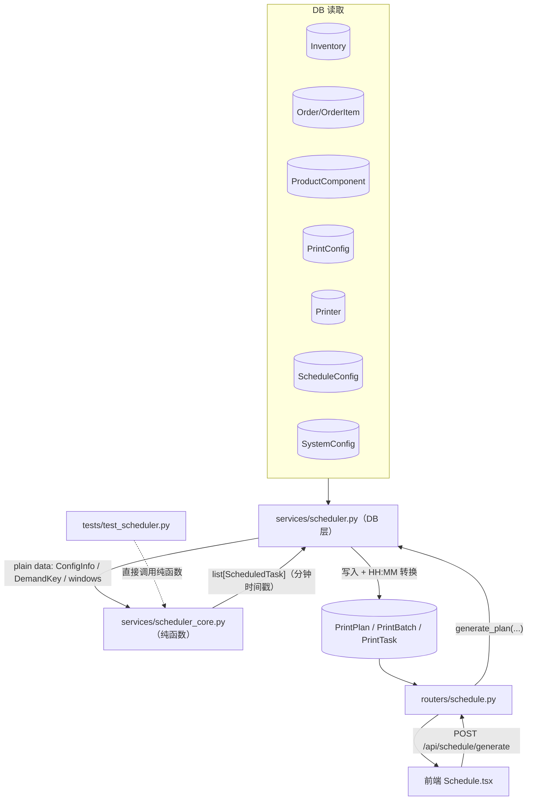
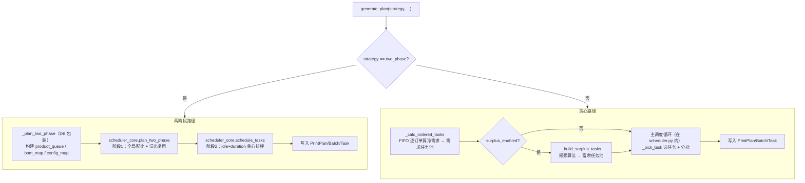
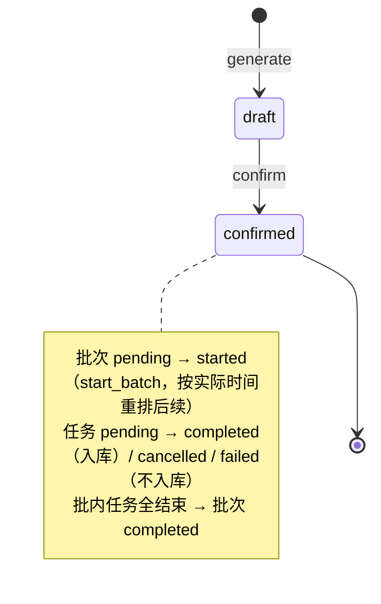
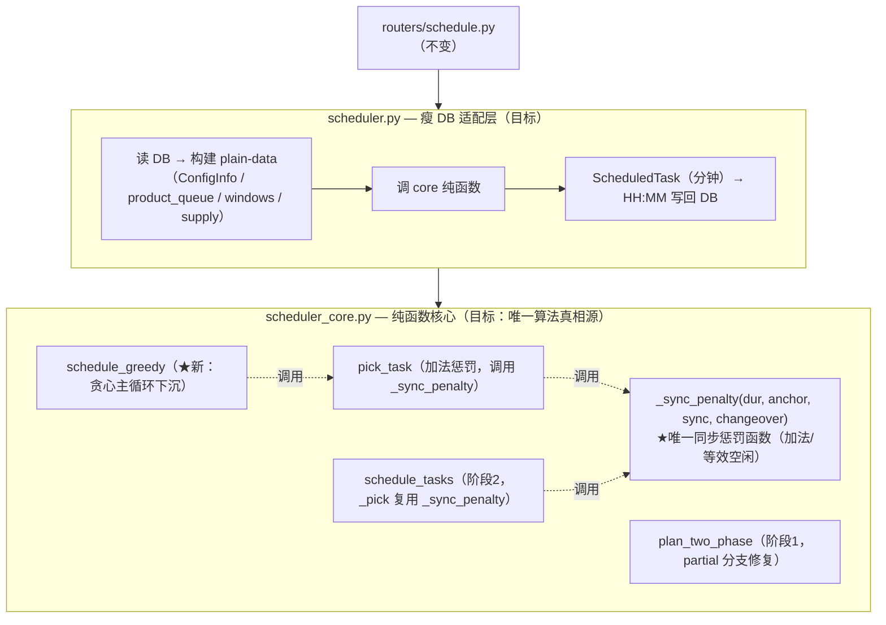
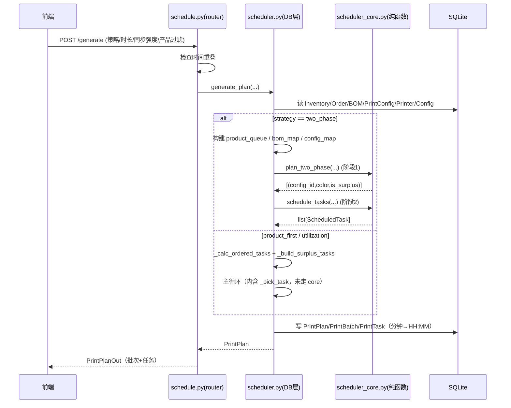

# 排班算法（Scheduler）

> Last updated: 2026-06-13 04:11:59 (UTC+8)
> Serves: prd-003（打印机排班）、富余生产、订单优先级、操作窗口
>
> **权威算法规格**：[docs/schedule_specs.md](../schedule_specs.md)。本文档不复制其算法叙述，而是描述**代码结构、分层、数据流、与 specs 的分歧、风险**。涉及具体策略/评分/富余规则时直接引用 schedule_specs.md 的章节号。
>
> **⚠️ 本轮迭代（scheduler 修复）**：本文档同时记录「现状（as-is）」与「目标设计（to-be）」。现状描述保留以便回归对照；本轮要修复的双实现/分歧项在文中标注「**本轮修复中**」，目标架构集中见 [§目标设计（本轮迭代）](#目标设计本轮迭代)。本轮**只改算法实现与 specs/常量对齐，不改 DB schema、不改 HTTP 契约、不改前端**。

## Overview

排班子系统根据「待处理订单 + 产品 BOM + 当前库存 + 打印机 + 操作窗口」自动生成多台打印机的排班表，输出按批次（`PrintBatch`）分组的打印任务（`PrintTask`）。它是系统最复杂的部分，采用**纯函数核心层 + DB 服务包装层**两层结构（见 `system.md` §6.2）。

实现文件：
- `backend/app/services/scheduler_core.py` — 纯函数核心层（算法）
- `backend/app/services/scheduler.py` — DB 服务层（数据读写 + 协调）
- `backend/app/routers/schedule.py` — HTTP 入口 + 执行控制（批次/任务状态机）
- `backend/tests/test_scheduler.py` — 核心层单元测试（850 行）

## Goals & Non-Goals

**Goals（工程层面）**
- 算法逻辑可纯单元测试，与 DB 解耦。
- 支持三种策略（`product_first` / `utilization` / `two_phase`）+ 正交的同步强度参数 + 产品过滤，自由组合（schedule_specs §5、§9、§11）。
- 严格满足时限约束：任务启动与结束均在排班周期内（schedule_specs §4）。
- 跨天操作窗口拼接（schedule_specs §2）。

**Non-Goals**
- 不做实时打印机状态监控（手动标记 started/completed）。
- 不做多用户并发排班（单用户、生成时检测时间重叠即可）。
- 不追求全局最优解——三种策略均为贪心/两阶段启发式，目标是「足够好且可解释」。

## System Context



## Detailed Design

### 数据模型

#### 算法层数据结构（`scheduler_core.py`）

```python
DemandKey = tuple[int, str]          # (component_id, color) —— 统一的需求/供给键

@dataclass
class ConfigInfo:                    # PrintConfig 的纯数据投影
    id: int
    component_id: int
    component_name: str
    quantity: int                    # 每盘产出
    duration_minutes: int            # 打印时长

@dataclass
class ScheduledTask:                 # Phase 2 / 主循环输出
    printer_index: int               # 0-based 打印机序号
    config_id: int
    color: str
    is_surplus: bool
    start_min: int                   # 自排班起点起算的分钟
    end_min: int
    batch_index: int
```

- **时间统一用分钟整数**（`0 ~ N×1440`），跨天通过窗口偏移表达；DB 边界才转 `"HH:MM"`。
- **窗口**：`list[tuple[int, int]]`，每个元组是 `(window_start_min, window_end_min)`，已跨天偏移、已排序。

#### 持久化模型（产物，详见 `system.md` §4）

`PrintPlan`（头：date / start_time / duration_hours / status）→ `PrintBatch`（一组同时启动的任务：start_time / batch_order / status）→ `PrintTask`（printer_id / print_config_id / color / is_surplus / start_time / end_time / status）。

### API / Interface Contract

#### HTTP 端点（`routers/schedule.py`）

| 方法 + 路径 | 请求体 | 说明 |
|---|---|---|
| `GET /api/schedule/plans` | — | 列出所有排班（按 date 降序） |
| `GET /api/schedule/plans/{id}` | — | 取单个排班（含 batches/tasks） |
| `POST /api/schedule/generate` | `GeneratePlanRequest` | 生成排班；**先检查与已有排班时间是否重叠**（重叠抛 400） |
| `POST /api/schedule/plans/{id}/confirm` | — | draft → confirmed |
| `DELETE /api/schedule/plans/{id}` | — | 删除该排班**及所有日期 ≥ 它的排班**（级联，返回 deleted_dates） |
| `DELETE /api/schedule/tasks/{id}` | — | 删单任务（草稿编辑） |
| `PUT /api/schedule/tasks/{id}/config/{new_config_id}` | — | 替换任务配置并重算 end_time |
| `DELETE /api/schedule/batches/{id}` | — | 删整批 |
| `POST /api/schedule/batches/{id}/start` | `{actual_time:"HH:MM"}` | 标记批次开始，按实际时间**重排后续 pending 批次** |
| `POST /api/schedule/tasks/{id}/complete` | — | 完成任务 → **库存 +quantity**；批内全结束则批次 completed |
| `POST /api/schedule/tasks/{id}/cancel` | — | 取消（不入库） |
| `POST /api/schedule/tasks/{id}/fail` | — | 失败（不入库） |

#### `GeneratePlanRequest`（`schemas.py`）

```python
date: date
surplus_enabled: bool = True
start_time: str = "00:00"
duration_hours: int = 24
strategy: str = "product_first"           # product_first | utilization | two_phase
target_product_ids: list[int] | None = None  # 产品过滤，None=不过滤
sync_strength: int = 50                    # 0~100
```

#### 核心层函数签名（`scheduler_core.py`，权威语义见 schedule_specs）

- `find_next_start(current_min, windows) -> int | None` — ≥current 的最早窗口内启动点。
- `idle_after(start, duration, changeover, windows) -> int` — 任务结束+换料后到下一窗口的空闲分钟。
- `product_completion_score(comp_key, sim_supply, product_units, bom_cache, assembled) -> (float,float,float)` — 凑齐评分（schedule_specs §5.1）。
- `try_assemble(sim_supply, product_units, bom_cache, assembled) -> None` — 按优先级消费库存组装产品单元。
- `pick_task(remaining, configs, start, changeover, windows, deadline, ...) -> tuple | None` — 任务选择（含 additive 同步惩罚）。
- `compute_effective_capacity(custom_start, deadline, windows, num_printers, safety_margin=0.9) -> int` — 有效产能（分钟）。
- `plan_two_phase(...) -> list[(config_id, color, is_surplus)]` — 两阶段法阶段 1（schedule_specs §5.3）。
- `schedule_tasks(...) -> list[ScheduledTask]` — 两阶段法阶段 2 时间排程。
- `count_complete_products(scheduled, configs, bom_map, initial_supply) -> {product_id: count}` — 产出统计。

### Logic & Behavior

#### 两条调度路径

`generate_plan()`（`scheduler.py`）按 `strategy` 分为两条互斥路径：



> **重要结构现状（本轮修复中）**：`two_phase` 阶段 2 走 `scheduler_core.schedule_tasks`（additive 同步惩罚）。
> 而 `product_first`/`utilization` 的主循环**仍在 `scheduler.py` 内**，调用 `scheduler.py._pick_task`（multiplicative 同步惩罚），**未委托给 core**。core 内也有一份等价的 `pick_task`（additive），目前仅被测试与（间接）two_phase 路径使用。两份 `_pick_task`/`pick_task` 逻辑不一致，见 §Alternatives 与 §Open Questions。
> **本轮迭代将此现状收敛为单一 core 实现**：删除 `scheduler.py._pick_task`，主循环下沉至 core，三策略统一走 additive 加法惩罚。目标见 [§目标设计（本轮迭代）](#目标设计本轮迭代)。

#### 贪心路径主循环（`scheduler.py.generate_plan`，schedule_specs §8）

1. `_calc_ordered_tasks`：按 `created_at` FIFO 逐订单计算净需求（初始供给 = 库存 + 早于排班日的已排班产出），库存已满足的订单跳过，前序溢出顺延（schedule_specs §10）。`_select_configs` 为净需求选盘（优先选 `quantity ≤ remaining` 的最大盘）。
2. 若 `product_first`：`_build_product_context` 展开产品单元队列 + BOM 缓存，初始化 `sim_supply` 并 `_try_assemble` 预组装。
3. 若 `surplus_enabled`：`_build_surplus_tasks` 用瓶颈算法生成富余池（schedule_specs §7）。
4. 分批循环：找最早可用打印机时间 → `find_next_start` 求窗口内启动点 → 收集该时刻可用打印机 → 逐台 `_next_task`（先需求池后富余池）选任务 → 更新 `printer_available = end + changeover` →（product_first）更新 sim_supply 并 try_assemble。首批从 `custom_start` 启动；后续批次起点 = `find_next_start(earliest)`。

#### 两阶段路径（schedule_specs §5.3）

- 阶段 1（`plan_two_phase`）：`compute_effective_capacity` 估有效产能 → 按 `product_queue` 优先级贪心分配，逐产品单元算「组件盘数配方 + 溢出复用」，产能不足时对瓶颈组件做部分生产后 break → 输出 `plan_counts` 展开为任务列表，按 `order_demand_counts` 标记 `is_surplus`。
- 阶段 2（`schedule_tasks`）：固定按 `score = idle + sync_penalty`（tiebreak duration）排程；批次起点用 **dynamic batch start timing**——按 `sync_strength` 在「最早可用打印机时间」与「最晚可用打印机时间」之间插值（sync=0 取最早、sync=100 取最晚、sync=50 取中点），超时则回退最早。

#### 同步强度（schedule_specs §9 + 代码现状）

- **schedule_specs §9.3 描述（旧）**：multiplicative——penalty 作为评分元组前置因子 `(sync_penalty, prod_score, idle, dur)`。这正是 `scheduler.py._pick_task` 的实现。
- **`scheduler_core.py` 实现（新，commit 75089ee）**：additive——penalty 转为「等效空闲分钟」，二次方缩放后加到 idle 上：`score = (prod_score, idle + sync_penalty, dur)`，其中 `sync_penalty = |dur-anchor|/anchor × (sync/100)² × changeover × 4`。配合阶段 2 的 dynamic batch start timing。
- 锚定逻辑一致：每批第一台打印机正常选任务，其时长成为 `anchor_duration`，后续台叠加偏差惩罚。

#### 执行控制状态机（`routers/schedule.py`）



`start_batch`：解析实际开始时间，更新本批 task 时间，按 `printer_available + changeover` 重排所有 `batch_order >` 当前且 `status==pending` 的批次（与排班算法一致地按打印机跟踪可用时间）。

## 目标设计（本轮迭代）

> 本节是本轮 scheduler 修复迭代的**目标架构（to-be）**，对应已批准的审计结论 方案 A/B/C/F。落地后应回填到 §Detailed Design 的对应小节并删除「本轮修复中」标注。
> **范围红线**：本轮**不动** DB schema（`PrintPlan/PrintBatch/PrintTask` 字段）、**不动** HTTP 契约（`routers/schedule.py` 所有端点请求/响应不变）、**不动**前端。改动仅限 `scheduler.py` / `scheduler_core.py` / `schedule_specs.md` / `test_scheduler.py`，以及 `design-scheduler.md`、`system.md` 文档对齐。

### T0. 目标分层（消除双实现）



落地后**删除**：`scheduler.py._pick_task`（multiplicative，273-278 行）、`scheduler.py.generate_plan` 内 612-774 行的贪心主循环（`_next_task` / 分批 / sim_supply 更新 / 动态批次启动）。`scheduler.py` 仅保留：DB 读取辅助（`_get_windows` / `_get_initial_supply` / `_calc_ordered_tasks` / `_build_product_context` / `_build_surplus_tasks` / `_plan_two_phase` 的 DB 包装）、plain-data 构建、调 core、结果写回。

> **决策：`_build_surplus_tasks` 暂留 `scheduler.py`**。它本身已是「读 DB → 纯瓶颈循环」，但瓶颈循环目前与 DB 查询交织。本轮**不强制**下沉它（不在审计 A/B 范围），只要求它产出的 `surplus_tasks` 作为 plain-data 传入新的 core 主循环。若实现时发现易于剥离纯函数部分可顺手做，但非必须，避免扩大本轮范围。

### T1. 方案 A — 统一同步惩罚 + 主循环下沉

#### A.1 单一同步惩罚函数（消除三份拷贝）

当前同步惩罚有**三份**实现：`scheduler.py._pick_task`（乘法，273-278）、`scheduler_core.pick_task`（加法，192-194）、`scheduler_core.schedule_tasks._pick`（加法，394-398）。后两份公式相同但各写一遍。目标：抽出**唯一**纯函数，三处调用方全部复用。

```python
# scheduler_core.py 顶部常量区
SYNC_PENALTY_CHANGEOVER_MULT = 4      # 惩罚相对 changeover 的放大倍数
# 缩放因子说明见 schedule_specs §9.3

def _sync_penalty(
    duration: int,
    anchor_duration: int | None,
    sync_strength: int,
    changeover: int,
) -> float:
    """同步惩罚 → 等效空闲分钟（加法，二次方缩放）。

    anchor_duration 为 None / <=0 或 sync_strength<=0 时返回 0.0。
    公式：|dur-anchor|/anchor × (sync/100)² × changeover × SYNC_PENALTY_CHANGEOVER_MULT
    """
    if not anchor_duration or anchor_duration <= 0 or sync_strength <= 0:
        return 0.0
    strength_factor = (sync_strength / 100) ** 2
    return abs(duration - anchor_duration) / anchor_duration * strength_factor * changeover * SYNC_PENALTY_CHANGEOVER_MULT
```

- `pick_task`、`schedule_tasks._pick` 均改为 `sp = _sync_penalty(dur, anchor, sync_strength, changeover)`，评分维持 `score = (prod_score, idle + sp, dur)`（pick_task）/ `score = idle + sp`（schedule_tasks）。
- 行为不变（公式本就相同），仅消除重复定义 → 单一真相源。

#### A.2 新 core 主循环函数签名 `schedule_greedy`

把 `scheduler.py.generate_plan` 的贪心分批主循环（660-774 行）整体下沉为 core 纯函数。**设计决策**：新增独立函数 `schedule_greedy`（而非扩展 `schedule_tasks`），理由：

| 准则 | 扩展 `schedule_tasks` | 新增 `schedule_greedy`（选定） |
|---|---|---|
| 输入语义 | two_phase 是「已配比好的扁平任务列表」，无需求/富余分池、无 sim_supply | 贪心是「需求池+富余池+产品凑齐上下文」，输入维度差异大 |
| 批次启动时机 | dynamic batch start（按 sync 在最早/最晚间插值） | 现状贪心是「首批 custom_start，后续 find_next_start(最早)」——**本轮保持现状**，不引入 dynamic start（属行为变更，非本轮目标） |
| 任务选择 | 固定 `idle+sync`，无 prod_score | 走 `pick_task`（带 prod_score / FIFO 优先级 / 同步惩罚） |
| 圈复杂度 | 合并后单函数承载两套分支，可读性差 | 两函数各自单一职责 |
| **裁决** | | **新增 `schedule_greedy`：输入与控制流差异过大，强行合并得不偿失** |

函数签名（plain-data，无 `Session`）：

```python
def schedule_greedy(
    *,
    demand_tasks: list[tuple[int, str, int]],   # 需求池 (config_id, color, order_priority)
    surplus_tasks: list[tuple[int, str]],        # 富余池 (config_id, color)，无富余时传 []
    configs: dict[int, ConfigInfo],              # {config_id: ConfigInfo}
    num_printers: int,
    windows: list[tuple[int, int]],
    custom_start: int,
    deadline: int,
    changeover: int,
    sync_strength: int,
    use_product_first: bool,                     # True=product_first, False=utilization
    # 仅 product_first 用（use_product_first=False 时传 None）：
    sim_supply: dict[DemandKey, int] | None = None,
    product_units: list[tuple[int, int]] | None = None,
    bom_cache: dict[int, dict[DemandKey, int]] | None = None,
    assembled: set[int] | None = None,
) -> list[ScheduledTask]:
    """三策略中 product_first / utilization 的贪心主循环（纯函数）。

    与 schedule_tasks（two_phase 阶段2）并列。内部：
      - 分批循环：首批 custom_start 启动；后续批 find_next_start(min(printer_available))
      - 每批逐台调 pick_task：先 demand 后 surplus（demand 全超时则清空）
      - 第一台设 anchor_duration，后续台叠加 _sync_penalty
      - use_product_first 时：每选中一个任务，sim_supply += 产出，调 try_assemble
      - 死循环兜底沿用现状（无可用打印机→推进到下一窗口；空批→删批退出）
    Returns: list[ScheduledTask]（与 schedule_tasks 同构，scheduler.py 统一写回逻辑）
    """
```

**关键设计点**：
- `sim_supply` / `assembled` 由调用方（`scheduler.py`）构建并传入；core 在循环内**就地修改**它们（与现状 `_try_assemble` 副作用语义一致）。core 仍是「纯」——无 DB、无全局态，输出仅依赖输入。
- 返回 `list[ScheduledTask]` 而非直接写 DB——`scheduler.py` 用**与 two_phase 路径完全相同**的 `ScheduledTask → PrintBatch/PrintTask` 写回代码（579-607 行那段）。本轮可顺手把该写回逻辑抽成 `scheduler.py._persist_scheduled(db, plan, scheduled, printers)` 私有函数，两条路径共用，消除写回重复。
- `demand_tasks` 元素统一为三元组 `(config_id, color, order_priority)`，`utilization` 也带 priority（FIFO），`pick_task` 的 `use_completion=False` 分支读 `item[2]` 作 prod_score——与现状一致。

#### A.3 行为变化与回归锁定

| 维度 | 现状（product_first/utilization） | 目标 | 影响 |
|---|---|---|---|
| 同步惩罚 | 乘法、评分元组**前置**（强支配 prod_score） | 加法、并入 idle 维度（弱惩罚，不支配 prod_score） | **默认 sync=50 下任务选择会变**；高 sync 不再阻止批次填满 |
| 低强度（sync<30） | 线性，仍有可感惩罚 | 二次方缩放，几乎无惩罚 | sync 小值更「干净」 |
| 批次启动时机 | 首批 custom_start，后续 find_next_start(最早) | **不变**（不引入 dynamic start） | 贪心路径批次节奏不变 |

> **回归测试要求（强制）**：这是用户可见行为变更（同步语义从乘法强支配 → 加法弱惩罚）。必须新增端到端回归测试**锁定新行为**，覆盖：(1) product_first + sync=0/50/100 的批次数单调性（参照现有 `test_sync_gradient_sensitivity`）；(2) product_first 下 prod_score 仍主导（高 sync 不应让算法放弃凑齐瓶颈件去追时长对齐）；(3) utilization + sync 的 idle 主导。详见 §Cross-Cutting Concerns·测试策略。

### T2. 方案 B — two_phase partial 分支修复

#### B.1 现状缺陷（`scheduler_core.plan_two_phase` 301-318）

产能不足以容纳「下一个完整产品单元的所有组件盘」时，进入 partial 分支：把该单元的 `plates_needed` 按 `plate_time` **降序**（`sort(key=lambda x: -x[2])`）逐个塞进剩余产能。缺陷：

1. **排序方向错误**：优先塞**最长**的盘。最长盘往往是单产出瓶颈件（如下柜 776min/盘产 8 个），塞进去耗尽产能却**单独一个组件凑不齐完整产品**，产出「孤儿长件」。短的短板件反而排不进 → 这一截产能没换来任何「更接近凑齐一个完整产品」。
2. **overflow 口径不一致**（316 行）：`actual >= plates` 时才扣 BOM 需求（`bom.get(comp_key,0)`），`actual < plates`（部分生产）时**不扣** BOM。语义模糊——部分生产的盘到底算不算「为这个产品单元消费了组件」未定义，影响后续（已 break，实际无后续，但语义不清且易被误改）。

#### B.2 选定修法：「凑整放弃」（complete-or-skip），而非「边际贡献排序」

**设计决策**：partial 分支改为「**尝试用剩余产能凑齐这一个完整产品单元的全部短板组件；凑不齐则放弃该单元、不产出任何孤儿盘**」。

选型对比：

| 准则 | 现状（-plate_time 降序） | 修法①边际贡献排序（瓶颈件 stock/bom_qty 最低优先） | 修法②凑整放弃（选定） |
|---|---|---|---|
| 是否产出孤儿件 | 是（最长件优先，凑不齐） | 减少但仍可能（排序改善，不保证完整） | **否**（要么凑齐一个产品，要么不产） |
| 与 two_phase 立意一致性 | 差（two_phase 卖点是「配比精确、凑齐最多完整产品」） | 中 | **高**（每一份产能都服务于「多凑一个完整产品」） |
| overflow 口径 | 不一致（部分生产不扣 BOM） | 仍需定义部分生产语义 | **干净**：凑齐则正常走「产能足够」分支的 overflow 更新；放弃则不产、不改 overflow |
| 实现复杂度 | — | 中（要算边际贡献分） | **低**（复用主分支逻辑：能否 afford 全部 plates_needed？能则记账，不能则 break 不产） |
| 浪费末段产能 | 否（塞满但塞的是垃圾） | 否 | 是（末段可能留白）——可接受 |
| 可测性 | 差 | 中 | **高**（断言：partial 不产生使任一组件 stock 非整除 BOM 的孤儿；或断言完整产品数不因 partial 下降） |
| **裁决** | 淘汰 | 次选 | **选定** |

**选定理由**：two_phase 的核心承诺（schedule_specs §5.3）是「全局配比、凑齐最多完整产品」。在最后一个放不下的产品单元上塞半个产品的零件，既不增加完整产品数，又把产能浪费在孤儿件上、还污染 overflow 池。「凑整放弃」让 two_phase 的产出严格等于「完整产品的整数倍 + 已 afford 的整产品」，语义最干净、最符合立意，且实现上**直接复用主分支的记账逻辑**（不需要新的边际贡献评分）。代价是末段可能留少量空闲产能——但 two_phase 阶段 2 排程时这些产能本就可能因碎片无法利用，且 `surplus_enabled` 场景下富余目标会继续填充，影响可忽略。

> **边界**：若**当前单元就是第一个**（`remaining_capacity` 从一开始就不够任何完整产品），凑整放弃会导致 `plan_counts` 为空 → 空排班。这与现状「无打印机/无订单→空排班」一类，可接受；但需单测覆盖「产能恰好够 N 个完整产品、第 N+1 个差一点」的临界场景，断言产出恰为 N 个完整产品的盘、无孤儿件。

#### B.3 partial 分支目标伪代码

```python
# 替换 301-318 行
if time_needed > remaining_capacity:
    # 凑整放弃：这一单元的全部短板盘是否都能 afford？
    #（time_needed 已含 changeover；放不下则不产出任何盘，结束分配）
    break   # plan_counts 保留此前已完整 afford 的单元，不产孤儿件

# time_needed <= remaining_capacity 时走原「产能足够」分支（320-334），逐组件记账
```

> 即：partial 分支退化为「直接 break」。因为只要 `time_needed > remaining_capacity`，这个单元就凑不齐，依「凑整放弃」原则不产出。原 302-318 的「按 plate_time 降序塞」整段删除。overflow 口径问题随之消失（部分生产路径不复存在）。

### T3. 方案 C — SURPLUS_TARGET_PRODUCTS 单一真相源

#### C.1 现状三处不一致

`scheduler.py:40`=20、`scheduler_core.py:21`=20（**core 内定义但无引用**，死常量）、`schedule_specs.md §7.3`=5。另 `project-overview.md` 同时出现 20 与 5。

#### C.2 选定值与收敛方式

**设计决策：最终值 = 20**；唯一定义在 `scheduler_core.py`，`scheduler.py` 改为 `from .scheduler_core import SURPLUS_TARGET_PRODUCTS`，删除 `scheduler.py:40` 的本地定义；`schedule_specs.md §7.3` 数值由 5 改为 20。

选型对比（值取 20 vs 5）：

| 准则 | 20（选定） | 5 |
|---|---|---|
| 与**实际运行行为**一致 | 是（两份代码都跑 20） | 否（需改代码行为） |
| 本轮范围 | 纯文档/常量对齐，零行为变更 | 改富余产出量＝行为变更，需额外回归 |
| 富余「备货」力度 | 强（一次可备 20 个完整产品余量） | 弱 |
| 风险 | 备货多可能某组件堆积（有 `max_rounds=500` 兜底） | 备货过少，富余开关价值降低 |
| **裁决** | **选定（对齐实际行为，零行为变更，最小风险）** | 否 |

**理由**：本轮是「修复 + 对齐」迭代，不应顺带改变富余产出规模这种产品手感参数。代码两处实测值都是 20，specs 的 5 是文档滞后。收敛到 20 = 把文档对齐到代码现状，零行为变更、零额外回归负担。若产品侧后续认为 20 太多，另开 PR 调整并配套回归——不混入本轮。

> **实现注意**：`scheduler_core.py` 的 `SURPLUS_TARGET_PRODUCTS` 当前在 core 内**无任何引用**（富余瓶颈循环 `_build_surplus_tasks` 在 `scheduler.py`）。本轮**不要求**把 `_build_surplus_tasks` 整体下沉到 core，只要求常量单一定义 + import。若后续 `_build_surplus_tasks` 下沉，则该常量自然在 core 内被引用，消除「core 死常量」的别扭。

### T4. 方案 F — 规格与常量对齐（依赖 A/B 完成）

> **排序约束**：F 必须在 A、B 代码落地后再做，否则会把 specs 改成与代码不符的另一种形态。

1. **`schedule_specs.md §9.3` 用加法惩罚重写**：删除「penalty 作为评分元组前置因子」「乘以 sync_strength/100」的旧叙述，改写为：penalty 转为**等效空闲分钟**加到 idle 维度；公式 `|dur-anchor|/anchor × (sync/100)² × changeover × 4`；说明 `×4`（相对 changeover 的放大倍数 `SYNC_PENALTY_CHANGEOVER_MULT`）与 `²`（二次方缩放：低强度<30 近乎无惩罚、高强度强惩罚）两个缩放因子的来由。同步更新 §9.4 效果示例若与新公式不符。
2. **澄清 FIFO 语义（§5.1 / §10）**：实现是「**硬 FIFO + 跳过库存已满足订单**」（`scheduler.py:132/136` 静态 `order_priority = enumerate(orders)`，按 `created_at` 升序，库存满足则 `continue`）。specs §5.1 / §10 若有「软 FIFO」「不完全阻塞后续订单」类措辞，改为与实现一致的硬 FIFO 表述（**用户未要求实现软 FIFO**，不改代码，只改文档）。
3. **算法常量集中到 core 顶部 + specs 引用「见代码常量」**：`SURPLUS_TARGET_PRODUCTS=20`、changeover 默认 `15`、`compute_effective_capacity` 安全系数 `0.9`、`SYNC_PENALTY_CHANGEOVER_MULT=4` 集中到 `scheduler_core.py` 顶部常量区；specs 相关数值改为「见代码常量 `<NAME>`」并保留一处数值快照便于阅读。
   > **范围说明**：changeover 默认 15 当前散落在 `scheduler.py._get_changeover_minutes`、`routers/schedule.py.start_batch`、前端 `Schedule.tsx`。本轮**只收敛 core/scheduler.py 内的算法常量**；`routers` 与前端的 15 属「SystemConfig 默认值初始化」更大议题（见 §Open Questions #4、system.md §9.5），**不在本轮范围**，避免范围蔓延。

### T5. 本轮不做（明确排除，防范围蔓延）

- ❌ 不引入贪心路径的 dynamic batch start timing（保持「首批 custom_start，后续最早」）。
- ❌ 不下沉 `_build_surplus_tasks` 全量到 core（只要求其输出作 plain-data 传入）。
- ❌ 不改 changeover 默认 15 在 `routers`/前端的内联（属 SystemConfig 初始化议题）。
- ❌ 不改操作窗口 fallback 硬编码（Open Questions #3，独立议题）。
- ❌ 不改 DB schema、HTTP 契约、前端任何代码。
- ❌ 不改富余产出规模（SURPLUS 维持实际值 20）。

### Edge Cases（现状已处理）

| 场景 | 处理 |
|---|---|
| 无打印机 | `generate_plan` 抛 `ValueError` → 400 |
| 超长任务放不进剩余周期 | `pick_task` 跳过 `start+dur > deadline`；需求池全超时则清空避免死循环 |
| 本批无任何打印机可用 | 安全兜底：把最早打印机推进到下一窗口启动点，避免死循环 |
| 本批一个任务都没排进 | 删除空批次并结束循环 |
| 与已有排班时间重叠 | `generate_schedule` 端点抛 400 |
| 删除中间日期排班 | 级联删除所有 ≥ 该日期的排班（保证供给链一致性） |
| 富余无限生成 | `SURPLUS_TARGET_PRODUCTS` 上限 + `max_rounds=500` 双保险 |

## Data Flow



## Alternatives Considered

### 同步惩罚：multiplicative 前置 vs additive 等效空闲

| 准则 | Multiplicative 前置（scheduler.py 旧 / specs §9.3） | Additive 等效空闲（scheduler_core，commit 75089ee） |
|---|---|---|
| 是否阻止批次填满 | 可能（penalty 排在评分元组最前，强支配） | 否（仅加到 idle 维度，不支配 prod_score） |
| 低强度行为 | 线性，低强度也有可感惩罚 | 二次方缩放，<30 几乎无惩罚 |
| 与 dynamic batch start 配合 | 无 | 有（阶段 2 按 sync 插值批次起点） |
| 当前使用方 | product_first/utilization 主循环 | two_phase 阶段 2 + 单元测试 |
| **裁决** | 旧，**本轮删除** | **本轮统一为全路径唯一实现（方案 A），specs §9.3 同步重写（方案 F）** |

### 是否做批内分散

schedule_specs §6 已记录：早期强制批内分散（4 台打不同组件）严重损害效率，**已废弃**。现做法：完全由任务池比例驱动（需求计算阶段已按正确比例生成任务）。本设计沿用。

### 调度策略三选（schedule_specs §5.4 有完整对比表）

`two_phase`（智能规划）为推荐通用策略；`product_first` 适合紧急发货；`utilization` 适合囤货。三者与 `sync_strength`、`target_product_ids` 正交组合。

## Cross-Cutting Concerns

- **错误处理**：`ValueError` → 400；多重死循环兜底（见 Edge Cases）。
- **安全**：无鉴权（见 `system.md` §5.3），排班可被任意调用。
- **性能**：数据规模极小（产品<10、组件 20~30、打印机 4、每日订单少，见 specs §9）。复杂度受 `pick_task` 每批 O(候选任务数) × 富余 `max_rounds≤500` 约束，单次生成毫秒~百毫秒级。**潜在 N+1**：`_calc_ordered_tasks`、`_build_surplus_tasks`、`_plan_two_phase` 内对每订单/每产品逐条查 BOM、对每 config 逐条查（`db.get(PrintConfig, ...)` 循环）。当前规模无碍，规模增大需批量加载。
- **可观测性**：仅 `print(f"目录已加载: {stats}")` 与 `migrate` 的 logger；排班过程无日志/指标。
- **测试**：`test_scheduler.py` 覆盖 `find_next_start`、`idle_after`、`try_assemble`、`plan_two_phase`、`schedule_tasks`、`sync_strength`、组件配比、策略对比、边界、`count_complete_products`（10 个测试类）。仅覆盖**核心层**；`scheduler.py` 的 DB 层主循环与 `_pick_task` 旧实现无直接单测。

**本轮迭代新增测试要求（强制，全部针对 core 纯函数，无需 DB）**：

1. **`schedule_greedy` 专项测试类**（新 `TestScheduleGreedy`）——主循环下沉后的核心回归面：
   - product_first：高 sync 不夺取 prod_score 主导（构造一个差 1 个瓶颈件即可凑齐的产品，断言即使 sync=100 也优先选该瓶颈件而非时长对齐件）。
   - utilization：sync 影响 idle 维度但 FIFO order_priority 仍优先。
   - 需求池/富余池切换：demand 取完才取 surplus；demand 全超 deadline 时清空不死循环。
   - 批次启动：首批 == custom_start；后续批 == find_next_start(min(printer_available))（**断言不引入 dynamic start**）。
   - 与旧 `scheduler.py._pick_task` 行为差异锁定：同一输入下，记录新加法惩罚的选择结果作为黄金值（防回退到乘法）。
2. **`_sync_penalty` 单元测试**：anchor=None/0、sync=0 → 0.0；公式数值（取已知 dur/anchor/changeover/sync 手算比对）；二次方缩放（sync=30 惩罚 ≪ sync=100）。
3. **two_phase partial 凑整放弃测试**（扩充 `TestPlanTwoPhase`）：
   - 产能恰好够 N 个完整产品、第 N+1 差一点 → 断言产出恰为 N 个完整产品的盘、**无孤儿件**（每个出现的组件其总产出能整除参与的 BOM 需求 / 或 `count_complete_products` 不因 partial 下降）。
   - 第一个产品就放不下 → `plan_counts` 为空（空排班）。
   - 回归：原 `test_capacity_exhaustion` / `test_capacity_safety_margin` 仍通过。
4. **SURPLUS 常量 import 测试**（可选轻量）：断言 `scheduler.scheduler` 与 `scheduler_core` 引用同一 `SURPLUS_TARGET_PRODUCTS` 对象/值（防再次漂移）。
5. **现有同步梯度测试**（`test_sync_gradient_sensitivity` / `test_sync_100_fewer_batches_than_0` 等）改为同时覆盖 `schedule_greedy`（参数化或复制），确保贪心路径也满足批次数单调性。

> DB 层主循环已下沉为纯函数后，`scheduler.py` 仅剩薄适配，**本轮不要求**新增 DB 集成测试（保持 core 单测策略），但**可选**加一个 `generate_plan` 冒烟测试（建临时 SQLite、最小目录、断言三策略各生成非空 plan 且 task 时间在周期内）以覆盖适配层接线——若 planner 容量允许则做，非强制。

## Dependencies & Integration Points

- **依赖**：`Inventory`/`Order`/`ProductComponent`/`PrintConfig`/`Printer`/`ScheduleConfig`/`SystemConfig`（读）；目录由 `design-catalog.md` 维护。
- **被依赖**：前端 `Schedule.tsx`（生成/展示/执行）；`complete_task` 写回 `Inventory`（与 `design-orders-inventory.md` 的库存增减形成闭环：排班完成入库、发货出库）。
- **供给链耦合**：`_get_initial_supply` 把「早于排班日的已排班产出」计入初始供给——因此删除中间排班必须级联删除后续排班（已实现），否则供给估算失真。

## Open Questions & Risks

1. ~~**`_pick_task` 双实现分歧**~~ **【本轮迭代修复 — 方案 A】**：统一为 `scheduler_core` 唯一加法惩罚实现，主循环下沉为 `schedule_greedy`，删除 `scheduler.py._pick_task`，specs §9.3 同步重写（方案 F）。目标见 [§目标设计·T1/T4](#t1-方案-a--统一同步惩罚--主循环下沉)。
2. ~~**`SURPLUS_TARGET_PRODUCTS` 三处口径不一**~~ **【本轮迭代修复 — 方案 C】**：收敛到 `scheduler_core` 单一定义=20，`scheduler.py` import，specs §7.3 由 5 改 20。目标见 [§目标设计·T3](#t3-方案-c--surplus_target_products-单一真相源)。
3. **操作窗口默认 fallback 硬编码**（`scheduler.py:53`）：`[(480,720),(750,1080),(1110,1380)]` 应改为初始化时写入默认 `ScheduleConfig` 行，避免与前端默认值（`Settings.tsx`）两处漂移。**（不在本轮范围）**
4. **`changeover` 默认 15 内联多处**：`scheduler.py._get_changeover_minutes`、`schedule.py.start_batch`、前端各写 `if cfg else 15`。本轮只收敛 core/scheduler.py 内**算法常量**（方案 F·3）；`routers`/前端的 15 属 SystemConfig 初始化议题，**不在本轮范围**。
5. ~~**两阶段溢出复用临界逻辑复杂**~~ **【本轮迭代修复 — 方案 B】**：partial 分支改「凑整放弃」（直接 break，不产孤儿件），消除 `overflow` 部分生产口径歧义，补产能临界专项单测。目标见 [§目标设计·T2](#t2-方案-b--two_phase-partial-分支修复)。
6. **分钟时间戳上限**：`fmtTime`/DB 用 `"HH:MM"` 允许 >24:00（如 `33:40`），跨多天 OK，但 `start_batch` 等处用 `ah*60+am` 解析假定 `actual_time` 在 0~23:59，若实际操作发生在跨夜时段需注意。
