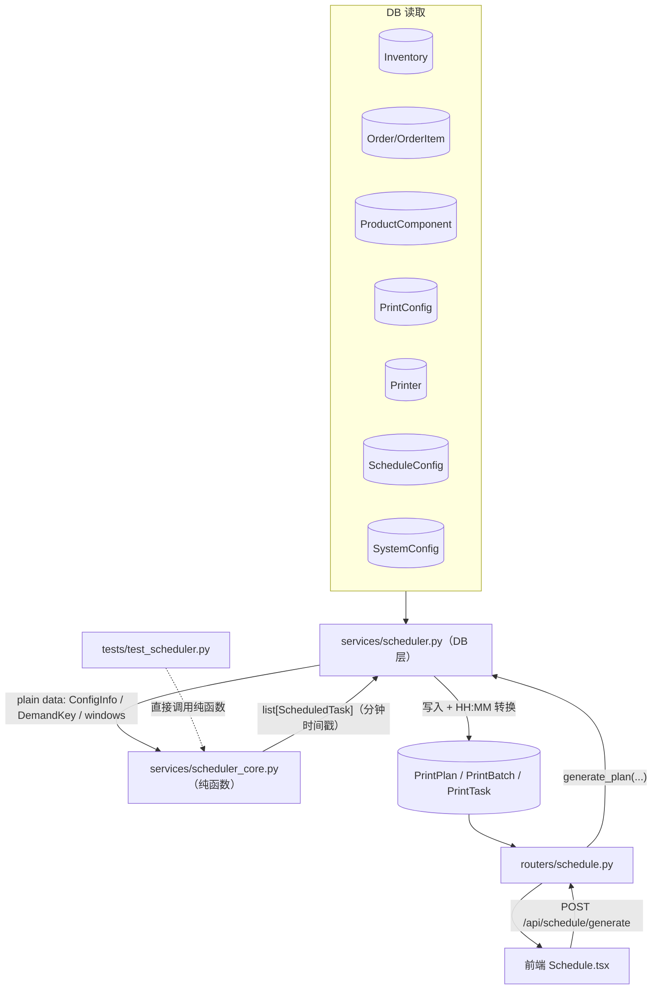
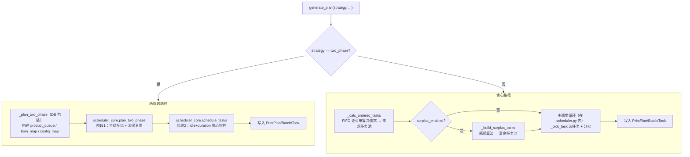
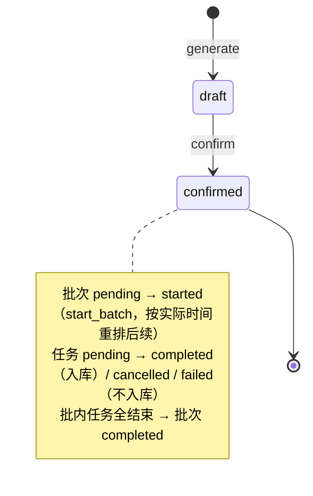
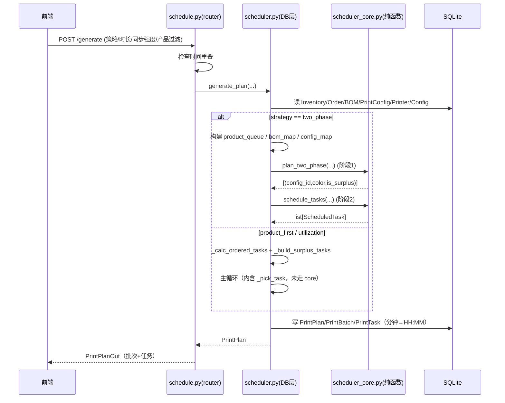

# 排班算法（Scheduler）

> Last updated: 2026-06-13 02:11:44 (UTC+8)
> Serves: 打印机排班（specs.md 第 5 节）、富余生产、订单优先级、操作窗口
>
> **权威算法规格**：[docs/schedule_specs.md](../schedule_specs.md)。本文档不复制其算法叙述，而是描述**代码结构、分层、数据流、与 specs 的分歧、风险**。涉及具体策略/评分/富余规则时直接引用 schedule_specs.md 的章节号。

## Overview

排班子系统根据「待处理订单 + 产品 BOM + 当前库存 + 打印机 + 操作窗口」自动生成多台打印机的排班表，输出按批次（`PrintBatch`）分组的打印任务（`PrintTask`）。它是系统最复杂的部分，采用**纯函数核心层 + DB 服务包装层**两层结构（见 `system.md` §6.2）。

实现文件：
- `backend/app/services/scheduler_core.py` — 纯函数核心层（算法）
- `backend/app/services/scheduler.py` — DB 服务层（数据读写 + 协调）
- `backend/app/routers/schedule.py` — HTTP 入口 + 执行控制（批次/任务状态机）
- `backend/tests/test_scheduler.py` — 核心层单元测试（850 行）

## Goals & Non-Goals

**Goals（工程层面）**
- 算法逻辑可纯单元测试，与 DB 解耦。
- 支持三种策略（`product_first` / `utilization` / `two_phase`）+ 正交的同步强度参数 + 产品过滤，自由组合（schedule_specs §5、§9、§11）。
- 严格满足时限约束：任务启动与结束均在排班周期内（schedule_specs §4）。
- 跨天操作窗口拼接（schedule_specs §2）。

**Non-Goals**
- 不做实时打印机状态监控（手动标记 started/completed）。
- 不做多用户并发排班（单用户、生成时检测时间重叠即可）。
- 不追求全局最优解——三种策略均为贪心/两阶段启发式，目标是「足够好且可解释」。

## System Context



## Detailed Design

### 数据模型

#### 算法层数据结构（`scheduler_core.py`）

```python
DemandKey = tuple[int, str]          # (component_id, color) —— 统一的需求/供给键

@dataclass
class ConfigInfo:                    # PrintConfig 的纯数据投影
    id: int
    component_id: int
    component_name: str
    quantity: int                    # 每盘产出
    duration_minutes: int            # 打印时长

@dataclass
class ScheduledTask:                 # Phase 2 / 主循环输出
    printer_index: int               # 0-based 打印机序号
    config_id: int
    color: str
    is_surplus: bool
    start_min: int                   # 自排班起点起算的分钟
    end_min: int
    batch_index: int
```

- **时间统一用分钟整数**（`0 ~ N×1440`），跨天通过窗口偏移表达；DB 边界才转 `"HH:MM"`。
- **窗口**：`list[tuple[int, int]]`，每个元组是 `(window_start_min, window_end_min)`，已跨天偏移、已排序。

#### 持久化模型（产物，详见 `system.md` §4）

`PrintPlan`（头：date / start_time / duration_hours / status）→ `PrintBatch`（一组同时启动的任务：start_time / batch_order / status）→ `PrintTask`（printer_id / print_config_id / color / is_surplus / start_time / end_time / status）。

### API / Interface Contract

#### HTTP 端点（`routers/schedule.py`）

| 方法 + 路径 | 请求体 | 说明 |
|---|---|---|
| `GET /api/schedule/plans` | — | 列出所有排班（按 date 降序） |
| `GET /api/schedule/plans/{id}` | — | 取单个排班（含 batches/tasks） |
| `POST /api/schedule/generate` | `GeneratePlanRequest` | 生成排班；**先检查与已有排班时间是否重叠**（重叠抛 400） |
| `POST /api/schedule/plans/{id}/confirm` | — | draft → confirmed |
| `DELETE /api/schedule/plans/{id}` | — | 删除该排班**及所有日期 ≥ 它的排班**（级联，返回 deleted_dates） |
| `DELETE /api/schedule/tasks/{id}` | — | 删单任务（草稿编辑） |
| `PUT /api/schedule/tasks/{id}/config/{new_config_id}` | — | 替换任务配置并重算 end_time |
| `DELETE /api/schedule/batches/{id}` | — | 删整批 |
| `POST /api/schedule/batches/{id}/start` | `{actual_time:"HH:MM"}` | 标记批次开始，按实际时间**重排后续 pending 批次** |
| `POST /api/schedule/tasks/{id}/complete` | — | 完成任务 → **库存 +quantity**；批内全结束则批次 completed |
| `POST /api/schedule/tasks/{id}/cancel` | — | 取消（不入库） |
| `POST /api/schedule/tasks/{id}/fail` | — | 失败（不入库） |

#### `GeneratePlanRequest`（`schemas.py`）

```python
date: date
surplus_enabled: bool = True
start_time: str = "00:00"
duration_hours: int = 24
strategy: str = "product_first"           # product_first | utilization | two_phase
target_product_ids: list[int] | None = None  # 产品过滤，None=不过滤
sync_strength: int = 50                    # 0~100
```

#### 核心层函数签名（`scheduler_core.py`，权威语义见 schedule_specs）

- `find_next_start(current_min, windows) -> int | None` — ≥current 的最早窗口内启动点。
- `idle_after(start, duration, changeover, windows) -> int` — 任务结束+换料后到下一窗口的空闲分钟。
- `product_completion_score(comp_key, sim_supply, product_units, bom_cache, assembled) -> (float,float,float)` — 凑齐评分（schedule_specs §5.1）。
- `try_assemble(sim_supply, product_units, bom_cache, assembled) -> None` — 按优先级消费库存组装产品单元。
- `pick_task(remaining, configs, start, changeover, windows, deadline, ...) -> tuple | None` — 任务选择（含 additive 同步惩罚）。
- `compute_effective_capacity(custom_start, deadline, windows, num_printers, safety_margin=0.9) -> int` — 有效产能（分钟）。
- `plan_two_phase(...) -> list[(config_id, color, is_surplus)]` — 两阶段法阶段 1（schedule_specs §5.3）。
- `schedule_tasks(...) -> list[ScheduledTask]` — 两阶段法阶段 2 时间排程。
- `count_complete_products(scheduled, configs, bom_map, initial_supply) -> {product_id: count}` — 产出统计。

### Logic & Behavior

#### 两条调度路径

`generate_plan()`（`scheduler.py`）按 `strategy` 分为两条互斥路径：



> **重要结构现状**：`two_phase` 阶段 2 走 `scheduler_core.schedule_tasks`（additive 同步惩罚）。
> 而 `product_first`/`utilization` 的主循环**仍在 `scheduler.py` 内**，调用 `scheduler.py._pick_task`（multiplicative 同步惩罚），**未委托给 core**。core 内也有一份等价的 `pick_task`（additive），目前仅被测试与（间接）two_phase 路径使用。两份 `_pick_task`/`pick_task` 逻辑不一致，见 §Alternatives 与 §Open Questions。

#### 贪心路径主循环（`scheduler.py.generate_plan`，schedule_specs §8）

1. `_calc_ordered_tasks`：按 `created_at` FIFO 逐订单计算净需求（初始供给 = 库存 + 早于排班日的已排班产出），库存已满足的订单跳过，前序溢出顺延（schedule_specs §10）。`_select_configs` 为净需求选盘（优先选 `quantity ≤ remaining` 的最大盘）。
2. 若 `product_first`：`_build_product_context` 展开产品单元队列 + BOM 缓存，初始化 `sim_supply` 并 `_try_assemble` 预组装。
3. 若 `surplus_enabled`：`_build_surplus_tasks` 用瓶颈算法生成富余池（schedule_specs §7）。
4. 分批循环：找最早可用打印机时间 → `find_next_start` 求窗口内启动点 → 收集该时刻可用打印机 → 逐台 `_next_task`（先需求池后富余池）选任务 → 更新 `printer_available = end + changeover` →（product_first）更新 sim_supply 并 try_assemble。首批从 `custom_start` 启动；后续批次起点 = `find_next_start(earliest)`。

#### 两阶段路径（schedule_specs §5.3）

- 阶段 1（`plan_two_phase`）：`compute_effective_capacity` 估有效产能 → 按 `product_queue` 优先级贪心分配，逐产品单元算「组件盘数配方 + 溢出复用」，产能不足时对瓶颈组件做部分生产后 break → 输出 `plan_counts` 展开为任务列表，按 `order_demand_counts` 标记 `is_surplus`。
- 阶段 2（`schedule_tasks`）：固定按 `score = idle + sync_penalty`（tiebreak duration）排程；批次起点用 **dynamic batch start timing**——按 `sync_strength` 在「最早可用打印机时间」与「最晚可用打印机时间」之间插值（sync=0 取最早、sync=100 取最晚、sync=50 取中点），超时则回退最早。

#### 同步强度（schedule_specs §9 + 代码现状）

- **schedule_specs §9.3 描述（旧）**：multiplicative——penalty 作为评分元组前置因子 `(sync_penalty, prod_score, idle, dur)`。这正是 `scheduler.py._pick_task` 的实现。
- **`scheduler_core.py` 实现（新，commit 75089ee）**：additive——penalty 转为「等效空闲分钟」，二次方缩放后加到 idle 上：`score = (prod_score, idle + sync_penalty, dur)`，其中 `sync_penalty = |dur-anchor|/anchor × (sync/100)² × changeover × 4`。配合阶段 2 的 dynamic batch start timing。
- 锚定逻辑一致：每批第一台打印机正常选任务，其时长成为 `anchor_duration`，后续台叠加偏差惩罚。

#### 执行控制状态机（`routers/schedule.py`）



`start_batch`：解析实际开始时间，更新本批 task 时间，按 `printer_available + changeover` 重排所有 `batch_order >` 当前且 `status==pending` 的批次（与排班算法一致地按打印机跟踪可用时间）。

### Edge Cases（现状已处理）

| 场景 | 处理 |
|---|---|
| 无打印机 | `generate_plan` 抛 `ValueError` → 400 |
| 超长任务放不进剩余周期 | `pick_task` 跳过 `start+dur > deadline`；需求池全超时则清空避免死循环 |
| 本批无任何打印机可用 | 安全兜底：把最早打印机推进到下一窗口启动点，避免死循环 |
| 本批一个任务都没排进 | 删除空批次并结束循环 |
| 与已有排班时间重叠 | `generate_schedule` 端点抛 400 |
| 删除中间日期排班 | 级联删除所有 ≥ 该日期的排班（保证供给链一致性） |
| 富余无限生成 | `SURPLUS_TARGET_PRODUCTS` 上限 + `max_rounds=500` 双保险 |

## Data Flow



## Alternatives Considered

### 同步惩罚：multiplicative 前置 vs additive 等效空闲

| 准则 | Multiplicative 前置（scheduler.py 旧 / specs §9.3） | Additive 等效空闲（scheduler_core，commit 75089ee） |
|---|---|---|
| 是否阻止批次填满 | 可能（penalty 排在评分元组最前，强支配） | 否（仅加到 idle 维度，不支配 prod_score） |
| 低强度行为 | 线性，低强度也有可感惩罚 | 二次方缩放，<30 几乎无惩罚 |
| 与 dynamic batch start 配合 | 无 | 有（阶段 2 按 sync 插值批次起点） |
| 当前使用方 | product_first/utilization 主循环 | two_phase 阶段 2 + 单元测试 |
| **裁决** | 旧，待淘汰 | **代码演进选择（应推广到全部路径并更新 specs §9.3）** |

### 是否做批内分散

schedule_specs §6 已记录：早期强制批内分散（4 台打不同组件）严重损害效率，**已废弃**。现做法：完全由任务池比例驱动（需求计算阶段已按正确比例生成任务）。本设计沿用。

### 调度策略三选（schedule_specs §5.4 有完整对比表）

`two_phase`（智能规划）为推荐通用策略；`product_first` 适合紧急发货；`utilization` 适合囤货。三者与 `sync_strength`、`target_product_ids` 正交组合。

## Cross-Cutting Concerns

- **错误处理**：`ValueError` → 400；多重死循环兜底（见 Edge Cases）。
- **安全**：无鉴权（见 `system.md` §5.3），排班可被任意调用。
- **性能**：数据规模极小（产品<10、组件 20~30、打印机 4、每日订单少，见 specs §9）。复杂度受 `pick_task` 每批 O(候选任务数) × 富余 `max_rounds≤500` 约束，单次生成毫秒~百毫秒级。**潜在 N+1**：`_calc_ordered_tasks`、`_build_surplus_tasks`、`_plan_two_phase` 内对每订单/每产品逐条查 BOM、对每 config 逐条查（`db.get(PrintConfig, ...)` 循环）。当前规模无碍，规模增大需批量加载。
- **可观测性**：仅 `print(f"目录已加载: {stats}")` 与 `migrate` 的 logger；排班过程无日志/指标。
- **测试**：`test_scheduler.py` 覆盖 `find_next_start`、`idle_after`、`try_assemble`、`plan_two_phase`、`schedule_tasks`、`sync_strength`、组件配比、策略对比、边界、`count_complete_products`（10 个测试类）。仅覆盖**核心层**；`scheduler.py` 的 DB 层主循环与 `_pick_task` 旧实现无直接单测。

## Dependencies & Integration Points

- **依赖**：`Inventory`/`Order`/`ProductComponent`/`PrintConfig`/`Printer`/`ScheduleConfig`/`SystemConfig`（读）；目录由 `design-catalog.md` 维护。
- **被依赖**：前端 `Schedule.tsx`（生成/展示/执行）；`complete_task` 写回 `Inventory`（与 `design-orders-inventory.md` 的库存增减形成闭环：排班完成入库、发货出库）。
- **供给链耦合**：`_get_initial_supply` 把「早于排班日的已排班产出」计入初始供给——因此删除中间排班必须级联删除后续排班（已实现），否则供给估算失真。

## Open Questions & Risks

1. **`_pick_task` 双实现分歧**：`scheduler.py`（multiplicative）vs `scheduler_core.py`（additive）。product_first/utilization 走前者、two_phase 走后者、单测只测后者。行为不一致，schedule_specs §9.3 描述的是已过时的前者。**应统一为 core 实现并把主循环也下沉到 core，再同步更新 schedule_specs §9.3**。
2. **`SURPLUS_TARGET_PRODUCTS` 三处口径不一**：`scheduler.py`=20、`scheduler_core.py`=20、`schedule_specs.md §7.3`=5、`project-overview.md` 同时出现 20 与 5。应单一定义（建议 core）并被导入，文档对齐。
3. **操作窗口默认 fallback 硬编码**（`scheduler.py:53`）：`[(480,720),(750,1080),(1110,1380)]` 应改为初始化时写入默认 `ScheduleConfig` 行，避免与前端默认值（`Settings.tsx`）两处漂移。
4. **`changeover` 默认 15 内联多处**：`scheduler.py._get_changeover_minutes`、`schedule.py.start_batch` 各写 `if cfg else 15`，无集中常量。
5. **两阶段溢出复用临界逻辑复杂**（`plan_two_phase` 内 `overflow` 更新分支），缺少针对部分生产 break 路径的边界单测。
6. **分钟时间戳上限**：`fmtTime`/DB 用 `"HH:MM"` 允许 >24:00（如 `33:40`），跨多天 OK，但 `start_batch` 等处用 `ah*60+am` 解析假定 `actual_time` 在 0~23:59，若实际操作发生在跨夜时段需注意。
