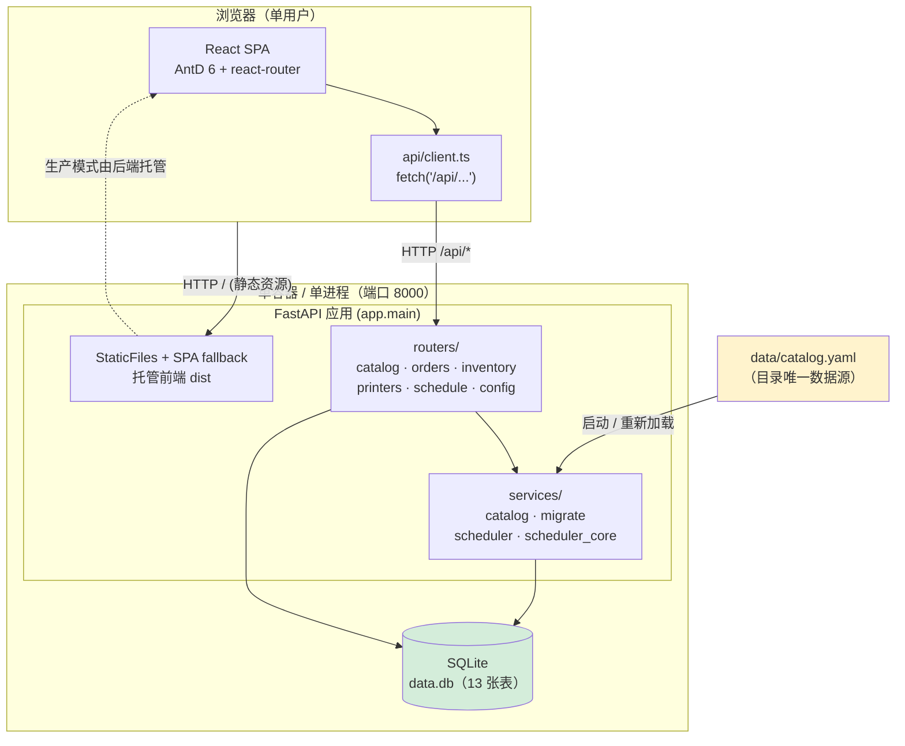
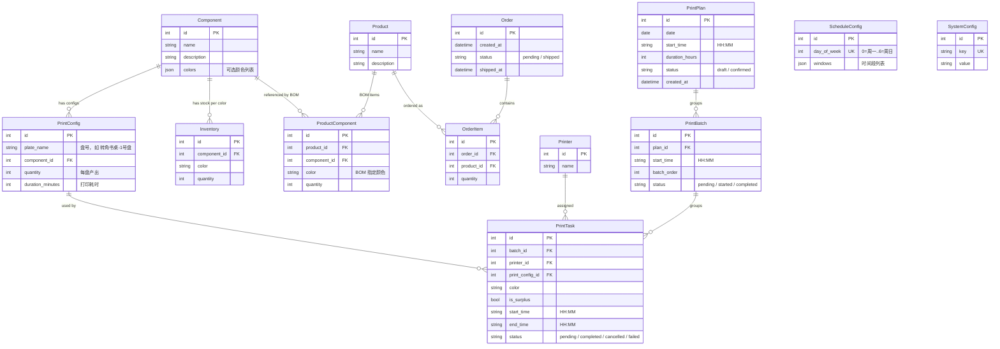
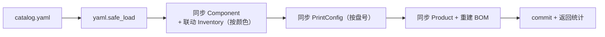
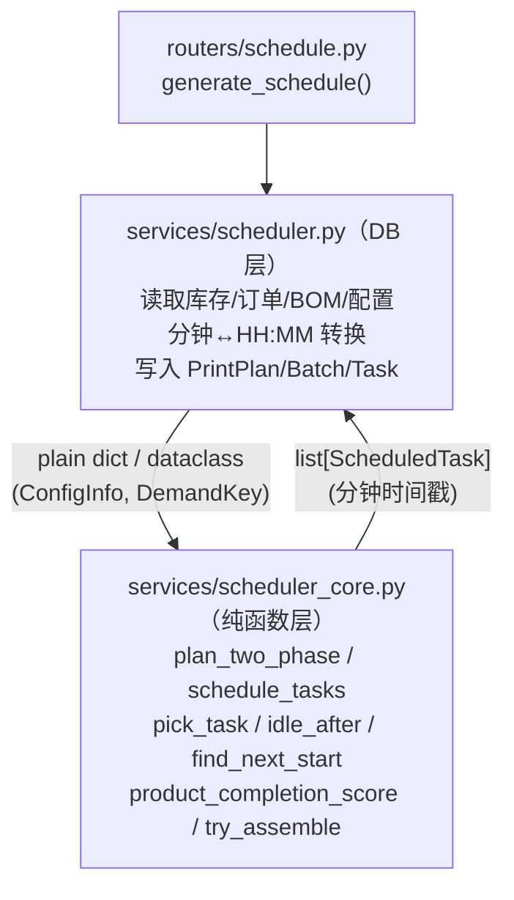
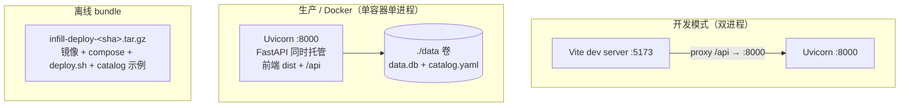

# 系统总体设计（System）

> Last updated: 2026-06-13 02:11:44 (UTC+8)
> Serves: 全部 PRD / 全部业务域（本文档为跨切面基础章节，所有 `design-*.md` 在此之上展开）
>
> 本文档是「整本设计书」的基础章节，描述跨组件的技术栈、架构、数据模型总览、API 约定与共享模式。
> 组件级细节见各 `design-<slug>.md`。
> 业务/产品层原始规格见 [docs/specs.md](../specs.md)，排班算法权威规格见 [docs/schedule_specs.md](../schedule_specs.md)，历史状态报告见 [docs/project-overview.md](../project-overview.md)。
>
> **文档定位**：本文档忠实记录「现状（as-is）」。当 `specs.md` 与代码冲突时，以代码为准并在「Open Questions & Risks」标注分歧（例如 specs.md 规划的 AntV/G2 实际从未引入）。

---

## 1. 系统概览与指导思想

面向个人 3D 打印小作坊的**单用户、本地部署**生产管理与排班系统。核心职责：

1. 维护产品目录（组件、打印盘配置、产品 BOM），唯一数据源是 `data/catalog.yaml`。
2. 管理订单队列与组件库存（含颜色维度）。
3. 根据待处理订单、产品 BOM、当前库存，自动生成多台打印机的排班表。

### 指导思想（从代码中提炼的实际设计原则）

| 原则 | 体现 | 理由 |
|---|---|---|
| **YAML 单一数据源** | `catalog.yaml` 是目录唯一来源，DB 只是运行时镜像；网页对目录只读 | 个人作坊用户用文本编辑器维护目录比做一套 CRUD UI 更省事、更不易出错 |
| **纯函数算法层 / DB 服务层分离** | `scheduler_core.py`（纯函数，无 DB 依赖）+ `scheduler.py`（DB 读写包装） | 算法可单元测试（`test_scheduler.py` 850 行），DB 细节不污染算法 |
| **零运维持久化** | SQLite 单文件 + `data/` 卷挂载 | 单用户场景，数据即文件，无需独立 DB 进程 |
| **单容器部署** | 后端 FastAPI 同时托管前端静态产物 + API | 部署只有一个进程一个端口，离线 bundle 即可交付 |
| **启动即自愈** | 启动时 `auto_migrate` 补列 + `create_all` 建表 + `load_catalog` 加载目录 | 无独立迁移工具链，旧库升级新代码可自动兼容简单列新增 |
| **(component_id, color) 二元需求维度** | 库存、BOM、任务、需求均按「组件+颜色」建模 | 同一组件不同颜色是不同的可消耗实体，必须分开计量 |

---

## 2. 技术栈与选型理由

> 版本以代码仓库 `frontend/package.json`、`backend/requirements.txt` 为准。
> **注意**：`specs.md` 第 2 节规划了 AntV/G2 用于甘特图，但实际从未加入依赖；甘特图最终用原生 HTML/CSS 实现（详见 `design-frontend.md`）。

| 层 | 选型 | 版本 | 选型理由 |
|---|---|---|---|
| 前端框架 | React + TypeScript | React 19.2 / TS 5.9 | 组件化 + 类型安全；团队/生态成熟 |
| 前端 UI 库 | Ant Design | 6.3 | 中文支持好，Table/Form/Modal/Slider 等开箱即用，契合中文后台界面需求 |
| 前端图标 | @ant-design/icons | 6.1 | 与 AntD 配套 |
| 前端路由 | react-router-dom | 7.13 | SPA 路由；`BrowserRouter` + 后端 SPA fallback |
| 前端构建 | Vite | 8.0 | 快速 dev server + 开发期 `/api` 代理 |
| 日期处理 | dayjs | （AntD 6 传递依赖） | AntD DatePicker/TimePicker 的时间对象 |
| 后端框架 | FastAPI | 0.115 | 轻量、自带 OpenAPI、Pydantic 校验；排班算法用 Python 表达自然 |
| ASGI 服务器 | Uvicorn[standard] | 0.34 | 生产/开发统一入口 |
| ORM | SQLAlchemy | 2.0 | 声明式模型 + 关系映射；`DeclarativeBase` 风格 |
| 数据校验 | Pydantic | 2.11 | 请求/响应 schema，`from_attributes` 直接序列化 ORM 对象 |
| 数据库 | SQLite | — | 单用户、零运维、数据即文件 |
| 目录格式 | YAML (PyYAML) | 6.0 | 人类可读，用户直接编辑 |
| 容器 | Docker + docker-compose | — | 单容器交付 + 离线 bundle |

**未采用 / 已偏离规划**：
- AntV/G2（specs 规划）— 未引入，甘特图用原生 DOM 实现。
- 数据库迁移工具（Alembic 等）— 未采用，改用启动期 `auto_migrate` 自动补列（仅支持新增列，详见第 6 节）。

---

## 3. 高层系统架构

**请求路径分流**（`app/main.py`）：
- `/api/*` → 对应 router；若 SPA fallback 捕获到 `api/` 前缀则返回 404 JSON。
- `/assets/*` → 前端构建静态资源（仅当 `static/` 目录存在，即生产模式）。
- 其余路径 → 命中真实文件则返回该文件，否则回退 `index.html`（支持前端 BrowserRouter 深链接刷新）。

---

## 4. 共享数据模型总览

数据库共 **13 张表**（`backend/app/models.py`，均继承 `Base`）。
> **与 specs.md 的分歧**：specs.md 第 3 节按「10 张表」编号描述（把 PrintPlan/PrintBatch/PrintTask 等也算入但合并了部分），实际 ORM 定义为 13 张物理表。本文档以代码为准。
> specs.md 未提及 `color` 维度与 `colors` 字段、任务 `is_surplus`/`status`、批次 `status` 等，这些是代码演进后新增的。

### 4.1 实体关系图

### 4.2 表分组与所有权

| 分组 | 表 | 数据来源 | 文档归属 |
|---|---|---|---|
| 目录（catalog） | `Component` · `PrintConfig` · `Product` · `ProductComponent` | `catalog.yaml`（只读镜像） | `design-catalog.md` |
| 订单与库存 | `Order` · `OrderItem` · `Inventory` | 用户录入 / 发货扣减 / 手动调整 | `design-orders-inventory.md` |
| 排班产物 | `PrintPlan` · `PrintBatch` · `PrintTask` | 排班算法生成 + 执行控制更新 | `design-scheduler.md` |
| 配置 | `Printer` · `ScheduleConfig` · `SystemConfig` | 系统设置页 | `design-frontend.md` / 本文档 |

### 4.3 关键建模约定（跨组件）

- **颜色维度**：`Inventory`、`ProductComponent`、`PrintTask` 均带 `color: str`（默认 `""` 表无颜色）。算法层用二元组 `DemandKey = (component_id, color)` 作为统一的需求/供给键（见 `scheduler_core.py`）。`Component.colors`（JSON）声明该组件的可选颜色集合，加载目录时据此为每种颜色预建一条 `Inventory` 记录。
- **时间表示双轨制**：
  - DB 存储用 `"HH:MM"` 字符串（`PrintTask.start_time/end_time`、`PrintBatch.start_time`、`PrintPlan.start_time`），可超过 `24:00`（跨夜/跨天，如 `33:40`）。
  - 算法层内部统一用「自排班起点起算的分钟整数」（`start_min/end_min`，`0~N×1440`），便于跨天窗口拼接与比较。
  - 转换在 `scheduler.py` 边界完成。
- **状态枚举用字符串而非 DB Enum**：尽管 `models.py` 注释写 enum，实际全部用 `String`（`status` 列）。取值靠约定，无 DB 级约束。
- **软删级联**：通过 SQLAlchemy `cascade="all, delete-orphan"` 在关系上实现父删子删（如删 `PrintPlan` 连带删 `PrintBatch`/`PrintTask`）。

---

## 5. API 约定与模式

### 5.1 通用约定

- **统一前缀 `/api`**：所有业务路由挂在 `/api` 下，由 SPA fallback 据此区分前端路由与 API（`app/main.py`）。
- **按业务域拆分 router**（`app/routers/`）：

  | router | prefix | tag | 职责 |
  |---|---|---|---|
  | `catalog` | `/api`（含 `/components`、`/products`、`/catalog/reload`） | 目录 | 目录只读展示 + 重新加载 |
  | `orders` | `/api/orders` | 订单 | 订单 CRUD + 发货扣库存 |
  | `inventory` | `/api/inventory` | 库存 | 库存查询/调整 + 富余计算 |
  | `printers` | `/api/printers` | 打印机 | 打印机 CRUD |
  | `schedule` | `/api/schedule` | 排班 | 生成/确认/删除排班 + 批次任务编辑 + 执行控制 |
  | `config` | `/api/config` | 配置 | 操作窗口 / 系统配置 / 重置数据库 |
  | （main） | `/api/health` | — | 健康检查 |

- **依赖注入数据库会话**：`db: Session = Depends(get_db)`，`get_db` 为 generator（`database.py`），请求结束自动 `close`。部分需要独立事务的场景（`catalog/reload`、`config/reset-db`、`lifespan` 加载）直接 `SessionLocal()` 手动管理。
- **响应模型**：用 Pydantic `*Out` schema + `model_config = {"from_attributes": True}` 直接序列化 ORM 对象（`schemas.py`）。
- **错误处理**：抛 `HTTPException(status_code, detail)`，前端 `api/client.ts` 统一读取 `body.detail` 作为错误消息。常用码：`404`（资源不存在）、`400`（业务校验失败，如库存不足、时间重叠、订单已发货）。
- **CORS**：`allow_origins=["*"]`，开发模式跨端口（5173→8000）所需；生产同源无影响（**安全说明见 5.3**）。

### 5.2 非典型 REST 的端点（现状记录）

- 部分写操作用动词式 POST 而非纯 REST：`/orders/{id}/ship`、`/schedule/plans/{id}/confirm`、`/schedule/batches/{id}/start`、`/schedule/tasks/{id}/complete|cancel|fail`、`/catalog/reload`、`/config/reset-db`。这是对「业务动作」的直接建模，对单用户系统是合理取舍。
- `catalog` router 的目录读取接口未严格收敛在子前缀下（如 `/components`、`/products`、`/components/configs/all` 直接挂 `/api`）。

### 5.3 跨切面安全说明（现状）

本系统设计为**单用户本地部署**，因此：
- **无鉴权**：所有 API 公开，无 token/session/login。
- **CORS 全开**：`allow_origins=["*"]`。
- 这些在「本地单用户」假设下可接受，但若未来暴露到公网则是风险（见各组件「Open Questions & Risks」与 specs.md 第 10 节「未来扩展」）。

---

## 6. 跨切面共享模式

### 6.1 catalog.yaml → DB 加载模式

目录的唯一事实源是 `data/catalog.yaml`，DB 只是运行时镜像。加载是**幂等的差量同步**（upsert + 删除 YAML 中已移除项），触发点有三：

1. 应用启动（`lifespan`，`main.py`）。
2. 用户点「重新加载目录」（`POST /api/catalog/reload`）。
3. 重置数据库后重新加载（`POST /api/config/reset-db`）。

详细同步语义（按名称匹配、库存记录联动、颜色增删规则）见 `design-catalog.md`。

### 6.2 纯函数算法层 / DB 服务层分离

排班相关的「计算」与「持久化」严格分离：

- `scheduler_core.py` 只接受 plain Python 数据结构（`dict`、`tuple`、`@dataclass ConfigInfo/ScheduledTask`），**无 `Session` 依赖**，因此可纯单元测试（`backend/tests/test_scheduler.py`）。
- `scheduler.py` 负责 DB 查询、构建输入数据、调用 core、把结果（分钟整数）转回 `"HH:MM"` 写入 DB。
- **现状缺陷**：该分离尚未彻底——`scheduler.py` 仍保留一份 `_pick_task` 旧实现（multiplicative 同步惩罚）与一份 `product_first/utilization` 主调度循环，并未全部委托给 core；core 的 `pick_task` 是 additive 惩罚的新版本。两份逻辑存在分歧，详见 `design-scheduler.md` 与本文「Open Questions & Risks」。

### 6.3 时间窗口与分钟时间戳

- 操作窗口按 `day_of_week` 配置（`ScheduleConfig.windows`），算法层统一转为「自排班起点起算的分钟区间」并跨天偏移拼接（`scheduler.py._get_windows`）。
- 无配置时回退硬编码默认窗口 `[(480,720),(750,1080),(1110,1380)]`（即 8-12 / 12:30-18 / 18:30-23）。**该默认值在前端 Settings 弹窗与后端 fallback 各硬编码一份**（见风险）。

### 6.4 启动期自迁移（auto_migrate）

无 Alembic。`services/migrate.py` 在启动时对比 ORM 模型与实际表结构，用 `ALTER TABLE ADD COLUMN` 补齐**缺失的列**：
- 仅处理「新增列」；不处理列删除、改类型、改约束。
- 跳过 callable 默认值（如 `datetime.now`）。
- 整张表缺失则交给随后的 `Base.metadata.create_all`。

适合本项目「单文件 SQLite + 频繁加字段」的演进节奏，但不是通用迁移方案（见风险）。

---

## 7. 部署与基础设施

### 7.1 三种运行形态

| 形态 | 命令 / 产物 | 端口 | 前端来源 | 数据库 / 目录路径 |
|---|---|---|---|---|
| 开发 | `vite` + `uvicorn app.main:app` | 5173（前）/ 8000（后） | Vite dev server | `./data.db` / `data/catalog.yaml`（默认相对路径） |
| Docker | `docker compose up`（`Dockerfile` 两阶段构建） | 8000 | 后端托管 `static/`（前端 dist 拷入） | `/app/data/data.db` / `/app/data/catalog.yaml`（env 覆盖） |
| 离线 bundle | `scripts/bundle.sh` → `release/*.tar.gz` → 目标机 `deploy.sh` | 8000 | 同 Docker | 同 Docker |

### 7.2 关键环境变量

| 变量 | 默认 | 用途 |
|---|---|---|
| `DATABASE_URL` | `sqlite:///./data.db` | SQLite 文件路径（Docker 设为 `/app/data/data.db`） |
| `CATALOG_PATH` | `<repo>/data/catalog.yaml` | 目录文件路径（Docker 设为 `/app/data/catalog.yaml`） |

### 7.3 数据持久化

- 唯一持久状态：`data/` 目录（`data.db` + `catalog.yaml`），通过 docker volume 挂载，容器重建不丢数据。
- 备份 = 拷贝 `data/` 目录。

---

## 8. 系统级关键决策与理由

| 决策 | 理由 | 放弃的代价 |
|---|---|---|
| SQLite 而非 Postgres/MySQL | 单用户、零运维、数据即文件、易备份 | 无并发写、无独立 DB 运维能力（对本场景不需要） |
| YAML 目录 + 网页只读 | 用户用文本编辑器维护比做 CRUD UI 更省事 | 目录变更需手动 reload；无版本/审计 |
| 启动期 auto_migrate 而非 Alembic | 演进快、加字段频繁、不想维护迁移脚本链 | 只能加列，复杂变更需手动处理 |
| 算法纯函数化（core/服务分层） | 可单元测试、算法逻辑与 DB 解耦 | 需维护 DB↔plain data 的转换样板；当前分层未彻底 |
| 单容器托管前后端 | 部署只有一个进程一个端口，离线交付简单 | 前后端无法独立扩缩（本场景无需） |
| 无鉴权 / CORS 全开 | 本地单用户，简化实现 | 不可直接公网暴露 |

---

## 9. 跨切面 Open Questions & Risks

> 各组件自身的风险见对应 `design-*.md`。此处仅列系统级。

1. **表数量口径不一致**：`specs.md` 称 10 张表、本仓库任务背景也写「10 张表」，实际 ORM 为 13 张物理表。文档已以代码为准。
2. **`SURPLUS_TARGET_PRODUCTS` 常量重复定义**：`scheduler.py`（=20）与 `scheduler_core.py`（=20）各定义一份；`schedule_specs.md` 7.3 写 `=5`，`project-overview.md` 一处写 20、一处写 5。三处口径不一。应收敛到 `scheduler_core.py` 单一定义并被 `scheduler.py` 导入。
3. **同步惩罚算法两套实现并存**：`scheduler.py._pick_task` 用 multiplicative 前置因子（旧），`scheduler_core.py.pick_task` 用 additive「等效空闲分钟」二次方缩放（新）；`schedule_specs.md` 9.3 描述的是 multiplicative 版本，已与 core 实现脱节。`product_first/utilization` 主循环走的是 `scheduler.py._pick_task`，仅 `two_phase` 阶段 2 走 core。需统一并更新 specs。
4. **操作窗口默认值硬编码两处**：`scheduler.py:53` 的 fallback `[(480,720),(750,1080),(1110,1380)]` 与前端 `Settings.tsx` 弹窗默认窗口各硬编码一份，应通过初始化迁移写入默认 `ScheduleConfig` 行统一来源。
5. **`SystemConfig` 默认值无初始化**：`changeover_minutes`、`surplus_enabled` 等无启动初始化迁移，代码到处用 `int(cfg.value) if cfg else 15` 这类内联默认；多处重复同一默认数字。
6. **AntV/G2 规划落空**：specs.md 第 2 节列为图表选型，实际未引入；甘特图用原生 DOM 实现。文档已更正。
7. **无鉴权可公网暴露风险**：见 5.3，超出当前「本地单用户」假设即成风险。
8. **`auto_migrate` 能力有限**：仅支持加列，列改名/删除/改类型需人工干预。

---

## 10. 组件设计文档索引

| 文档 | 覆盖范围 |
|---|---|
| `design-scheduler.md` | 排班算法：DB 服务层 + 纯函数核心层、三种策略、同步强度、操作窗口、富余生产、执行控制 |
| `design-catalog.md` | `catalog.yaml` 格式与加载链路、与 DB 的差量同步语义 |
| `design-orders-inventory.md` | 订单队列、发货扣减、BOM 折算、库存调整、富余计算 |
| `design-frontend.md` | 前端路由、`api/client.ts` 封装、各页面职责、甘特图/列表视图实现 |
